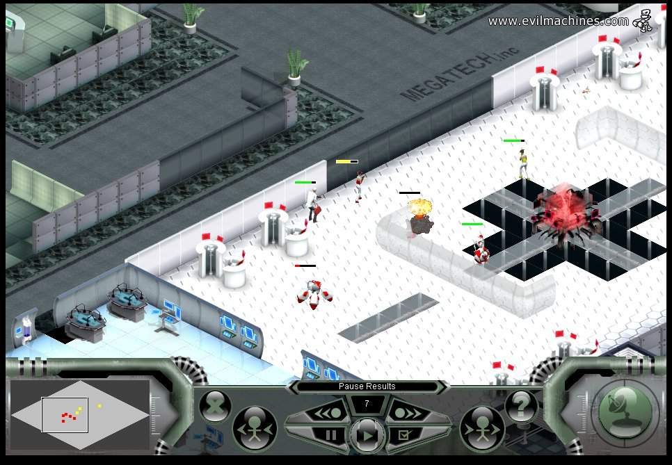

# Evil Machines (2005)

## Zusammenfassung
- Ein isometrisches, rundenbasiertes Mehrspieler-Strategiespiel mit einem Spielablauf, der mit XCOM und Laser Squad Nemesis vergleichbar ist.
- Gilt weithin als das erste plattformübergreifende Spiel, das nahtloses Spielen zwischen PC und Mobilgeräten unterstützt.

## Anerkennung
- Gewinner, Dare to be Digital-Wettbewerb, 2005.

## Entwicklungsübersicht
- **Zeitplan:** 12 Wochen.
- **Team:** Dies war das erste Spiel, an dem wir gemeinsam gearbeitet haben; zwei von uns arbeiteten zusammen, bevor unser Unternehmen formell gegründet wurde, und arbeiten seitdem weiterhin zusammen.
- **Ziel:** Funktionsparität beim Mehrspieler-Strategiespiel zwischen PC-Web und früher mobiler Hardware erreichen, in einer Zeit, bevor plattformübergreifende Engines oder Dienste existierten.

## Plattformen und Modi
- **PC:** Webbasierter Client.
- **Mobile:** Java-Mobilanwendung (z. B. kompatibel mit Geräten der Nokia-Ära).
- **Spielmodell:** Rundenbasiert; Spieler konnten ihre Züge auf beiden Plattformen ausführen, mit einem gemeinsamen, autoritativen Spielzustand.

## Zentrale Innovationen
- **Plattformübergreifende Parität:** Dieselbe Kern-Spielschleife zeitgleich auf zwei grundverschiedenen Technologie-Stacks geliefert und damit ein neues Modell für das Spielen über mehrere Geräte etabliert.
- **Palettenwechsel zur Laufzeit:** Eine leichtgewichtige Methode erfunden, um Teams auf speicherbeschränkten Geräten visuell zu unterscheiden, indem zur Laufzeit Farbpaletten gewechselt werden, anstatt separate Sprite-Sets zu laden.
- **Mobile-First-Strategie-UX:** Eine Benutzeroberfläche für strategisches Spielen auf frühen Mobiltelefonen entworfen, bei denen Bildschirmgröße, Eingabemethoden und Rechenleistung erhebliche Einschränkungen darstellten.
- **Serverseitig autoritative Architektur:** Zentralisierte Regel- und Zustandsverwaltung, um Konsistenz über Plattformen hinweg sicherzustellen, wodurch zuverlässige geräteübergreifende Züge möglich wurden.

## Technische Architektur
- **Web-Architektur für plattformübergreifendes Spielen:** Ein Server vermittelte alle Interaktionen, sodass sowohl der PC-Webclient als auch die mobile Java-App gegen denselben Spielzustand arbeiteten.
- **Datenfluss:** Clients übermittelten Zuganweisungen an ein Backend mittels serverseitiger SQL-Abfragen und Verarbeitung; der Server validierte, löste auf und persistierte die Ergebnisse, bevor er Aktualisierungen verteilte.
- **Thin-Client-Design:** Clients konzentrierten sich auf Eingabe, Rendering und Zustandsanzeige, während Spiellogik und Regelauflösung auf dem Server stattfanden, um Determinismus über Plattformen hinweg zu garantieren.
- **Ressourcenoptimierung:** Strenge Speicherlimits auf Mobilgeräten wurden adressiert, indem der Asset-Footprint minimiert, Palettenwechsel eingesetzt und das Laden sorgfältig gesteuert wurde, um nicht die Gerätegrenzen zu überschreiten.

## Entwicklungsherausforderungen
Als mobiles Strategie-Gameplay noch weitgehend unerforscht war, stützten wir uns auf iterative UX-Prototypen, abgestimmt auf Tastenfeldeingabe, kleine Bildschirme und kurze Sitzungen, und kombinierten sie mit klaren, isometrischen Visuals, die auf schnelle Lesbarkeit optimiert waren. Um identisches Spielverhalten über eine heterogene Gerätelandschaft hinweg sicherzustellen, verlagerten wir die Regelausführung auf den Server und implementierten ein datenbankgestütztes Zug-System, sodass Ergebnisse einheitlich blieben und frei von plattformspezifischen Eigenheiten. Schließlich, da knappe Speicherbudgets einzigartige Grafiken für jeden Spieler ausschlossen, differenzierten wir Teams durch Palettenwechsel zur Laufzeit und umfangreiche Sprite-Wiederverwendung, um Vielfalt zu liefern, ohne den Footprint zu erhöhen.

## Auswirkungen und Vermächtnis
- Etablierte ein Funktionsmuster für plattformübergreifenden, rundenbasierten Mehrspielerbetrieb, Jahre bevor Mainstream-Engines und -Dienste dies unterstützten.
- Zeigte, dass PC- und Mobil-Clients einen einzigen, autoritativen Spielzustand mit konsistenter Mechanik und Benutzererfahrung teilen können.
- Legte die technische und kollaborative Grundlage für unsere spätere Arbeit; die während dieses Projekts entstandene Partnerschaft setzte sich fort, während sich unser Unternehmen weiterentwickelte.

## Bemerkenswerte Erstleistungen
- Unser erstes echtes Spiel, entwickelt als das Team, das zu unserem Unternehmen wurde.
- Weitgehend anerkannt als das erste plattformübergreifende Spiel, das gleichzeitig über PC-Web und Mobiltelefontechnologien lief.