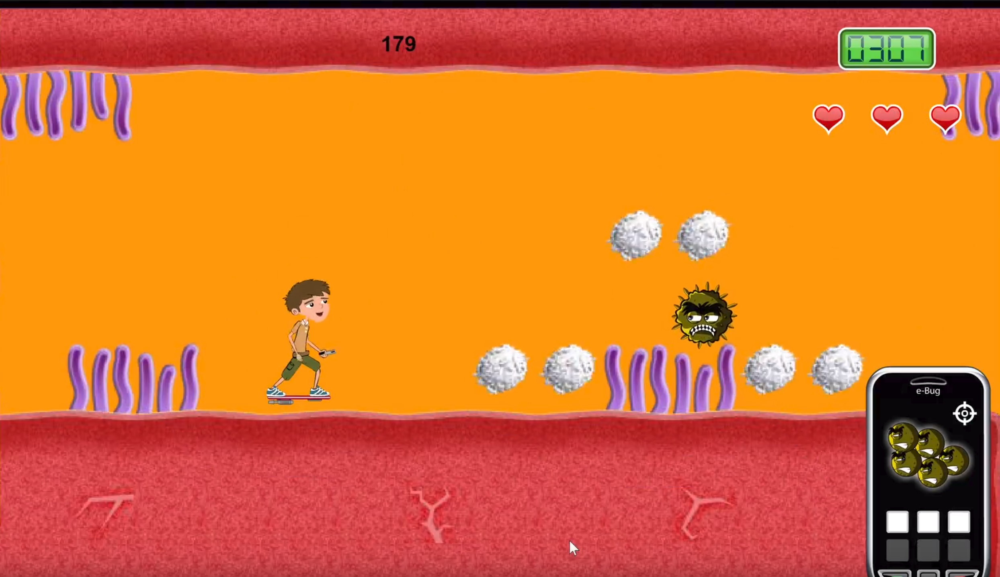

# Super Microbe World (E‑Bug Junior Game) - 2011

## Summary
Super Microbe World, which we developed for Public Health England in 2011, formed the core junior game within the EU‑funded e‑Bug initiative. Designed as a serious game platform for schools in the late 2000s/early 2010s, it pioneered an approach that foregrounded learning through game mechanics. Targeted at 9–12 year olds, the project used Constructive Alignment to connect classroom learning outcomes to specific in‑game actions, enabling pupils to internalize concepts about prudent antibiotic use and hand and respiratory hygiene through play. **The game was played approximately 1,700 times in the first three months of launch**, demonstrating significant early adoption. It was one of the largest serious games projects of its time, and its findings continue to be heavily cited in education and public health research.

## Educational Aims and Audience
- **Audience:** Primary pupils aged 9–12 (studies conducted with 153 pupils aged 9–11 in primary and summer schools).
- **Learning focus:** Basic principles of antimicrobial stewardship (bacteria vs. viruses and when antibiotics are appropriate), hand hygiene, and respiratory hygiene.
- **Classroom fit:** Designed to complement teacher resources and a student website featuring games and interactive activities, supporting integrated lesson delivery.

## Design and Pedagogy
- **Grounded in Constructive Alignment:** Each level and mechanic was deliberately mapped to explicit learning outcomes. Game verbs (what players do) were chosen to instantiate curricular objectives rather than overlaying quizzes on top of gameplay.
- **Mechanic‑first research inversion:** The project explicitly inverted typical serious‑games approaches by starting with mechanics that embody target concepts, then iteratively validating learning through classroom use.
- **Iterative co‑design in schools:** We spent most of our time visiting schools, working with teachers and pupils and iteratively crafting experiences that could help in classrooms.
- **Level structure:** A five‑level platform game, with each level associated with a defined set of learning objectives and feedback loops aligning performance with understanding.

## Technology and Production
- **Technology:** Built in ActionScript (CS2 era) with a custom physics engine and a bespoke animation director to support responsive platform mechanics and expressive character feedback on varied school hardware.
- **Production approach:** Rapid iteration cycles driven by classroom observations, formative testing, and close collaboration with teachers to refine difficulty, clarity of feedback, and alignment to lesson plans.

## Evaluation and Impact
- **Study cohort:** 153 pupils (ages 9–11) across primary and summer school settings.
- **Game usage:** During a three-month evaluation period (May-August 2009), approximately 1,700 players accessed the junior game online, plus 62 children across three UK schools in Glasgow, Gloucester, and London.
- **Outcomes:** Evaluation demonstrated statistically significant knowledge improvements in key areas, particularly around understanding when antibiotics are effective (distinguishing bacterial versus viral infections) and ensuring antibiotic courses are completed. While many children already possessed baseline knowledge before playing, the study represented the first comprehensive statistical evaluation of educational hygiene games for this age group.
- **Scale and influence:** At the time, one of the largest serious‑games projects in the sector; its methodology and results have remained widely cited in both serious‑games and public health education research.
- **Lasting contribution:** Demonstrated that carefully aligned game mechanics can deliver measurable learning in classroom contexts, informing subsequent practice in curriculum‑aligned game design.

## Development Challenges
We needed to balance educational rigor with engaging gameplay mechanics on constrained school hardware. Building a custom physics engine in ActionScript CS2 while maintaining smooth performance across diverse classroom computers demanded careful optimization. Our iterative co-design process meant constantly refining the alignment between game actions and learning objectives, ensuring that every interaction reinforced the intended educational outcomes without compromising player engagement.

## Commissioning and Credits
- **Client:** Public Health England (as part of the EU‑funded E‑Bug initiative).
- **Year:** 2011.
- **Context:** A serious game platform created specifically for school deployment in the late 2000s/early 2010s, targeting learning through interactive gameplay.

## Significance
Super Microbe World established a blueprint for curriculum‑aligned, mechanics‑driven serious games. By coupling a rigorous pedagogical framework with custom technology and extensive in‑class iteration, we showed that students can acquire nuanced public health knowledge through play, leaving a durable research footprint and shaping best practices for educational game design.