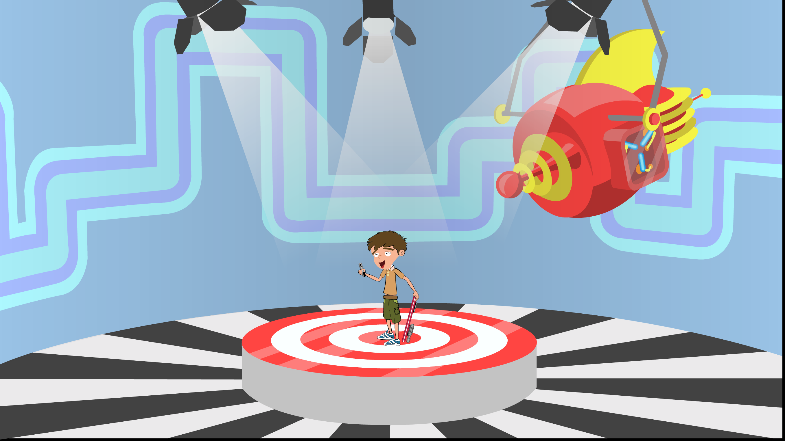
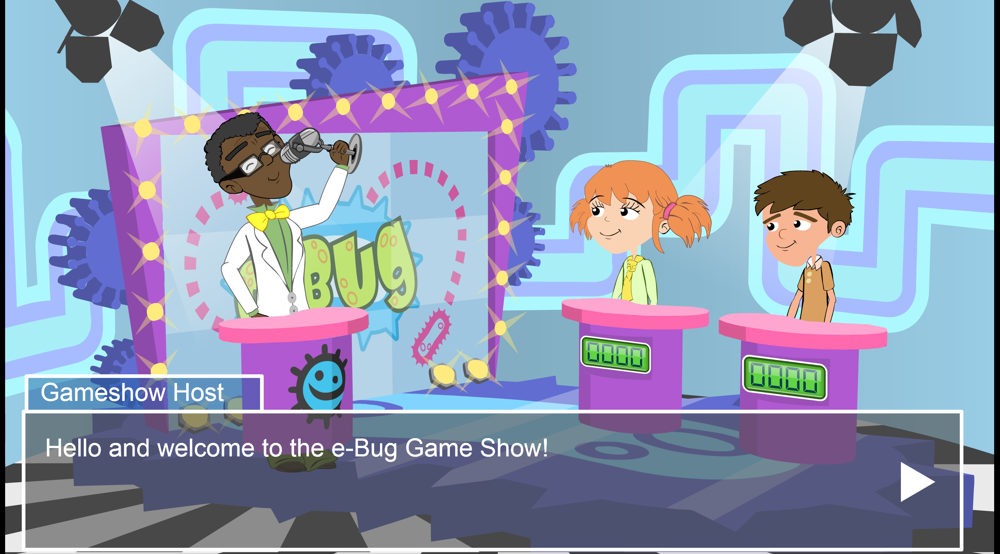

# Super Microbe World (E‑Bug-Junior-Spiel) - 2011

## Zusammenfassung
Super Microbe World, das wir 2011 für Public Health England entwickelt haben, bildete das zentrale Junior-Spiel innerhalb der EU‑finanzierten e‑Bug-Initiative. Als Serious-Game-Plattform für Schulen Ende der 2000er/Anfang der 2010er Jahre konzipiert, ebnete es einen Ansatz, der Lernen durch Spielmechaniken in den Vordergrund stellte. Ausgerichtet auf 9–12‑Jährige nutzte das Projekt konstruktive Ausrichtung, um Unterrichtslernziele mit spezifischen In‑Game‑Aktionen zu verknüpfen, wodurch Schülerinnen und Schüler Konzepte zu umsichtigem Antibiotikaeinsatz sowie Hand- und Atemhygiene spielerisch verinnerlichen konnten. **Das Spiel wurde in den ersten drei Monaten nach dem Start etwa 1.700‑mal gespielt**, was eine erhebliche frühe Nutzung belegte. Es war eines der größten Serious‑Games‑Projekte seiner Zeit, und seine Erkenntnisse werden in der Bildungs‑ und Public‑Health‑Forschung weiterhin stark zitiert.

## Bildungsziele und Zielgruppe
- **Zielgruppe:** Grundschülerinnen und ‑schüler im Alter von 9–12 Jahren (Studien durchgeführt mit 153 Kindern im Alter von 9–11 Jahren in Grund- und Sommerschulen).
- **Lernfokus:** Grundprinzipien des Antimicrobial/Antibiotic Stewardship (Bakterien vs. Viren und wann Antibiotika angemessen sind), Händehygiene und Atemhygiene.
- **Eignung für den Unterricht:** Entwickelt zur Ergänzung von Lehrmaterialien und einer Schüler-Website mit Spielen und interaktiven Aktivitäten, zur Unterstützung eines integrierten Unterrichts.

## Design und Pädagogik
- **Verankert in konstruktiver Ausrichtung:** Jedes Level und jede Mechanik wurde bewusst auf explizite Lernziele abgebildet. Spielverben (was die Spielenden tun) wurden gewählt, um curriculare Ziele zu verkörpern, statt Quizfragen über das Gameplay zu legen.
- **Mechanik‑First‑Forschungsinversion:** Das Projekt kehrte typische Serious‑Games‑Vorgehensweisen explizit um, indem es mit Mechaniken begann, die Zielkonzepte verkörpern, und das Lernen anschließend iterativ durch den Einsatz im Unterricht validierte.
- **Iteratives Co‑Design in Schulen:** Wir verbrachten den Großteil unserer Zeit mit Schulbesuchen, arbeiteten mit Lehrkräften und Schülerinnen und Schülern zusammen und entwickelten iterativ Erfahrungen, die im Unterricht helfen konnten.
- **Level‑Struktur:** Ein Plattformspiel mit fünf Levels, wobei jedem Level ein definierter Satz von Lernzielen und Feedback‑Schleifen zugeordnet ist, die Leistung mit Verständnis in Einklang bringen.

## Technologie und Produktion
- **Technologie:** Entwickelt in ActionScript (CS2‑Ära) mit einer kundenspezifischen Physik‑Engine und einem maßgeschneiderten Animations‑Director, um reaktionsschnelle Plattformmechaniken und ausdrucksstarkes Charakter‑Feedback auf unterschiedlicher Schulhardware zu unterstützen.
- **Produktionsansatz:** Schnelle Iterationszyklen, getrieben durch Beobachtungen im Unterricht, formative Tests und enge Zusammenarbeit mit Lehrkräften, um Schwierigkeitsgrad, Klarheit des Feedbacks und die Ausrichtung an Unterrichtsplanungen zu verfeinern.

## Evaluation und Wirkung
- **Studienkohorte:** 153 Kinder (9–11 Jahre) in Grund- und Sommerschulumgebungen.
- **Spielnutzung:** Während eines dreimonatigen Evaluationszeitraums (Mai–August 2009) griffen rund 1.700 Spielende online auf das Junior‑Spiel zu, plus 62 Kinder in drei britischen Schulen in Glasgow, Gloucester und London.
- **Ergebnisse:** Die Evaluation zeigte statistisch signifikante Wissenszuwächse in Schlüsselbereichen, insbesondere beim Verständnis, wann Antibiotika wirksam sind (Unterscheidung bakterieller gegenüber viralen Infektionen) und bei der Sicherstellung, dass Antibiotikakuren vollständig abgeschlossen werden. Obwohl viele Kinder bereits vor dem Spielen Grundwissen besaßen, stellte die Studie die erste umfassende statistische Evaluation von edukativen Hygienespielen für diese Altersgruppe dar.
- **Größe und Einfluss:** Damals eines der größten Serious‑Games‑Projekte im Sektor; Methodik und Ergebnisse werden sowohl in der Serious‑Games‑ als auch in der Public‑Health‑Bildungsforschung weithin zitiert.
- **Nachhaltiger Beitrag:** Zeigte, dass sorgfältig ausgerichtete Spielmechaniken in Unterrichtskontexten messbares Lernen ermöglichen und die spätere Praxis im lehrplan‑ausgerichteten Game‑Design beeinflussen.

## Entwicklungsherausforderungen
Wir mussten pädagogische Strenge mit fesselnden Gameplay‑Mechaniken auf eingeschränkter Schulhardware in Einklang bringen. Eine eigene Physik‑Engine in ActionScript CS2 zu entwickeln und dabei auf verschiedensten Klassenraum‑Computern eine flüssige Performance zu gewährleisten, erforderte sorgfältige Optimierung. Unser iterativer Co‑Design‑Prozess bedeutete, die Ausrichtung zwischen Spielhandlungen und Lernzielen ständig zu verfeinern, sodass jede Interaktion die beabsichtigten Bildungsergebnisse stärkte, ohne die Spielerbindung zu beeinträchtigen.

## Beauftragung und Credits
- **Auftraggeber:** Public Health England (als Teil der EU‑finanzierten E‑Bug‑Initiative).
- **Jahr:** 2011.
- **Kontext:** Eine Serious‑Game‑Plattform, speziell für den Schuleinsatz Ende der 2000er/Anfang der 2010er Jahre geschaffen, die Lernen durch interaktives Gameplay in den Fokus stellt.

## Bedeutung
Super Microbe World etablierte eine Blaupause für lehrplan‑ausgerichtete, mechanik‑getriebene Serious‑Games. Durch die Verbindung eines rigorosen pädagogischen Rahmens mit maßgeschneiderter Technologie und umfangreicher Iteration im Unterricht zeigten wir, dass Lernende differenziertes Public‑Health‑Wissen durch Spiel erwerben können – mit einem nachhaltigen Fußabdruck in der Forschung und prägend für Best Practices im Educational‑Game‑Design.