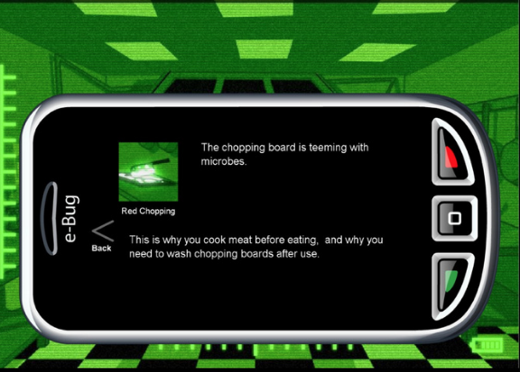

# The Microbe Files (E‑Bug Senior Game) - 2012

## Summary
A story-led mystery game for 13–15-year-olds in which players become investigators solving public‑health cases involving microbes. We developed it in 2012 for Public Health England as part of the EU‑funded E‑Bug initiative, serving as the senior counterpart to the junior game Super Microbe World. Extended under the edugames4all banner and led to the STAR storytelling framework.

## Purpose and Audience
- **Target learners:** Secondary school pupils aged 13–15.
- **Educational focus:** Prudent antibiotic use, antibiotic resistance, and hand/respiratory hygiene.
- **Placement:** Designed for classroom and desktop use to complement E‑Bug health education resources.

## Narrative and Learning Design
- **Story-based mystery structure:** Four missions present evidence-driven cases at scenes where microbes and public-health issues are central. Players assume the role of an investigator, guided by the character Hugh Gaego, and progress by piecing together clues to resolve each case.
- **Interactive Digital Storytelling (IDS):** The game integrated cinematic storytelling techniques with playable investigative tasks, exemplifying a hybrid IDS approach that shaped learning through narrative tension, evidence collection, and decision-making.
- **Explicit learning objectives:** Each mission embedded outcomes related to antibiotic stewardship and hygiene, using narrative context to motivate knowledge acquisition and application.
- **Senior progression:** Built as the older-learner counterpart to Super Microbe World, ensuring continuity across the E‑Bug curriculum with age-appropriate complexity and themes.

## Collaborative, Research-Led Development
- **Co-design methodology:** Mission ideas, tone, vocabulary, and interface were iteratively refined through interactive workshops and school visits with pupils, teachers, and subject experts.
- **Research alignment:** Part of the broader edugames4all effort, which framed the game within a research program advancing IDS for health education and public engagement.
- **Authoring capability:** We developed an associated authoring tool to enable the creation of interactive digital storytelling for educational interventions, supporting extensibility, educator input, and future mission authoring.

## Technology and Production
- **Stack:** Adobe Flash (client), Lotus Domino (content/services), Google Spreadsheet (data-driven content).
- **Data-driven mission design:** Story beats, assets, and parameters were externalized in structured data, enabling rapid content iteration, balancing, and localization without code changes.
- **Internationalization:** Content and logic were separated to support translation and adaptation across participating E‑Bug countries.

## Key Contributions and Innovations
- **Pioneering IDS for education:** The Microbe Files operationalized IDS principles—blending cinematic narrative with interactive problem-solving—for a formal education context, demonstrating how story can structure and sustain engagement with complex health topics.
- **STAR storytelling framework:** In its edugames4all continuation, we adopted the STAR framework to scaffold consistent narrative design across missions, supporting clarity of story arcs and alignment with learning objectives.
- **Authoring plus analytics-ready design:** The data-driven approach and authoring tool created a sustainable pipeline for content updates, mission authoring, and localization—an important step toward scalable, research-informed educational games.
- **Co-creation with end users:** The collaborative process ensured authenticity of language, relevance of scenarios, and usability for secondary students, exemplifying best practice in participatory educational game design.

## Gameplay and Pedagogy
Role-play as an investigator situates learners in authentic public-health scenarios, using mystery resolution to contextualize how microbes spread and are controlled, why prudent antibiotic use matters and how resistance develops, and practical hand and respiratory hygiene behaviors. Problem-solving mechanics—evidence gathering, hypothesis testing, and case resolution—support knowledge transfer from narrative context to real-world health behaviors.

## Partnerships and Provenance
- **Commissioned by:** Public Health England (2012).
- **Embedded in:** The EU E‑Bug initiative's education program.
- **Extended:** Under the edugames4all banner, integrating the STAR framework and contributing to a comprehensive approach to health education through gaming.

## Legacy and Significance
The Microbe Files demonstrated that narrative-led, data-driven IDS could deliver curriculum-aligned health education to teenagers in a format teachers could adopt and researchers could extend. Our combination of co-design, authoring tools, internationalization, and research integration positioned it as a formative example of IDS applied to public-health education, informing subsequent edugames4all work and advancing the use of interactive storytelling to promote responsible antibiotic use and hygiene.