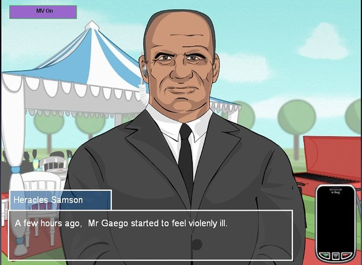
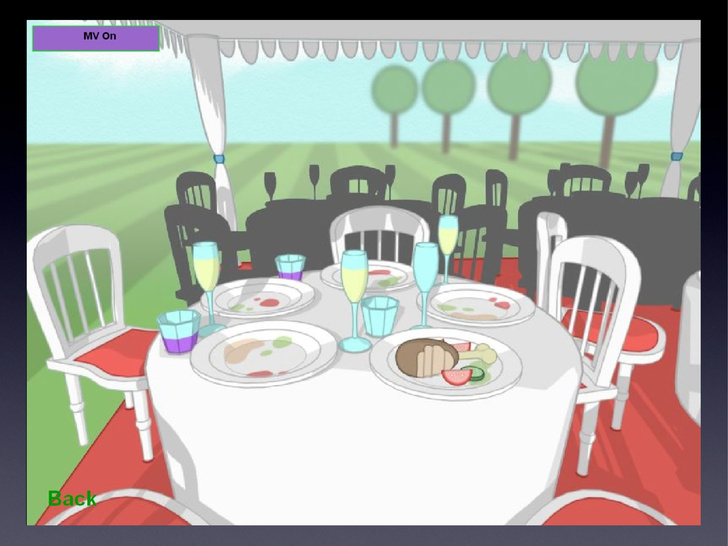

# The Microbe Files (E‑Bug Senior‑Spiel) - 2012

## Summary
Ein erzählgeleitetes Mystery‑Spiel für 13–15‑Jährige, in dem die Spielenden zu Ermittlerinnen und Ermittlern werden und Public‑Health‑Fälle mit Mikroben lösen. Wir entwickelten es 2012 für Public Health England als Teil der EU‑finanzierten E‑Bug‑Initiative, als Senior‑Gegenstück zum Junior‑Spiel Super Microbe World. Unter dem Banner edugames4all erweitert und führte zum STAR‑Storytelling‑Framework.

## Purpose and Audience
- **Target learners:** Schülerinnen und Schüler der Sekundarstufe im Alter von 13–15 Jahren.
- **Educational focus:** Umsichtiger Antibiotikaeinsatz, Antibiotikaresistenz sowie Hand‑ und Atemwegshygiene.
- **Placement:** Für Unterricht und Desktop‑Nutzung konzipiert, um die E‑Bug‑Ressourcen zur Gesundheitsbildung zu ergänzen.

## Narrative and Learning Design
- **Story-based mystery structure:** Vier Missionen präsentieren beweisgestützte Fälle an Schauplätzen, an denen Mikroben und Public‑Health‑Themen im Zentrum stehen. Die Spielenden übernehmen die Rolle einer Ermittlerin bzw. eines Ermittlers, werden von der Figur Hugh Gaego geleitet und kommen durch das Zusammenfügen von Hinweisen zur Lösung jedes Falls voran.
- **Interactive Digital Storytelling (IDS):** Das Spiel verband filmische Erzähltechniken mit spielbaren Ermittlungsaufgaben und veranschaulichte einen hybriden IDS‑Ansatz, der Lernen durch narrative Spannung, Beweissammlung und Entscheidungsfindung prägte.
- **Explicit learning objectives:** Jede Mission verankerte Ergebnisse zu Antibiotic‑Stewardship und Hygiene und nutzte den narrativen Kontext, um Wissensaufbau und Anwendung zu motivieren.
- **Senior progression:** Als Gegenstück für ältere Lernende zu Super Microbe World gebaut und so Kontinuität im E‑Bug‑Curriculum mit altersgerechter Komplexität und Themen sichergestellt.

## Collaborative, Research-Led Development
- **Co-design methodology:** Missionsideen, Tonalität, Wortschatz und Interface wurden iterativ über interaktive Workshops und Schulbesuche mit Schülerinnen und Schülern, Lehrkräften und Fachexpertinnen und ‑experten verfeinert.
- **Research alignment:** Teil des übergreifenden edugames4all‑Engagements, das das Spiel in ein Forschungsprogramm einbettete, das IDS für Gesundheitsbildung und Public Engagement voranbrachte.
- **Authoring capability:** Wir entwickelten ein zugehöriges Autorentool zur Erstellung von Interactive Digital Storytelling für Bildungsinterventionen, das Erweiterbarkeit, Beiträge von Lehrkräften und zukünftige Missionsautorierung unterstützte.

## Technology and Production
- **Stack:** Adobe Flash (Client), Lotus Domino (Inhalt/Dienste), Google Spreadsheet (datengetriebene Inhalte).
- **Data-driven mission design:** Story‑Beats, Assets und Parameter wurden in strukturierte Daten ausgelagert, was schnelle Inhaltsiteration, Balancing und Lokalisierung ohne Codeänderungen ermöglichte.
- **Internationalization:** Inhalte und Logik wurden getrennt, um Übersetzung und Anpassung in den teilnehmenden E‑Bug‑Ländern zu unterstützen.

## Key Contributions and Innovations
- **Pioneering IDS for education:** The Microbe Files operationalisierte IDS‑Prinzipien—die Verbindung aus filmischer Narration und interaktiver Problemlösung—für einen formalen Bildungskontext und zeigte, wie Story die Auseinandersetzung mit komplexen Gesundheitsthemen strukturieren und tragen kann.
- **STAR storytelling framework:** In der Fortführung unter edugames4all übernahmen wir das STAR‑Framework, um konsistentes narratives Design über Missionen hinweg zu strukturieren und die Klarheit von Handlungsbögen sowie die Ausrichtung an Lernzielen zu unterstützen.
- **Authoring plus analytics-ready design:** Der datengetriebene Ansatz und das Autorentool schufen eine nachhaltige Pipeline für Inhaltsupdates, Missionsautorierung und Lokalisierung—ein wichtiger Schritt hin zu skalierbaren, forschungsinformierten Bildungsspielen.
- **Co-creation with end users:** Der kollaborative Prozess sicherte Authentizität der Sprache, Relevanz der Szenarien und Nutzbarkeit für Sekundarstufenschülerinnen und ‑schüler und steht beispielhaft für Best Practices im partizipativen Design von Bildungsspielen.

## Gameplay and Pedagogy
Die Rollenübernahme als Ermittlerin bzw. Ermittler verortet Lernende in authentischen Public‑Health‑Szenarien und nutzt die Aufklärung eines Mysteriums, um zu kontextualisieren, wie sich Mikroben verbreiten und kontrollieren lassen, warum umsichtiger Antibiotikaeinsatz wichtig ist und wie Resistenzen entstehen, sowie praktische Hand‑ und Atemwegshygiene‑Verhaltensweisen. Problemlösungsmechaniken—Beweiserhebung, Hypothesenprüfung und Falllösung—unterstützen den Wissenstransfer vom narrativen Kontext auf reale Gesundheitsverhaltensweisen.

## Partnerships and Provenance
- **Commissioned by:** Public Health England (2012).
- **Embedded in:** Das Bildungsprogramm der EU‑Initiative E‑Bug.
- **Extended:** Unter dem edugames4all‑Banner erweitert, unter Einbindung des STAR‑Frameworks und als Beitrag zu einem umfassenden Ansatz der Gesundheitsbildung durch Spiele.

## Legacy and Significance
The Microbe Files zeigte, dass erzähllastiges, datengetriebenes IDS curricular ausgerichtete Gesundheitsbildung für Jugendliche in einem Format liefern kann, das Lehrkräfte übernehmen und Forschende erweitern konnten. Unsere Kombination aus Co‑Design, Autorentools, Internationalisierung und Forschungsintegration positionierte es als prägendes Beispiel für den Einsatz von IDS in der Public‑Health‑Bildung, prägte die anschließende edugames4all‑Arbeit und förderte den Einsatz interaktiven Storytellings zur Förderung eines verantwortungsvollen Antibiotikaeinsatzes und von Hygienemaßnahmen.