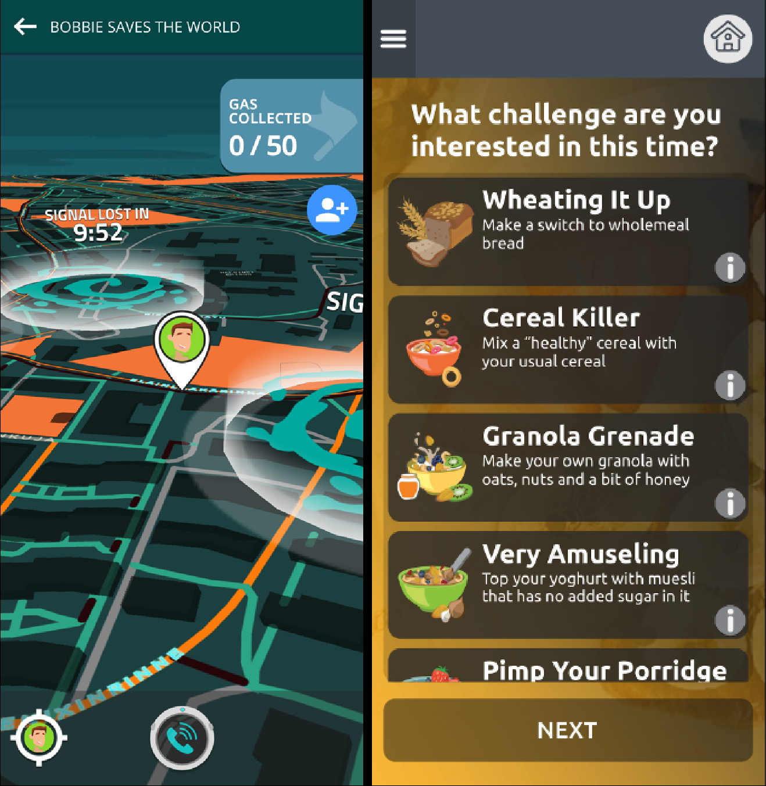

# LifeLab+

## Summary

LifeLab+ is a user-led serious game and digital health intervention developed as part of the **EACH-B (Engaging Adolescents in Changing Behaviour)** research program - a major cluster randomised controlled trial focused on improving diet and physical activity behaviors among teenagers. Commissioned under NIHR (National Institute for Health Research) and developed in collaboration with the MRC Unit at the University of Southampton, the project fused behavioral psychology with game design to drive meaningful, measurable engagement. The EACH-B study targets approximately 2,300 students aged 12-13 from 50 schools, with LifeLab+ serving as the interactive digital component alongside a 3-week science curriculum and teacher training. The program received an Advanced Commendation at the 2020 IEGC Awards. Overall project budget was £2.2m, with £330k directed to the game.

## Development Details

- **Co-design methodology**: We embedded adolescents as co-creators, not just testers. Across iterative cycles, teen participants informed concept formation, interaction patterns, challenge themes, and tone of voice. Structured workshops, rapid prototyping, and in-app telemetry-informed feedback loops ensured design decisions remained youth-centered.

- **Behavioral science integration**: We operationalized psychological principles (e.g., motivation, self-efficacy, habit formation, goal-setting, social reinforcement) into mechanics that encourage small, sustained behavior changes. Gameplay loops aligned with evidence-based behavior change techniques, translated into accessible challenges and micro-rewards.

- **Research partnership**: As part of the EACH-B cluster randomised controlled trial, we worked with the MRC Unit at the University of Southampton to align design sprints with research milestones and evaluation needs. The app was designed using self-determination theory and behavior change techniques, ensuring the product could support robust study designs while remaining engaging and age-appropriate. Secondary outcomes measured include behavioral self-regulation, self-efficacy for healthy eating and physical activity, and quality of life measures.

- **Governance and delivery**: Multi-year roadmap (2017–2022) executed via agile delivery. Regular ethics and safeguarding reviews, adolescent advisory input, and data governance checkpoints informed release gating. We managed a £330k workstream within the £2.2m program, covering experience design, app architecture, feature implementation, and analytics instrumentation.

- **Recognition**: Advanced Commendation at the 2020 IEGC Awards highlighted the project's innovative fusion of youth-led design and health behavior change delivery.

## Technical Aspects

- **Hub-and-spoke architecture**: A central "hub" coordinated access to modular "spokes," including:
  • Behavior challenges for diet and physical activity, with tiered difficulty and streak-based progression
  • Habit tracking and micro-goal setting, with contextual nudges
  • Educational mini-games and interactive learning modules
  • Reflection spaces and progress visualization
  
  This architecture enabled independent evolution of spokes, safer experimentation, and rapid swapping of content or mechanics without destabilizing the core.

- **Modular content pipeline**: A structured content model separated narrative, assets, and configuration, allowing non-technical teams to author and update challenges, tips, and rewards. Feature flags and configuration toggles supported controlled rollouts, A/B comparisons, and research cohorts.

- **Adaptive feedback loops**: Engagement signals (completion rates, dwell time, streak integrity) informed just-in-time prompts, difficulty tuning, and reward calibration. The system could adjust intensity and cadence to reduce drop-off and support habit consolidation.

- **Analytics for research and iteration**: Event-level telemetry supported measurement of engagement, adherence to challenges, and progression through learning modules. Export pathways enabled privacy-preserving aggregation for research analysis. Instrumentation was designed in collaboration with researchers to align with study endpoints while maintaining an engaging UX.

- **Privacy and safety**: Privacy-by-design principles informed data minimization, consent/assent flows appropriate for adolescents, and encryption of data in transit and at rest. Audit trails and role-based controls supported research integrity and safeguarding requirements.

## Impact/Significance

- **Advancing user-led health behavior change**: LifeLab+ demonstrates how co-design with adolescents can be elevated from consultation to core production, directly shaping mechanics that resonate with teen motivations. This strengthened engagement drivers critical for diet and physical activity behavior change.

- **Translating psychology into play**: The project operationalized behavioral constructs into game systems—goal gradients, streaks, timely prompts, and social reinforcement—without resorting to heavy-handed gamification. This balance enhanced both adherence and perceived autonomy.

- **A replicable architecture for serious games in health**: The hub-and-spoke model, analytic instrumentation, and modular content pipeline form a reusable blueprint for future digital health interventions requiring experimentation, cohort management, and ongoing content refresh.

- **Research-ready while youth-friendly**: By aligning technical instrumentation with research questions, the product supports robust evaluations without compromising user experience—a common barrier in health apps for young people.

- **Recognized innovation and sector credibility**: The IEGC Advanced Commendation and the NIHR/MRC collaboration underscore LifeLab+ as a credible, award-recognized exemplar at the intersection of games, design research, and public health.

- **Capacity building**: The project helped establish shared practices between game developers and health researchers, demonstrating how to co-produce interventions that are evidence-informed, ethically grounded, and engaging for the intended audience.

Our's contribution centered on turning adolescent insights and behavioral science into a maintainable, research-capable, and engaging product. LifeLab+ stands as a model for how serious games can deliver real-world value in digital health through rigorous co-design, thoughtful architecture, and measurable engagement.

---

**Project Duration**: 2017-2022  
**Client**: NIHR (National Institute for Health Research)  
**Budget**: £2.2m total project (£330k for the game)  
**Awards**: Advanced Commendation, 2020 IEGC Awards