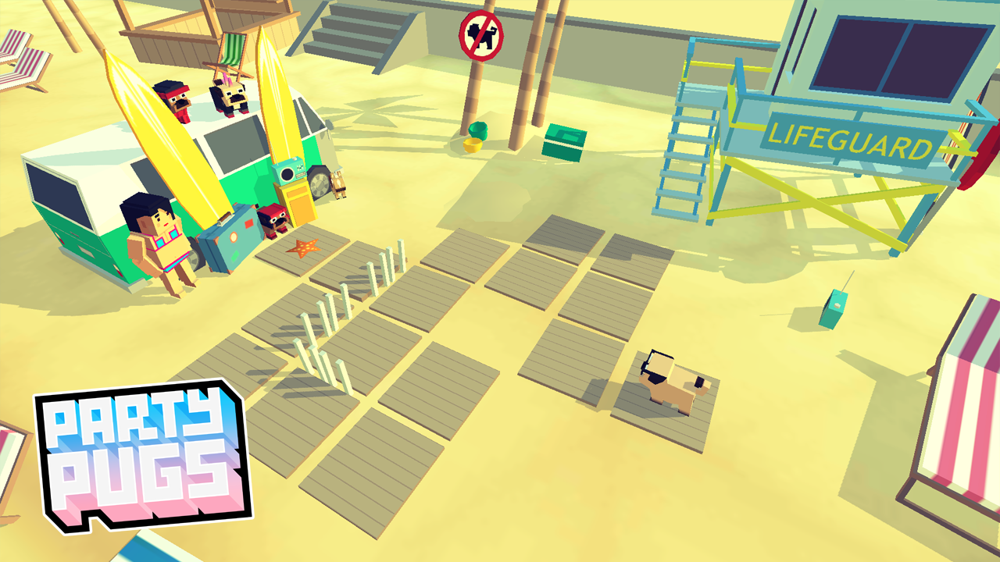

# Party Pugs (2017)

**Year:** 2017  

**Type:** Game Design Consultancy  

## Summary

In addition to building our own titles, we offer design consultancy to game studios, providing flexible on-demand expertise.

We were involved with Channel 4's Party Pugs project, contributing to writing and level design. Our role included providing feedback to the team creating the rest of the levels, helping ensure consistency and quality across the game's content designed for a broad audience.

## Contributions

**Role:** Writing and Level Design  
**Contributions:** 
- Writing and level design for select content
- Providing feedback to the team creating additional levels
- Supporting tone and accessibility considerations for the target audience

This consultancy involved hands-on contribution to specific content areas while supporting the broader development team's work on this accessible, family-friendly game.

## Awards and Recognition

**TIGA Game Industry Awards 2016 - Best Arcade Game Finalist**  
Party Pugs (originally titled "Pug Life") by Steely Glint Games was a finalist in the Best Arcade Game category at the 2016 TIGA Game Industry Awards, competing alongside titles from major studios including Sony Interactive Entertainment Europe and established indie developers.