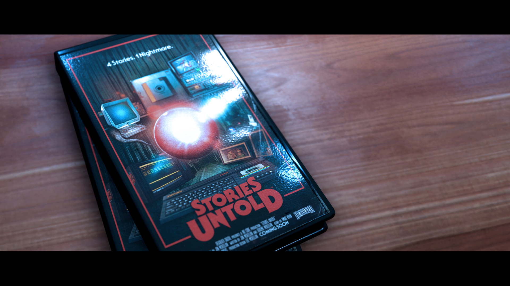
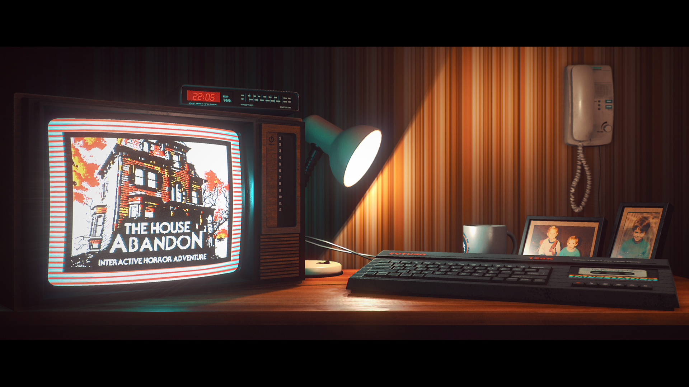

# Stories Untold (2017)

**Year:** 2017  

**Type:** Game Design Consultancy  

## Summary

In addition to building our own titles, we offer design consultancy to game studios, providing flexible on-demand expertise.

We provided consultancy support to NoCode on Stories Untold, contributing to usability analysis for experimental narrative interfaces and content and system cohesion review. Our role was supportive, helping the team balance novelty with readability across their innovative episodic content.

## Contributions

**Role:** Additional Design  
**Contributions:** 
- Usability analysis for experimental narrative interfaces
- Content and system cohesion review
- Supporting balance between innovation and accessibility in narrative delivery

This was a focused consultancy engagement where we provided feedback to assist the development team in refining their groundbreaking approach to interactive storytelling.

## Awards and Recognition

**BAFTA Scotland Game of the Year 2017** - Winner  
Stories Untold was recognized with the prestigious BAFTA Scotland Game of the Year award in 2017, acknowledging its innovative approach to episodic adventure gaming and experimental narrative design.