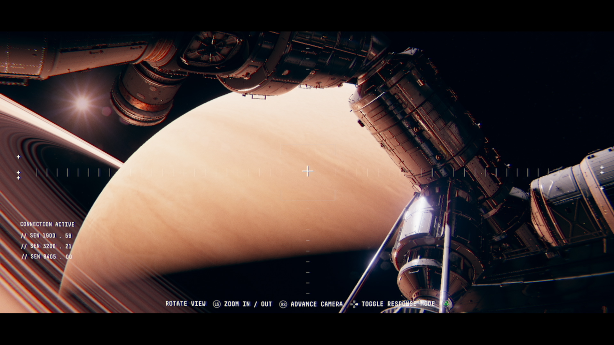

# Observation (2019)

**Year:** 2019  

**Type:** Game Design Consultancy  

## Summary

In addition to building our own titles, we offer design consultancy to game studios, providing flexible on-demand expertise.

We provided consultancy support to NoCode on Observation, contributing to usability analysis for experimental narrative interfaces and content and system cohesion review. Our involvement was limited but focused on helping refine the player experience in this innovative story-driven game.

## Contributions

**Role:** Design  
**Contributions:** 
- Usability analysis for experimental narrative interfaces
- Content and system cohesion review
- Supporting the team's vision for this complex narrative-driven experience

This was a light-touch consultancy engagement where we provided targeted feedback to support the development team's excellent work on this unique project.

## Awards and Recognition

**BAFTA Scotland Best Game 2019** - Winner  
**BAFTA Best British Game 2020** - Winner  
Observation achieved remarkable recognition, winning both the BAFTA Scotland Best Game award in 2019 and the BAFTA Best British Game award in 2020. The game was praised for its innovative approach to sci-fi storytelling and its unique perspective of playing as a space station AI.