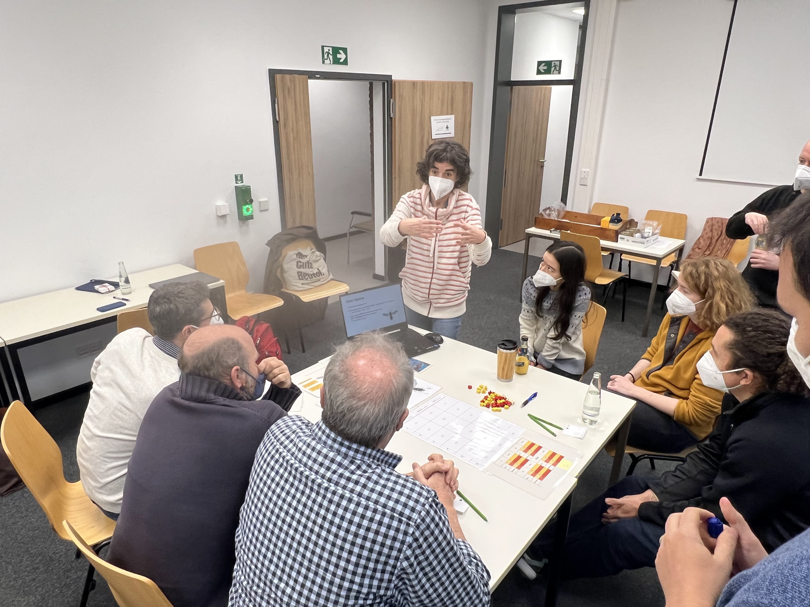
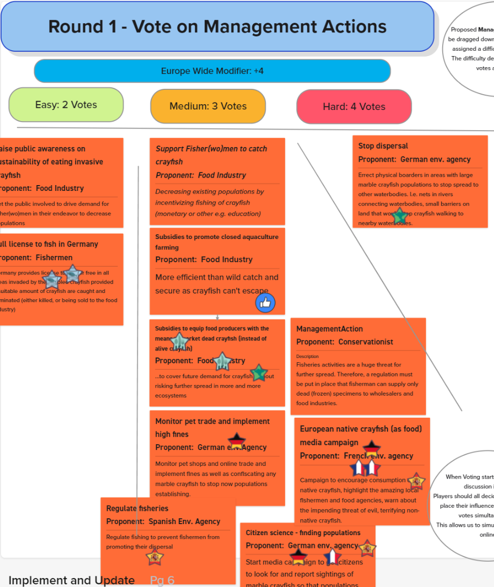

# European BioInvasions

## Summary

European BioInvasions is a "coopetitive" role-playing game we developed as part of two EU-funded research projects: InvasiBES and AlienScenarios. Designed for students, scientists, and stakeholders dealing with biological invasions, the game challenges players to collaborate and compete in managing invasive species across Europe over 60-120 minute sessions. Players vote on management action proposals while navigating changing conditions introduced through event cards, with the shared goal of reducing the impact of invasive species through strategic decision-making.

The game covers four key species—Marbled Crayfish, North American Raccoon, Common Ragweed, and Asian Hornet—with each species offering 4 potential future scenarios and 6-7 unique player roles representing different stakeholder perspectives and priorities. Successfully tested at a workshop in Berlin in 2022, the game was recognized as a finalist in the 2022 International Educational Games Competition for its innovative approach to environmental policy simulation.

## Development Details

- **Research Projects:** EU-funded InvasiBES and AlienScenarios
- **Year:** 2022 (project span 2021–2022)
- **Category:** Coopetitive role-playing game / Environmental education
- **Recognition:** Finalist, 2022 International Educational Games Competition
- **Duration:** 60-120 minutes per session
- **Materials:** Available for download at europeanbioinvasions.ecologygames.eu

We developed the game through collaborative scientific research and iterative design:

- **Research integration:** Built directly from EU-funded scientific research on biological invasions, ensuring accuracy and relevance to current conservation challenges
- **Multi-species focus:** Developed comprehensive scenarios for four key invasive species, each with distinct ecological and management characteristics
- **Stakeholder engagement:** Designed unique player roles reflecting real-world perspectives from researchers, policymakers, conservation groups, and affected communities
- **Workshop testing:** Successfully piloted in Berlin 2022 with scientists and stakeholders to validate gameplay mechanics and educational outcomes
- **Open access materials:** Created downloadable rulebook, printable game components, maps, and cards to maximize accessibility and reuse

## Technical Aspects

### Core Game Mechanics

- **Coopetitive gameplay:** Players must collaborate to address shared threats while competing for limited resources and different stakeholder priorities
- **Role-based perspectives:** 6-7 unique roles per species scenario, each with distinct beliefs, priorities, and constraints reflecting real-world stakeholder positions
- **Democratic decision-making:** Players vote on management action proposals, simulating collective decision processes in environmental governance
- **Event-driven scenarios:** Dynamic event cards introduce changing conditions each round, forcing players to adapt strategies and test resilience of their plans
- **Multi-species complexity:** Four different invasive species (Marbled Crayfish, Raccoon, Ragweed, Asian Hornet) each requiring species-specific management approaches
- **Future scenario planning:** 4 potential future scenarios per species allow exploration of different environmental and policy contexts
- **Game Master facilitation:** Guided sessions with structured debriefing to maximize learning outcomes and policy insights

### Educational Framework

- **European map visualization:** Physical game map tracks species spread and management actions across European regions
- **Evidence-based scenarios:** All species profiles and management options grounded in current scientific research and policy frameworks
- **Collaborative learning:** Group decision-making processes mirror real-world conservation planning and stakeholder engagement
- **Transferable insights:** Game outcomes translate directly to real-world understanding of invasive species management challenges

### Game Materials and Implementation

- **Print-and-play design:** Complete game materials available as free downloads including rulebook, game map, event cards, and player role cards
- **Modular species scenarios:** Each of the four species (Marbled Crayfish, Raccoon, Ragweed, Asian Hornet) functions as a standalone game module
- **Artwork and visualization:** Game components created by artist Kris Tsenova enhance the visual presentation and player engagement
- **Workshop integration:** Materials designed for educational and professional development contexts with clear facilitation guidelines
- **Scalable group sizes:** Flexible player counts accommodate different workshop sizes while maintaining game balance and engagement

## Impact and Significance

### Educational and Scientific Contributions

European BioInvasions demonstrates how collaborative game design can translate complex environmental research into accessible, engaging learning experiences. By grounding gameplay in actual EU-funded research from the InvasiBES and AlienScenarios projects, we created an authentic bridge between scientific knowledge and public understanding of invasive species management.

### Key Innovations

- **Research-to-practice translation:** Transforms abstract ecological data and policy frameworks into hands-on decision-making experiences that reveal the human dimensions of environmental management
- **Stakeholder perspective integration:** Each role authentically represents real-world viewpoints from researchers, policymakers, conservationists, and affected communities, fostering empathy and systems thinking
- **Collaborative problem-solving:** The coopetitive gameplay structure mirrors actual environmental governance challenges where stakeholders must balance competing interests while addressing shared threats
- **Open access impact:** Free availability of all game materials maximizes educational reach and enables widespread adoption in academic and professional development contexts
- **Modular reusability:** Species-based modules allow educators to focus on locally relevant invasive species while maintaining consistent learning frameworks

### Recognition and Reach

The game's recognition as a 2022 International Educational Games Competition finalist validates its contribution to environmental education and serious games design. Its development within EU research frameworks positions it as a model for how gaming methodologies can enhance scientific communication and stakeholder engagement in conservation contexts.

European BioInvasions exemplifies how game-based learning can make complex environmental challenges accessible while maintaining scientific rigor, advancing both educational gaming practices and public engagement with conservation science.

## Developing Stakeholder Workshop Games

*Map of the current state of raccoon invasions across Europe mid-game at a workshop*

*Asian Hornet variation of the game being played at a workshop*

*Raccoon scenario of the game being played at a workshop*

Our work on European BioInvasions demonstrates our experience developing games specifically for stakeholder engagement and workshop contexts. The game serves as a facilitated experience where participants representing different perspectives must negotiate solutions to complex environmental challenges.

We have successfully deployed the game in multiple stakeholder workshops focusing on different invasive species scenarios. These include dedicated sessions examining Asian hornet invasion management and North American raccoon population control strategies. Each workshop brings together relevant experts, policymakers, and affected community representatives to explore species-specific management approaches through collaborative gameplay.

The workshop implementation includes visual aids such as maps showing the current state of invasive species distribution, allowing participants to understand the scope and geographical spread of the biological invasion. These visual elements help ground abstract policy discussions in concrete spatial and temporal realities, enabling more informed decision-making during gameplay sessions.

Our approach to stakeholder workshop games emphasizes:

- **Multi-perspective representation:** Ensuring all relevant stakeholder viewpoints are authentically represented through distinct player roles
- **Visual communication:** Using maps, cards, and other visual aids to make complex information accessible during group decision-making
- **Structured facilitation:** Providing clear frameworks for group discussion, negotiation, and consensus-building
- **Real-world application:** Designing mechanics that translate directly to actual policy and management contexts
- **Collaborative learning:** Creating experiences where participants learn from each other's perspectives and expertise

This expertise in stakeholder workshop game design positions us to develop similar collaborative decision-making tools for other complex policy domains requiring multi-actor coordination and negotiation.

## Digital Prototyping and Remote Testing

*Representation of the game as prototyped in a Miro-like platform, facilitating online play between physical sessions*

*Map of marbled crayfish spread in Europe in the digital version*

To accelerate our design iteration process between formal stakeholder workshops, we developed digital prototypes of European BioInvasions using online collaborative tools similar to Miro. This approach allowed us to test gameplay mechanics, refine role balance, and gather feedback from participants remotely without requiring the logistical coordination of full in-person workshops.

The digital prototyping process enabled rapid iteration cycles where we could:

- **Test rule variations** and mechanical adjustments with smaller groups of participants
- **Refine stakeholder roles** and their respective objectives based on remote feedback sessions
- **Validate scenario balance** across different species modules before committing to physical workshop deployments
- **Engage international participants** who couldn't attend regional workshops but provided valuable domain expertise
- **Document gameplay patterns** more easily through digital interaction logs and screen recordings

This hybrid development approach—combining digital prototyping with formal stakeholder workshops—proved essential for creating a robust, well-balanced game. The digital versions served as testing grounds for new ideas and mechanics, while the physical workshops provided the authentic stakeholder engagement and validation needed for educational impact.

Our experience with digital-to-physical game development demonstrates our capability to leverage remote collaboration tools for efficient game design processes, particularly valuable for complex multi-stakeholder scenarios requiring extensive iteration and refinement.