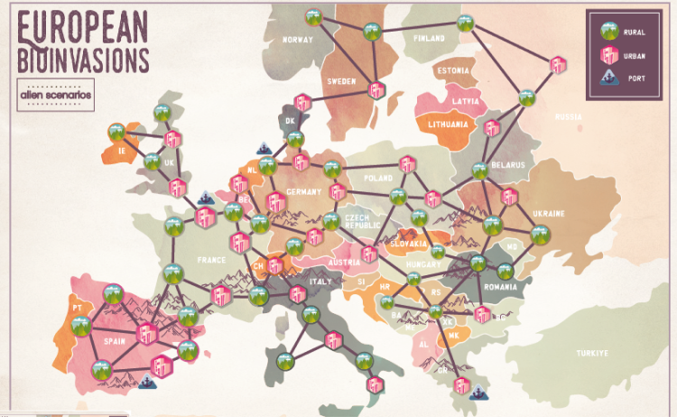
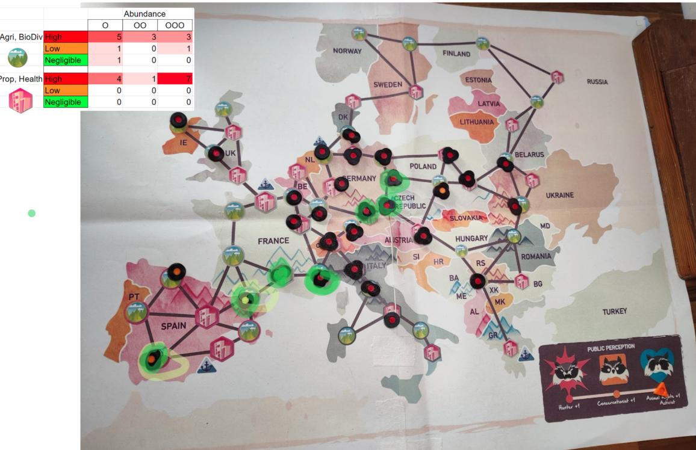

# European BioInvasions

## Zusammenfassung

European BioInvasions ist ein "koopetitives" Rollenspiel, das wir im Rahmen zweier EU-finanzierter Forschungsprojekte entwickelt haben: InvasiBES und AlienScenarios. Konzipiert für Studierende, Wissenschaftlerinnen und Wissenschaftler sowie Stakeholder, die sich mit biologischen Invasionen befassen, fordert das Spiel die Spielenden heraus, in 60-120-minütigen Sitzungen bei der Bewältigung invasiver Arten in Europa zu kooperieren und zu konkurrieren. Die Spielenden stimmen über Vorschläge zu Managementmaßnahmen ab, während sie sich durch Ereigniskarten eingeführten, sich verändernden Rahmenbedingungen navigieren, mit dem gemeinsamen Ziel, die Auswirkungen invasiver Arten durch strategische Entscheidungsfindung zu verringern.

Das Spiel umfasst vier Schlüsselarten – Marmorkrebs, Nordamerikanischer Waschbär, Beifuß-Ambrosie und Asiatische Hornisse – wobei jede Art 4 potenzielle Zukunftsszenarien und 6-7 einzigartige Spielerrollen bietet, die unterschiedliche Stakeholder-Perspektiven und Prioritäten repräsentieren. Erfolgreich bei einem Workshop in Berlin im Jahr 2022 getestet, wurde das Spiel für seinen innovativen Ansatz zur Simulation von Umweltpolitik als Finalist bei der 2022 International Educational Games Competition anerkannt.

## Entwicklungsdetails

- **Forschungsprojekte:** EU-finanzierte InvasiBES und AlienScenarios
- **Jahr:** 2022 (Projektzeitraum 2021–2022)
- **Kategorie:** Koopetitives Rollenspiel / Umweltbildung
- **Auszeichnung:** Finalist, 2022 International Educational Games Competition
- **Dauer:** 60-120 Minuten pro Sitzung
- **Materialien:** Zum Download verfügbar unter europeanbioinvasions.ecologygames.eu

Wir haben das Spiel durch kollaborative wissenschaftliche Forschung und iteratives Design entwickelt:

- **Forschungsintegration:** Direkt auf EU-finanzierter wissenschaftlicher Forschung zu biologischen Invasionen basierend, um Genauigkeit und Relevanz für aktuelle Naturschutzherausforderungen sicherzustellen
- **Mehrarten-Fokus:** Umfassende Szenarien für vier zentrale invasive Arten entwickelt, jede mit unterschiedlichen ökologischen und Managementeigenschaften
- **Stakeholder-Einbindung:** Einzigartige Spielerrollen gestaltet, die reale Perspektiven von Forschenden, Entscheidungsträgern, Naturschutzgruppen und betroffenen Gemeinschaften widerspiegeln
- **Workshop-Tests:** 2022 in Berlin erfolgreich mit Wissenschaftlern und Stakeholdern pilotiert, um Spielmechaniken und Bildungsergebnisse zu validieren
- **Open-Access-Materialien:** Erstellte, herunterladbare Spielregeln, druckbare Spielkomponenten, Karten und Kartenstapel zur Maximierung der Zugänglichkeit und Wiederverwendbarkeit

## Technische Aspekte

### Kernmechaniken des Spiels

- **Koopetitives Gameplay:** Spielende müssen zusammenarbeiten, um gemeinsamen Bedrohungen zu begegnen, während sie um begrenzte Ressourcen und unterschiedliche Stakeholder-Prioritäten konkurrieren
- **Rollenbasierte Perspektiven:** 6-7 einzigartige Rollen pro Artenszenario, jeweils mit eigenen Überzeugungen, Prioritäten und Einschränkungen, die reale Stakeholder-Positionen widerspiegeln
- **Demokratische Entscheidungsfindung:** Spielende stimmen über Vorschläge zu Managementmaßnahmen ab und simulieren kollektive Entscheidungsprozesse in der Umweltgovernance
- **Ereignisgetriebene Szenarien:** Dynamische Ereigniskarten führen in jeder Runde veränderte Bedingungen ein, wodurch Spielende ihre Strategien anpassen und die Resilienz ihrer Pläne testen müssen
- **Komplexität über mehrere Arten:** Vier unterschiedliche invasive Arten (Marmorkrebs, Waschbär, Ambrosie, Asiatische Hornisse), die jeweils artspezifische Managementansätze erfordern
- **Planung zukünftiger Szenarien:** 4 potenzielle Zukunftsszenarien pro Art ermöglichen die Erkundung unterschiedlicher Umwelt- und Politik-Kontexte
- **Moderation durch die Spielleitung:** Geführte Sitzungen mit strukturierter Nachbesprechung zur Maximierung von Lernerfolgen und Policy-Insights

### Bildungsrahmen

- **Visualisierung auf Europakarte:** Physische Spielkarte verfolgt die Ausbreitung der Arten und Managementmaßnahmen über europäische Regionen
- **Evidenzbasierte Szenarien:** Alle Artprofile und Managementoptionen sind in aktueller wissenschaftlicher Forschung und Politikrahmen verankert
- **Kollaboratives Lernen:** Gruppenentscheidungsprozesse spiegeln reale Naturschutzplanung und Stakeholder-Einbindung wider
- **Übertragbare Erkenntnisse:** Spielergebnisse lassen sich direkt auf das Verständnis realer Herausforderungen im Management invasiver Arten übertragen

### Spielmaterialien und Umsetzung

- **Print-and-Play-Design:** Vollständige Spielmaterialien als kostenlose Downloads, einschließlich Regelwerk, Spielkarte, Ereigniskarten und Spielerrollen-Karten
- **Modulare Artenszenarien:** Jede der vier Arten (Marmorkrebs, Waschbär, Ambrosie, Asiatische Hornisse) fungiert als eigenständiges Spielmodul
- **Artwork und Visualisierung:** Von der Künstlerin Kris Tsenova gestaltete Spielkomponenten verbessern die visuelle Darstellung und die Einbindung der Spielenden
- **Workshop-Integration:** Materialien für Bildungs- und Fortbildungskontexte mit klaren Moderationsanleitungen ausgelegt
- **Skalierbare Gruppengrößen:** Flexible Spielerzahlen ermöglichen unterschiedliche Workshop-Größen bei gleichzeitiger Wahrung von Spielbalance und Engagement

## Wirkung und Bedeutung

### Bildungs- und wissenschaftliche Beiträge

European BioInvasions zeigt, wie kollaboratives Spieldesign komplexe Umweltforschung in zugängliche, ansprechende Lernerfahrungen übersetzen kann. Indem das Gameplay auf tatsächlicher, EU-finanzierter Forschung aus den Projekten InvasiBES und AlienScenarios beruht, haben wir eine authentische Brücke zwischen wissenschaftlichem Wissen und öffentlichem Verständnis des Managements invasiver Arten geschaffen.

### Zentrale Innovationen

- **Übersetzung von Forschung in Praxis:** Verwandelt abstrakte ökologische Daten und Politikrahmen in praktische Entscheidungserfahrungen, die die menschlichen Dimensionen der Umweltsteuerung sichtbar machen
- **Integration von Stakeholder-Perspektiven:** Jede Rolle repräsentiert authentisch reale Sichtweisen von Forschenden, Entscheidungsträgern, Naturschützern und betroffenen Gemeinschaften und fördert Empathie und systemisches Denken
- **Kollaboratives Problemlösen:** Die koopetitive Spielstruktur spiegelt reale Herausforderungen der Umweltgovernance wider, bei denen Stakeholder konkurrierende Interessen ausbalancieren müssen, während sie gemeinsamen Bedrohungen begegnen
- **Open-Access-Wirkung:** Die kostenlose Verfügbarkeit aller Spielmaterialien maximiert die Bildungsreichweite und ermöglicht eine breite Nutzung in akademischen und beruflichen Kontexten
- **Modulare Wiederverwendbarkeit:** Artenbasierte Module erlauben es Lehrenden, sich auf lokal relevante invasive Arten zu konzentrieren, bei gleichzeitiger Beibehaltung konsistenter Lernrahmen

### Anerkennung und Reichweite

Die Anerkennung des Spiels als Finalist der 2022 International Educational Games Competition bestätigt seinen Beitrag zur Umweltbildung und zum Design von Serious Games. Seine Entwicklung innerhalb von EU-Forschungsrahmen positioniert es als Modell dafür, wie spielbasierte Methoden die wissenschaftliche Kommunikation und die Stakeholder-Einbindung im Naturschutz verbessern können.

European BioInvasions veranschaulicht, wie spielbasiertes Lernen komplexe Umweltprobleme zugänglich machen kann, während wissenschaftliche Strenge gewahrt bleibt, und fördert sowohl die Praxis des Bildungsspiels als auch die öffentliche Auseinandersetzung mit der Naturschutzwissenschaft.

## Entwicklung von Stakeholder-Workshop-Spielen

*Karte des aktuellen Stands der Waschbär-Invasionen in Europa zur Spielmitte in einem Workshop*

*Variante zur Asiatischen Hornisse wird in einem Workshop gespielt*

*Waschbär-Szenario des Spiels, das in einem Workshop gespielt wird*

Unsere Arbeit an European BioInvasions zeigt unsere Erfahrung in der Entwicklung von Spielen speziell für die Stakeholder-Einbindung und Workshop-Kontexte. Das Spiel dient als moderierte Erfahrung, bei der Teilnehmende mit unterschiedlichen Perspektiven Lösungen für komplexe Umweltprobleme aushandeln müssen.

Wir haben das Spiel erfolgreich in mehreren Stakeholder-Workshops zu verschiedenen Szenarien invasiver Arten eingesetzt. Dazu gehören eigens durchgeführte Sitzungen zur Bewältigung der Invasion der Asiatischen Hornisse sowie Strategien zur Kontrolle der Bestände des Nordamerikanischen Waschbären. Jeder Workshop bringt relevante Fachleute, Entscheidungsträger und Vertreter betroffener Gemeinschaften zusammen, um artspezifische Managementansätze durch kollaboratives Gameplay zu erkunden.

Die Workshop-Umsetzung umfasst visuelle Hilfsmittel wie Karten, die den aktuellen Stand der Verbreitung invasiver Arten zeigen, sodass die Teilnehmenden den Umfang und die geografische Ausbreitung der biologischen Invasion verstehen. Diese visuellen Elemente verankern abstrakte Politikdiskussionen in konkreten räumlichen und zeitlichen Realitäten und ermöglichen fundiertere Entscheidungen während der Spielesitzungen.

Unser Ansatz für Stakeholder-Workshop-Spiele betont:

- **Mehrperspektivische Darstellung:** Sicherstellung, dass alle relevanten Stakeholder-Sichtweisen durch unterschiedliche Spielerrollen authentisch repräsentiert sind
- **Visuelle Kommunikation:** Einsatz von Karten, Kartenstapeln und anderen visuellen Hilfen, um komplexe Informationen in Gruppenentscheidungen zugänglich zu machen
- **Strukturierte Moderation:** Bereitstellung klarer Rahmen für Gruppendiskussion, Verhandlung und Konsensbildung
- **Praxisnähe:** Entwicklung von Mechaniken, die sich direkt auf reale Politik- und Managementkontexte übertragen lassen
- **Kollaboratives Lernen:** Schaffung von Erfahrungen, bei denen Teilnehmende voneinander lernen – aus Perspektiven und Expertise der jeweils anderen

Diese Expertise im Design von Stakeholder-Workshop-Spielen versetzt uns in die Lage, ähnliche kollaborative Entscheidungswerkzeuge für andere komplexe Politikfelder zu entwickeln, die Koordination und Verhandlung zwischen mehreren Akteuren erfordern.

## Digitale Prototypisierung und Remote-Tests

*Darstellung des Spiels, prototypisiert auf einer Miro-ähnlichen Plattform, die Online-Spiel zwischen physischen Sitzungen erleichtert*

*Karte der Ausbreitung des Marmorkrebses in Europa in der digitalen Version*

Um unseren Design-Iterationsprozess zwischen formellen Stakeholder-Workshops zu beschleunigen, haben wir digitale Prototypen von European BioInvasions mit Online-Kollaborationstools ähnlich Miro entwickelt. Dieser Ansatz ermöglichte es uns, Spielmechaniken zu testen, Rollen-Balancing zu verfeinern und Feedback von Teilnehmenden remote zu sammeln, ohne die logistische Koordination vollständiger Präsenz-Workshops zu benötigen.

Der digitale Prototypisierungsprozess ermöglichte schnelle Iterationszyklen, in denen wir:

- **Regelvarianten testen** und mechanische Anpassungen mit kleineren Gruppen von Teilnehmenden vornehmen konnten
- **Stakeholder-Rollen verfeinern** und deren jeweilige Ziele auf Basis von Remote-Feedback-Sitzungen anpassen konnten
- **Szenario-Balance validieren** über verschiedene Artenmodule hinweg, bevor wir uns auf physische Workshop-Durchführungen festlegten
- **Internationale Teilnehmende einbinden** konnten, die nicht an regionalen Workshops teilnehmen konnten, aber wertvolle Fachexpertise einbrachten
- **Spielmuster dokumentieren** konnten, erleichtert durch digitale Interaktionsprotokolle und Bildschirmaufzeichnungen

Dieser hybride Entwicklungsansatz – die Kombination aus digitaler Prototypisierung und formellen Stakeholder-Workshops – erwies sich als entscheidend für die Erstellung eines robusten, ausgewogenen Spiels. Die digitalen Versionen dienten als Testfelder für neue Ideen und Mechaniken, während die physischen Workshops die authentische Stakeholder-Einbindung und Validierung für den Bildungserfolg lieferten.

Unsere Erfahrung mit der Entwicklung vom Digitalen zum Physischen zeigt unsere Fähigkeit, Remote-Zusammenarbeitstools für effiziente Spieldesign-Prozesse zu nutzen – besonders wertvoll für komplexe Multi-Stakeholder-Szenarien, die umfangreiche Iteration und Verfeinerung erfordern.