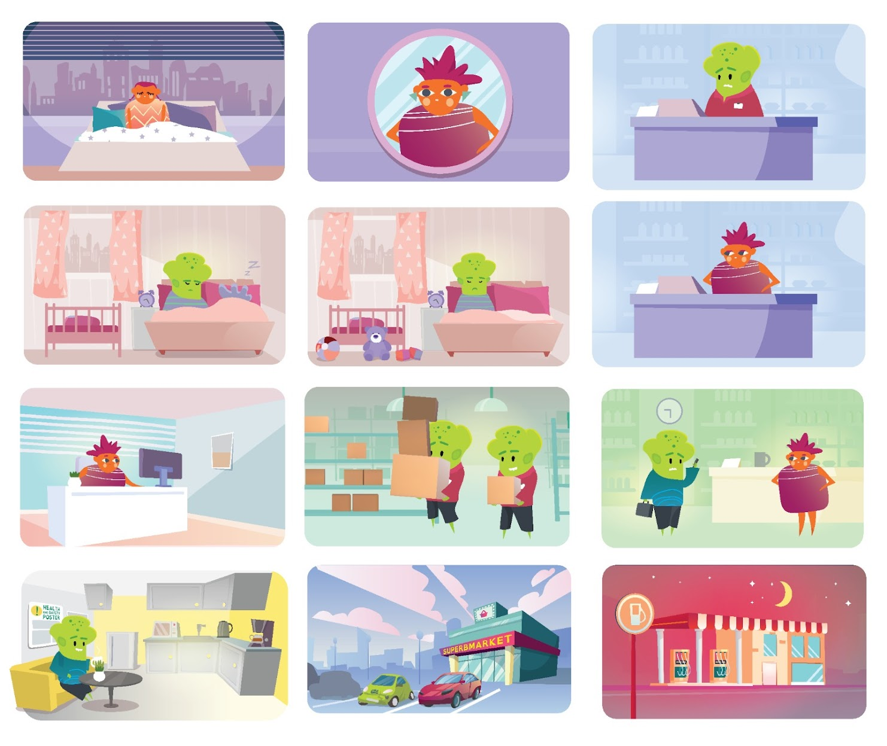

# SuperbMarket (2022)

## Summary

SuperbMarket is a serious game we developed for Glasgow University in 2021-2022, exploring the complex interplay between identity, health, and business decisions in the context of Decent Working conditions and the Real Living Wage. Set within a contemporary supermarket operation, the project positions learners to explore practical trade-offs across staff wellbeing, operational performance, and financial viability. The game was recognized as a finalist in the 2022 IEGA awards, acknowledging its educational rigor and relevance to contemporary workplace issues.

## Development Details

  
**Client:** Glasgow University  
**Year:** 2021-2022  
**Category:** Serious Game / Educational Application  
**Awards:** 2022 IEGA Finalist

We developed this project from Glasgow University's need for an interactive tool to transform abstract policy discussions—such as living wage adoption, scheduling practices, and workplace health—into concrete, navigable decision spaces that surface consequences for both individuals and organizations.

## Technical Aspects

### Core Mechanics
- **Character-driven narratives:** Players experience the story through the perspectives of Lee (experienced worker with family responsibilities) or Bo (student balancing work and studies), along with manager Jo making hiring and operational decisions
- **Workplace challenge simulation:** Real-world scenarios including car trouble, childcare conflicts, study pressures, and workplace safety incidents that affect employee performance and wellbeing
- **Decision consequence system:** Player choices around hiring criteria (minimum wage vs. experience, flexibility vs. company loyalty) and management responses (support vs. discipline) create branching story outcomes
- **Progressive difficulty:** Starting with everyday workplace challenges that escalate to serious incidents, requiring players to adapt policies and management approaches
- **Multiple endings:** Different story paths based on employee choices (second job, quitting, workplace accidents) and management responses to create replay value

### Technical Implementation
- **Ink narrative scripting:** Built using the Ink interactive fiction engine for robust branching dialogue and state management across complex story structures
- **Character state tracking:** Dynamic variables monitor employee stress, motivation, financial pressure, and manager attitudes to drive realistic story progression
- **Visual novel presentation:** Character positioning, backgrounds, and visual props enhance the narrative experience while maintaining focus on story and decisions
- **Modular story structure:** Separate narrative threads for different characters allow for complex interactions while maintaining code organization
- **Real-time consequence visualization:** Story outcomes immediately reflect the impact of policy decisions on employee wellbeing and business operations
- **Educational integration:** Designed for classroom use with clear learning moments embedded in authentic workplace scenarios

## Educational Objectives

SuperbMarket targets multiple learning outcomes across business, public health, and social policy contexts:

- **Systems thinking:** Connect pay policy, staffing, demand fluctuations, and wellbeing outcomes
- **Ethical decision-making:** Identify stakeholder impacts and reason through competing priorities
- **Decent work literacy:** Distinguish Real Living Wage from minimum wage frameworks and interpret implications of workplace policies
- **Identity awareness:** Understand how intersecting identities (age, caregiving status, disability) shape workplace experiences
- **Evidence interpretation:** Translate simulation insights into actionable recommendations

## Impact and Significance

### Academic Collaboration
Our partnership with Glasgow University grounded mechanics and scenarios in course objectives and research questions around fair work. The game functions as a living laboratory for studying decision-making under social and operational pressures, with telemetry and reflective prompts enabling pre/post analysis of learner reasoning.

### Industry Recognition
SuperbMarket's selection as a 2022 IEGA finalist signaled to both educators and industry stakeholders that complex labor topics can be taught through engaging, data-informed play. The recognition helps normalize simulation-based exploration of fair work in management education and employer training.

### Innovation in Serious Games
- **Authentic workplace narratives:** Grounds policy discussions in realistic employee experiences including financial pressure, family responsibilities, and career development challenges
- **Empathy-driven design:** Players experience workplace conditions from multiple perspectives, fostering understanding of how management decisions affect individual lives
- **Consequences over mechanics:** Story outcomes directly reflect real-world workplace dynamics rather than abstract game systems, making policy implications tangible
- **Intersectional representation:** Lee's family responsibilities and Bo's student status represent different worker demographics, highlighting how policies affect diverse employees differently
- **Progressive revelation:** Complex workplace issues emerge naturally through story progression, avoiding heavy-handed educational messaging
- **Replayability for learning:** Multiple story paths encourage exploration of different management approaches and their consequences

SuperbMarket demonstrates how narrative-driven serious games can effectively address contemporary workplace challenges by centering human experiences within policy frameworks. Our focus on authentic character development and realistic workplace scenarios makes decent work principles accessible through engaging, consequential storytelling that advances educational gaming in labor and business contexts.