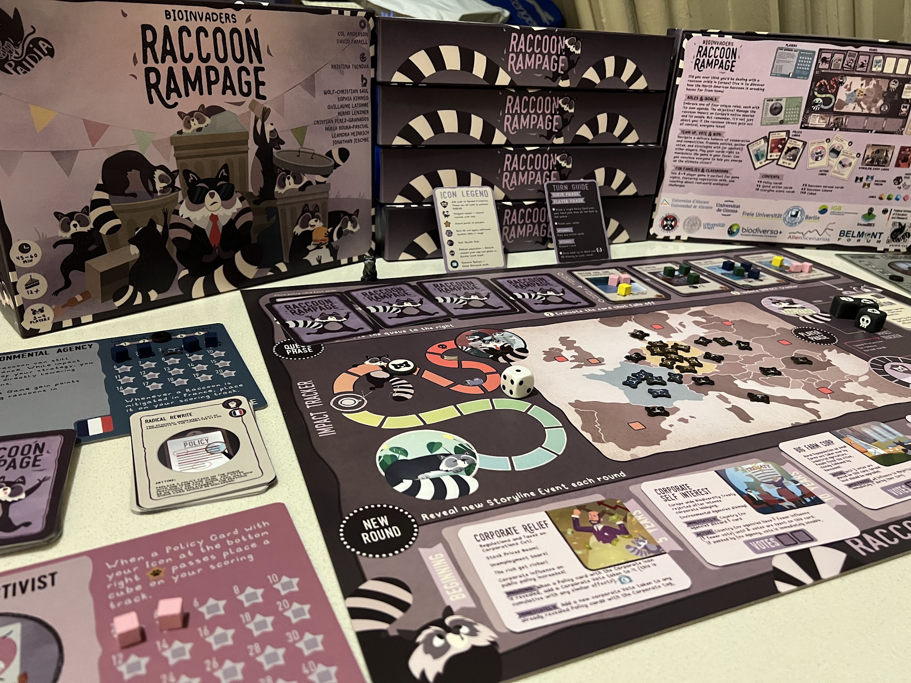

# BioInvasions: Raccoon Rampage (2024)

## Summary

BioInvasions: Raccoon Rampage is a semi‑cooperative board game about raccoon invasions in Europe, representing the evolution of our 2022 European BioInvasions work into a focused, single-species exploration. Developed from EU-funded research projects InvasiBES and AlienScenarios, this 45-60 minute experience blends strategic planning with social negotiation as 3-4 players assume the roles of Environmental Agencies, Hunters, and Animal Rights Lobbyists—each with distinct objectives—while collectively managing the ecological and societal impacts of a rapidly spreading invasive species.

The game is available in multiple formats: free to play on Tabletopia, free print-and-play download for home printing, and we are in the final stages of arranging an online store where people can purchase the full quality physical version. The game has been validated through academic research, with a Master's thesis evaluation of 86 participants demonstrating significant increases in invasive species knowledge and improved awareness of the need for cooperative, multi-stakeholder management strategies.

## Development Details

**Research Foundation:** Built directly from EU-funded InvasiBES and AlienScenarios research projects, translating cutting-edge invasion biology and scenario modeling into accessible gameplay mechanics.

**Continuation of European BioInvasions (2022):** This title advances our European BioInvasions line by narrowing focus to raccoon invasions specifically, allowing for deeper role asymmetries and policy trade-offs while extending the semi-cooperative negotiation framework in a more compact, 45–60 minute session suitable for repeated play.

**Art and Design:** Beautiful artwork gives the game instant table appeal.

**Iterative Digital and Physical Development:** We employed a hybrid development approach, alternating between in-person stakeholder sessions and digital prototyping to accelerate iteration and gather comprehensive feedback from diverse participants.

## Digital Prototyping and Development Process

*Early digital prototype developed on PlayingCards.io for rapid playtesting between in-person stakeholder sessions*

  
*Final production-quality version available on Tabletopia, representing the culmination of our iterative design process*

Our development process strategically combined physical and digital playtesting to maximize feedback quality and iteration speed:

**Phase 1 - Physical Stakeholder Sessions:** Initial concept development and core mechanic validation conducted through in-person workshops with environmental scientists, policymakers, and advocacy representatives.

**Phase 2 - Digital Rapid Prototyping:** Between formal stakeholder meetings, we developed playable prototypes on PlayingCards.io, enabling quick rule adjustments, card balance tweaks, and mechanic experimentation with smaller test groups.

**Phase 3 - Stakeholder Validation:** Refined mechanics and content were tested in subsequent in-person sessions, where stakeholder feedback could validate both gameplay improvements and educational authenticity.

**Phase 4 - Production Digital Implementation:** Final version delivered through Tabletopia platform, ensuring free accessibility for educational and research contexts while maintaining high production values and smooth digital board game experience.

This iterative approach allowed us to maintain the authentic stakeholder input essential for educational credibility while achieving the rapid iteration cycles necessary for polished game design. The digital prototyping phases proved particularly valuable for testing mechanical complexity and player engagement between the more formal stakeholder validation sessions.

## Gameplay and Mechanics

**Core Structure:**
- **Players:** 3–4 participants, ages 12+
- **Duration:** 45–60 minutes per session
- **Format:** Semi-cooperative strategy game with competitive elements
- **Components:** Large game board, over 160 cards with unique artwork, four player decks, cubes and dice
- **Unique Selling Point:** "Yes, you have to work together - BUT you also want to beat everyone else!"

**Player Roles and Objectives:**
Four unique player roles, each featuring individual player mats, unique card decks, and specific objectives:
- **Environmental Agencies:** Prioritize biodiversity protection and long-term ecosystem resilience through science-based management approaches
- **Hunters:** Emphasize practical control measures and cost-effective population management through direct intervention
- **Animal Rights Activists:** Advocate humane approaches and public sentiment considerations, challenging harsh interventions while promoting ethical alternatives
- **Additional Role:** [Fourth role varies based on scenario]

Each role creates tension between the shared mission of stopping raccoon invasion and individual competitive goals, driving dynamic alliances and strategic decision-making.

**Card-Driven Gameplay:**

*Policy Cards (Black Border):* Standard and unique cards that players queue and vote on collectively. These represent management strategies and interventions that require democratic decision-making while serving individual strategic goals.

*Action Cards (White Border):* Standard and unique cards allowing players to "mess with" other participants through mechanics like stealing votes, swapping policies, and manipulating vote results, adding competitive tension to cooperative objectives.

*Story Cards:* Introduced each round to create narrative pressure between group mission and personal goals, providing context and escalating challenges as the raccoon invasion spreads.

**Game Flow:**
1. **Story Development:** New story cards introduce evolving challenges and narrative context
2. **Policy Queuing:** Players propose management measures using policy cards
3. **Negotiation and Voting:** Build coalitions and vote on policies while pursuing individual objectives
4. **Action Manipulation:** Deploy action cards to influence outcomes, steal votes, or disrupt other players' strategies
5. **Impact Resolution:** Resolve collective and individual consequences based on decisions made
6. **Adaptive Strategy:** Adjust approaches as new story elements and player interactions reshape the game state

## Educational Framework and Impact

**Academic Validation:** A comprehensive before/after study with 86 participants demonstrated the game's educational effectiveness:
- **Knowledge Gains:** Significant increase in invasive species knowledge after gameplay
- **Perspective Shifts:** Participants' views of raccoons evolved from predominantly positive to more informed, neutral positions that acknowledge both animal welfare and ecological impact considerations
- **Systems Thinking:** Improved awareness of the need for cooperative, multi-stakeholder management strategies in environmental governance
- **Engagement Quality:** While some complexity limitations were identified for future refinement, overall potential as an educational tool was validated

**Curriculum Integration:** The game supports learning objectives across environmental science, policy studies, and stakeholder engagement curricula, with particular relevance for:
- Invasion ecology and biodiversity conservation
- Environmental policy and governance
- Multi-stakeholder decision-making processes
- Science-policy interface dynamics

## Technical Innovation and Implementation

**Research-to-Practice Translation:** Transforms abstract ecological data and policy frameworks from EU-funded research into hands-on decision-making experiences that reveal the human dimensions of environmental management.

**Stakeholder Perspective Authenticity:** Each role authentically represents real-world viewpoints from environmental agencies, wildlife management professionals, and advocacy organizations, fostering empathy and systems thinking about complex conservation challenges.

**Democratic Decision-Making Simulation:** The proposal-and-voting system mirrors actual environmental governance processes where stakeholders must balance competing interests while addressing shared threats to ecosystem stability.

**Accessible Digital Platform:** Free availability through Tabletopia maximizes educational reach and enables widespread adoption in academic, professional development, and public engagement contexts.

## Significance and Legacy

BioInvasions: Raccoon Rampage demonstrates how focused, species-specific serious games can deepen engagement with complex environmental challenges while maintaining scientific rigor. By concentrating on raccoon invasions specifically, we created space for more nuanced exploration of the ethical, practical, and ecological trade-offs that characterize real-world invasive species management.

The game's validation through academic research establishes it as a credible educational tool, while its development from EU-funded scientific research ensures that gameplay mechanics reflect current understanding of invasion biology and policy dynamics. As a continuation of our 2022 European BioInvasions work, Raccoon Rampage advances our methodology for translating research into engaging, collaborative learning experiences.

The project exemplifies our approach to research-informed game design: grounding mechanics in scientific evidence, validating educational outcomes through rigorous evaluation, and ensuring accessibility through digital platforms that support widespread adoption in educational and professional contexts.

---

**Year:** 2024  
**Client/Funding:** EU-funded research projects (InvasiBES and AlienScenarios)  
**Platform:** Tabletopia (free to play), download and print at home, store coming soon  
**Website:** https://raccoonrampage.ecologygames.eu/  
**Academic Validation:** Master's thesis evaluation with 86 participants

## Public Engagement and Events

*Players enjoying BioInvasions: Raccoon Rampage at Essen Spiel 2023, demonstrating the game's appeal to both gaming enthusiasts and educational audiences.*

The game has been successfully demonstrated at major gaming conventions, including Essen Spiel 2023, where it attracted both serious gaming enthusiasts and educators interested in environmental topics. These public demonstrations validate the game's accessibility and engagement potential beyond academic contexts, showing how research-based serious games can reach broader audiences through gaming culture and convention networks.