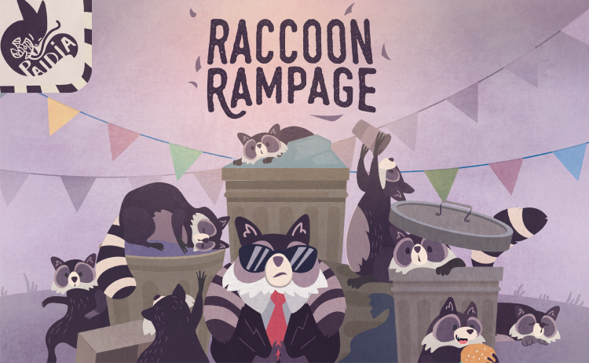
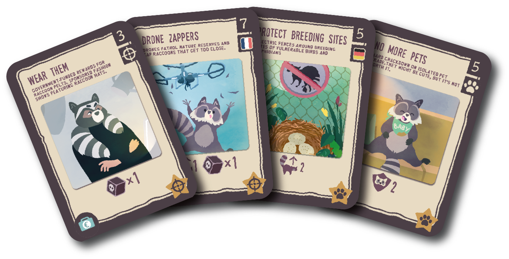
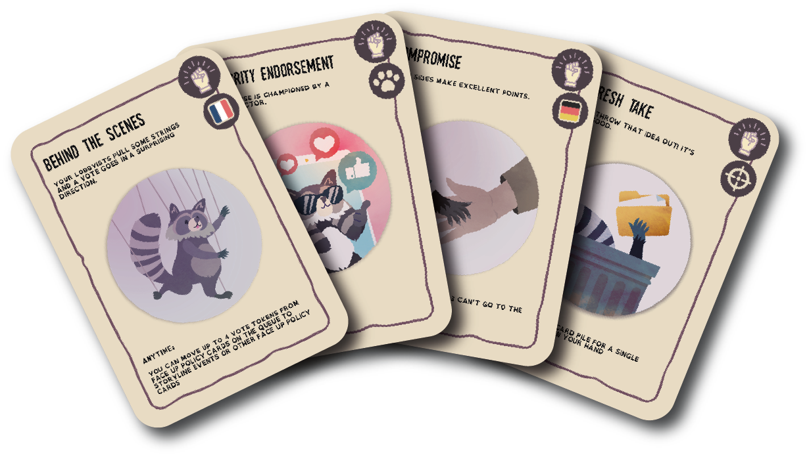
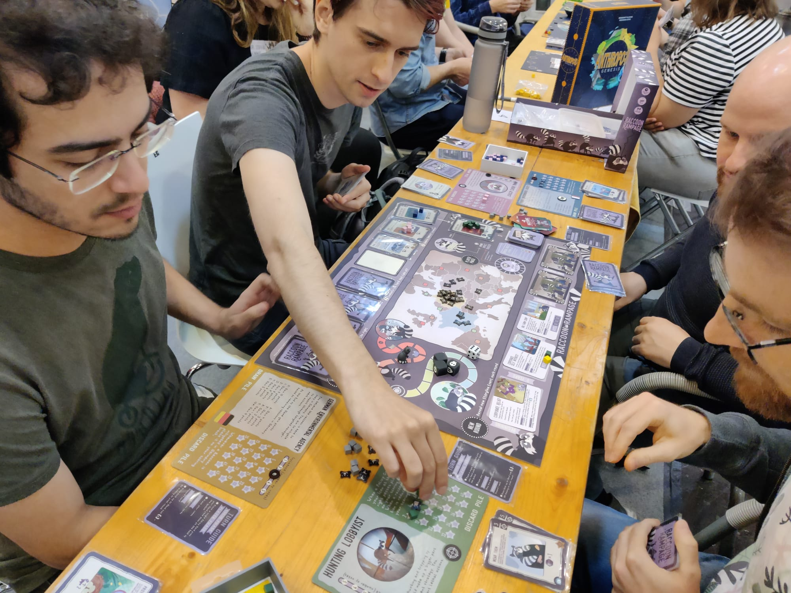
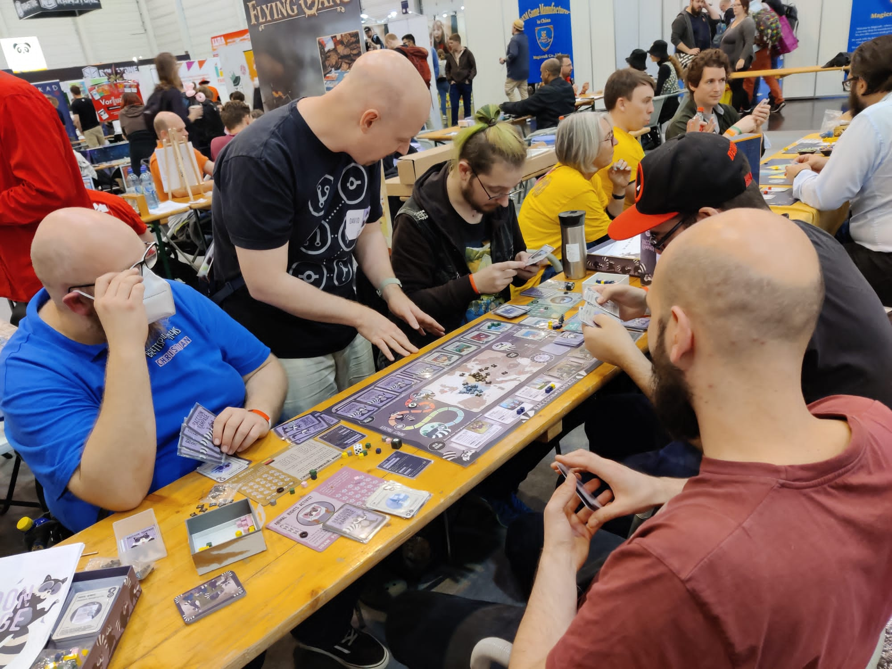

# BioInvasions: Raccoon Rampage (2024)

## Zusammenfassung

BioInvasions: Raccoon Rampage ist ein semi‑kooperatives Brettspiel über Waschbär-Invasionen in Europa und stellt die Weiterentwicklung unserer Arbeit zu European BioInvasions (2022) hin zu einer fokussierten, artspezifischen Erkundung dar. Basierend auf den EU-finanzierten Forschungsprojekten InvasiBES und AlienScenarios verbindet dieses 45–60‑minütige Erlebnis strategische Planung mit sozialer Verhandlung, während 3–4 Spielende in die Rollen von Umweltbehörden, Jägern und Tierrechts-Lobbyist:innen schlüpfen – jeweils mit eigenen Zielen – und zugleich die ökologischen und gesellschaftlichen Auswirkungen einer sich rasch ausbreitenden invasiven Art gemeinsam managen.

Das Spiel ist in mehreren Formaten verfügbar: kostenlos spielbar auf Tabletopia, als kostenloser Print-and-Play-Download zum Ausdrucken zu Hause, und wir befinden uns in den letzten Zügen, einen Online-Shop einzurichten, in dem die hochwertige physische Version erworben werden kann. Das Spiel wurde durch akademische Forschung validiert; eine Masterarbeit mit 86 Teilnehmenden zeigte signifikante Wissenszuwächse zu invasiven Arten sowie ein verbessertes Bewusstsein für die Notwendigkeit kooperativer, multi-stakeholder-basierter Managementstrategien.

## Entwicklungsdetails

**Forschungsgrundlage:** Baut direkt auf den EU-finanzierten Forschungsprojekten InvasiBES und AlienScenarios auf und übersetzt modernste Invasionsbiologie und Szenariomodellierung in zugängliche Spielmechaniken.

**Fortführung von European BioInvasions (2022):** Dieser Titel entwickelt unsere European-BioInvasions-Reihe weiter, indem er den Fokus speziell auf Waschbär-Invasionen verengt. So werden tiefere Rollen-Asymmetrien und politische Abwägungen möglich, während der semi‑kooperative Verhandlungsrahmen in einer kompakteren 45–60‑Minuten-Sitzung, die für wiederholtes Spielen geeignet ist, ausgebaut wird.

**Artwork und Design:** Wunderschönes Artwork sorgt für sofortige Präsenz am Spieltisch.

**Iterative digitale und physische Entwicklung:** Wir haben einen hybriden Entwicklungsansatz genutzt, abwechselnd mit Präsenz-Sitzungen von Stakeholdern und digitalem Prototyping, um Iterationen zu beschleunigen und umfassendes Feedback von vielfältigen Teilnehmenden zu sammeln.

## Digitales Prototyping und Entwicklungsprozess

*Früher digitaler Prototyp auf PlayingCards.io entwickelt, um schnelle Spieletests zwischen persönlichen Stakeholder-Sitzungen zu ermöglichen*

  
*Endgültige, produktionsreife Version auf Tabletopia verfügbar; sie bildet den Höhepunkt unseres iterativen Designprozesses*

Unser Entwicklungsprozess kombinierte strategisch physisches und digitales Playtesting, um die Qualität des Feedbacks und die Geschwindigkeit der Iterationen zu maximieren:

**Phase 1 - Physische Stakeholder-Sitzungen:** Erste Konzeptentwicklung und Validierung der Kernmechaniken in Präsenz-Workshops mit Umweltwissenschaftler:innen, politischen Entscheidungsträger:innen und Vertreter:innen von Interessengruppen.

**Phase 2 - Schnelles digitales Prototyping:** Zwischen formellen Stakeholder-Treffen entwickelten wir spielbare Prototypen auf PlayingCards.io, was schnelle Regelanpassungen, Karten-Balancing und Mechanik-Experimente mit kleineren Testgruppen ermöglichte.

**Phase 3 - Stakeholder-Validierung:** Verfeinerte Mechaniken und Inhalte wurden in weiteren Präsenzsitzungen getestet, in denen Stakeholder-Feedback sowohl spielerische Verbesserungen als auch pädagogische Authentizität validieren konnte.

**Phase 4 - Produktionsreife digitale Implementierung:** Endversion auf der Tabletopia-Plattform bereitgestellt, um kostenlose Zugänglichkeit für Bildungs- und Forschungskontexte zu gewährleisten und gleichzeitig hohe Produktionsqualität und ein reibungsloses digitales Brettspielerlebnis sicherzustellen.

Dieser iterative Ansatz ermöglichte es uns, das authentische Stakeholder-Feedback zu bewahren, das für pädagogische Glaubwürdigkeit entscheidend ist, und zugleich die schnellen Iterationszyklen zu erreichen, die für ein ausgereiftes Spieldesign notwendig sind. Die Phasen des digitalen Prototypings erwiesen sich als besonders wertvoll, um mechanische Komplexität und Spielenden-Engagement zwischen den formelleren Stakeholder-Validierungssitzungen zu testen.

## Spielablauf und Mechaniken

**Kernstruktur:**
- **Spieler:innen:** 3–4 Teilnehmende, ab 12+
- **Dauer:** 45–60 Minuten pro Sitzung
- **Format:** Semi‑kooperatives Strategiespiel mit kompetitiven Elementen
- **Komponenten:** Großer Spielplan, über 160 Karten mit einzigartigem Artwork, vier Spielerdecks, Markerwürfel und Spielwürfel
- **Alleinstellungsmerkmal:** "Ja, ihr müsst zusammenarbeiten - ABER ihr wollt auch alle anderen schlagen!"

**Spielerrollen und Ziele:**
Vier einzigartige Rollen, jeweils mit eigenem Spielertableau, einzigartigen Kartendecks und spezifischen Zielsetzungen:
- **Umweltbehörden:** Priorisieren den Schutz der Biodiversität und die langfristige Resilienz von Ökosystemen durch wissenschaftsbasierte Managementansätze
- **Jäger:** Betonen praktische Kontrollmaßnahmen und kosteneffizientes Populationsmanagement durch direkte Eingriffe
- **Tierrechtsaktivist:innen:** Setzen sich für humane Ansätze und die öffentliche Meinung ein, stellen harte Eingriffe infrage und fördern ethische Alternativen
- **Zusätzliche Rolle:** [Vierte Rolle variiert je nach Szenario]

Jede Rolle erzeugt eine Spannung zwischen der gemeinsamen Mission, die Waschbär-Invasion zu stoppen, und individuellen, kompetitiven Zielen. Das treibt dynamische Allianzen und strategische Entscheidungen voran.

**Kartengetriebenes Spiel:**

*Politikkarten (schwarzer Rand):* Standard- und einzigartige Karten, die Spielende in eine Warteschlange legen und über die gemeinsam abgestimmt wird. Sie repräsentieren Managementstrategien und Interventionen, die demokratische Entscheidungsprozesse erfordern und zugleich individuellen, strategischen Zielen dienen.

*Aktionskarten (weißer Rand):* Standard- und einzigartige Karten, mit denen Spielende anderen in die Quere kommen können – etwa durch Stimmenklau, Politiken-Tausch und das Manipulieren von Abstimmungsergebnissen – und so kompetitive Spannung in die kooperativen Ziele bringen.

*Story-Karten:* Werden in jeder Runde eingeführt, um narrativen Druck zwischen Gruppenmission und persönlichen Zielen aufzubauen; sie liefern Kontext und steigern die Herausforderungen, während sich die Waschbär-Invasion ausbreitet.

**Spielablauf:**
1. **Story-Entwicklung:** Neue Story-Karten führen sich wandelnde Herausforderungen und narrativen Kontext ein
2. **Politik-Warteschlange:** Spielende schlagen Managementmaßnahmen mittels Politikkarten vor
3. **Verhandlung und Abstimmung:** Koalitionen bilden und über Politiken abstimmen, während individuelle Ziele verfolgt werden
4. **Manipulation durch Aktionen:** Aktionskarten ausspielen, um Ergebnisse zu beeinflussen, Stimmen zu stehlen oder Strategien anderer zu stören
5. **Auswirkungen auswerten:** Kollektive und individuelle Konsequenzen der getroffenen Entscheidungen auflösen
6. **Adaptive Strategie:** Ansätze anpassen, wenn neue Story-Elemente und Interaktionen den Spielzustand verändern

## Pädagogischer Rahmen und Wirkung

**Akademische Validierung:** Eine umfassende Vorher-/Nachher-Studie mit 86 Teilnehmenden bestätigte die Wirksamkeit des Spiels:
- **Wissenszuwächse:** Signifikante Zunahme des Wissens zu invasiven Arten nach dem Spielen
- **Perspektivwechsel:** Sichtweisen auf Waschbären wandelten sich von überwiegend positiv hin zu informierteren, neutraleren Positionen, die sowohl Tierschutz- als auch ökologische Auswirkungen berücksichtigen
- **Systemdenken:** Verbesserte Wahrnehmung der Notwendigkeit kooperativer, multi-stakeholder-basierter Managementstrategien in der Umweltgovernance
- **Qualität der Beteiligung:** Obwohl einige Komplexitätsgrenzen für zukünftige Verfeinerungen identifiziert wurden, wurde das Potenzial als pädagogisches Werkzeug insgesamt bestätigt

**Lehrplanintegration:** Das Spiel unterstützt Lernziele in den Bereichen Umweltwissenschaften, Politikwissenschaften und Stakeholder-Engagement, mit besonderer Relevanz für:
- Invasionsökologie und Biodiversitätsschutz
- Umweltpolitik und Governance
- Entscheidungsprozesse mit mehreren Stakeholdern
- Dynamiken an der Schnittstelle zwischen Wissenschaft und Politik

## Technische Innovation und Umsetzung

**Übersetzung von Forschung in Praxis:** Transformiert abstrakte ökologische Daten und politische Rahmenwerke aus EU-finanzierter Forschung in praktische Entscheidungserfahrungen, die die menschlichen Dimensionen des Umweltmanagements sichtbar machen.

**Authentizität der Stakeholder-Perspektiven:** Jede Rolle repräsentiert authentisch realweltliche Standpunkte von Umweltbehörden, Wildtier-Managementfachleuten und Interessenvertretungen, fördert Empathie und Systemdenken zu komplexen Naturschutzherausforderungen.

**Simulation demokratischer Entscheidungsprozesse:** Das Vorschlags- und Abstimmungssystem spiegelt reale Prozesse der Umweltgovernance wider, in denen Stakeholder konkurrierende Interessen ausbalancieren müssen, während gemeinsame Bedrohungen für die Stabilität von Ökosystemen adressiert werden.

**Zugängliche digitale Plattform:** Kostenlose Verfügbarkeit über Tabletopia maximiert die Bildungsreichweite und ermöglicht eine breite Nutzung in akademischen, beruflichen und öffentlichen Engagement-Kontexten.

## Bedeutung und Vermächtnis

BioInvasions: Raccoon Rampage zeigt, wie fokussierte, artspezifische Serious Games die Auseinandersetzung mit komplexen Umweltfragen vertiefen können, ohne die wissenschaftliche Genauigkeit zu verlieren. Durch die Konzentration speziell auf Waschbär-Invasionen entstand Raum für eine nuanciertere Exploration der ethischen, praktischen und ökologischen Abwägungen, die das Management invasiver Arten in der realen Welt kennzeichnen.

Die Validierung des Spiels durch akademische Forschung etabliert es als glaubwürdiges Lehrwerkzeug, während seine Entwicklung aus EU-finanzierter wissenschaftlicher Forschung sicherstellt, dass die Spielmechaniken den aktuellen Stand der Invasionsbiologie und politischen Dynamiken widerspiegeln. Als Fortsetzung unserer Arbeit zu European BioInvasions (2022) führt Raccoon Rampage unsere Methodik fort, Forschung in fesselnde, kollaborative Lernerfahrungen zu übersetzen.

Das Projekt exemplifiziert unseren Ansatz eines forschungsinformierten Game Designs: Mechaniken in wissenschaftlichen Evidenzen zu verankern, Bildungsergebnisse durch rigorose Evaluation zu validieren und die Zugänglichkeit über digitale Plattformen sicherzustellen, die eine breite Adoption in Bildungs- und beruflichen Kontexten unterstützen.

---

**Jahr:** 2024  
**Auftraggeber/Förderung:** EU-finanzierte Forschungsprojekte (InvasiBES und AlienScenarios)  
**Plattform:** Tabletopia (kostenlos spielbar), herunterladen und zu Hause drucken, Shop folgt in Kürze  
**Website:** https://raccoonrampage.ecologygames.eu/  
**Akademische Validierung:** Evaluierung im Rahmen einer Masterarbeit mit 86 Teilnehmenden

## Öffentlichkeitsarbeit und Veranstaltungen

*Spieler:innen genießen BioInvasions: Raccoon Rampage auf der Essen Spiel 2023, was die Attraktivität des Spiels sowohl für Spielefans als auch für Bildungszielgruppen zeigt.*

Das Spiel wurde erfolgreich auf großen Spieleconventions demonstriert, darunter die Essen Spiel 2023, wo es sowohl ernsthafte Spieleenthusiast:innen als auch Pädagog:innen mit Interesse an Umweltthemen anzog. Diese öffentlichen Vorführungen bestätigen die Zugänglichkeit und das Engagementpotenzial des Spiels über akademische Kontexte hinaus und zeigen, wie forschungsbasierte Serious Games durch Spielekultur und Conventions ein breiteres Publikum erreichen können.