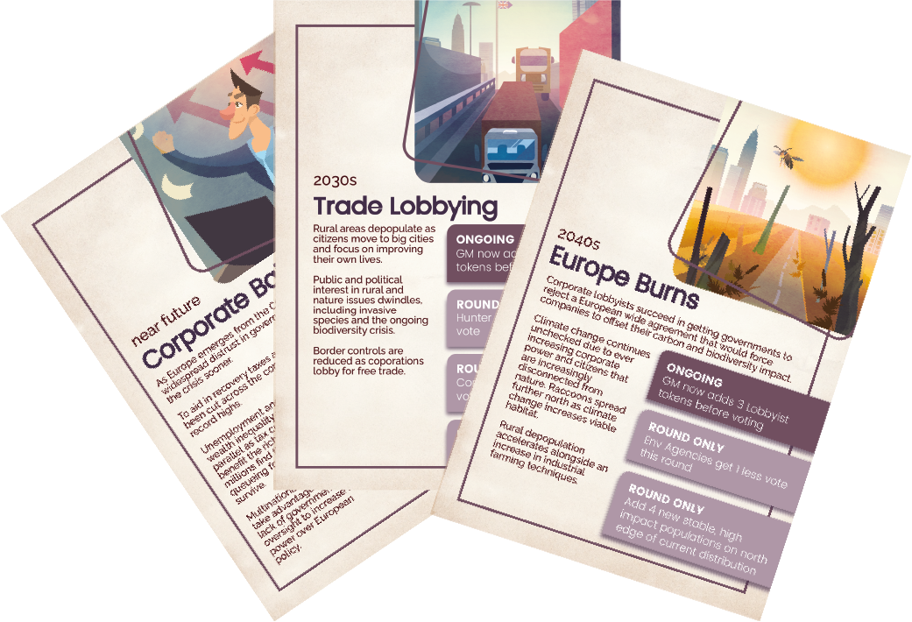

# Games Portfolio (2024-2005)

A comprehensive portfolio showcasing nearly two decades of innovative game development, from latest research-backed serious games to pioneering cross-platform experiences and award-winning educational interventions.

## Portfolio Overview

This portfolio spans **19 years** of game development (2005-2024), featuring:

- **Educational & Serious Games**: Curriculum-aligned learning experiences with measurable impact
- **Health Interventions**: Digital behavior change tools with clinical validation
- **Climate & Environmental**: Policy simulation games for stakeholder engagement
- **Research Partnerships**: EU-funded projects with academic institutions
- **Cross-Platform Innovation**: From early mobile-web integration to modern digital distribution
- **Award Recognition**: Multiple international gaming and educational awards

---

# BioInvasions: Raccoon Rampage (2024)

## Summary

BioInvasions: Raccoon Rampage is a semi‑cooperative board game about raccoon invasions in Europe, representing the evolution of our 2022 European BioInvasions work into a focused, single-species exploration. Developed from EU-funded research projects InvasiBES and AlienScenarios, this 45-60 minute experience blends strategic planning with social negotiation as 3-4 players assume the roles of Environmental Agencies, Hunters, and Animal Rights Lobbyists—each with distinct objectives—while collectively managing the ecological and societal impacts of a rapidly spreading invasive species.

The game is available in multiple formats: free to play on Tabletopia, free print-and-play download for home printing, and we are in the final stages of arranging an online store where people can purchase the full quality physical version. The game has been validated through academic research, with a Master's thesis evaluation of 86 participants demonstrating significant increases in invasive species knowledge and improved awareness of the need for cooperative, multi-stakeholder management strategies.

## Development Details

**Research Foundation:** Built directly from EU-funded InvasiBES and AlienScenarios research projects, translating cutting-edge invasion biology and scenario modeling into accessible gameplay mechanics.

**Continuation of European BioInvasions (2022):** This title advances our European BioInvasions line by narrowing focus to raccoon invasions specifically, allowing for deeper role asymmetries and policy trade-offs while extending the semi-cooperative negotiation framework in a more compact, 45–60 minute session suitable for repeated play.

**Art and Design:** Beautiful artwork gives the game instant table appeal.

**Iterative Digital and Physical Development:** We employed a hybrid development approach, alternating between in-person stakeholder sessions and digital prototyping to accelerate iteration and gather comprehensive feedback from diverse participants.

## Digital Prototyping and Development Process

*Early digital prototype developed on PlayingCards.io for rapid playtesting between in-person stakeholder sessions*

  
*Final production-quality version available on Tabletopia, representing the culmination of our iterative design process*

Our development process strategically combined physical and digital playtesting to maximize feedback quality and iteration speed:

**Phase 1 - Physical Stakeholder Sessions:** Initial concept development and core mechanic validation conducted through in-person workshops with environmental scientists, policymakers, and advocacy representatives.

**Phase 2 - Digital Rapid Prototyping:** Between formal stakeholder meetings, we developed playable prototypes on PlayingCards.io, enabling quick rule adjustments, card balance tweaks, and mechanic experimentation with smaller test groups.

**Phase 3 - Stakeholder Validation:** Refined mechanics and content were tested in subsequent in-person sessions, where stakeholder feedback could validate both gameplay improvements and educational authenticity.

**Phase 4 - Production Digital Implementation:** Final version delivered through Tabletopia platform, ensuring free accessibility for educational and research contexts while maintaining high production values and smooth digital board game experience.

This iterative approach allowed us to maintain the authentic stakeholder input essential for educational credibility while achieving the rapid iteration cycles necessary for polished game design. The digital prototyping phases proved particularly valuable for testing mechanical complexity and player engagement between the more formal stakeholder validation sessions.

## Gameplay and Mechanics

**Core Structure:**
- **Players:** 3–4 participants, ages 12+
- **Duration:** 45–60 minutes per session
- **Format:** Semi-cooperative strategy game with competitive elements
- **Components:** Large game board, over 160 cards with unique artwork, four player decks, cubes and dice
- **Unique Selling Point:** "Yes, you have to work together - BUT you also want to beat everyone else!"

**Player Roles and Objectives:**
Four unique player roles, each featuring individual player mats, unique card decks, and specific objectives:
- **Environmental Agencies:** Prioritize biodiversity protection and long-term ecosystem resilience through science-based management approaches
- **Hunters:** Emphasize practical control measures and cost-effective population management through direct intervention
- **Animal Rights Activists:** Advocate humane approaches and public sentiment considerations, challenging harsh interventions while promoting ethical alternatives
- **Additional Role:** [Fourth role varies based on scenario]

Each role creates tension between the shared mission of stopping raccoon invasion and individual competitive goals, driving dynamic alliances and strategic decision-making.

**Card-Driven Gameplay:**

*Policy Cards (Black Border):* Standard and unique cards that players queue and vote on collectively. These represent management strategies and interventions that require democratic decision-making while serving individual strategic goals.

*Action Cards (White Border):* Standard and unique cards allowing players to "mess with" other participants through mechanics like stealing votes, swapping policies, and manipulating vote results, adding competitive tension to cooperative objectives.

*Story Cards:* Introduced each round to create narrative pressure between group mission and personal goals, providing context and escalating challenges as the raccoon invasion spreads.

**Game Flow:**
1. **Story Development:** New story cards introduce evolving challenges and narrative context
2. **Policy Queuing:** Players propose management measures using policy cards
3. **Negotiation and Voting:** Build coalitions and vote on policies while pursuing individual objectives
4. **Action Manipulation:** Deploy action cards to influence outcomes, steal votes, or disrupt other players' strategies
5. **Impact Resolution:** Resolve collective and individual consequences based on decisions made
6. **Adaptive Strategy:** Adjust approaches as new story elements and player interactions reshape the game state

## Educational Framework and Impact

**Academic Validation:** A comprehensive before/after study with 86 participants demonstrated the game's educational effectiveness:
- **Knowledge Gains:** Significant increase in invasive species knowledge after gameplay
- **Perspective Shifts:** Participants' views of raccoons evolved from predominantly positive to more informed, neutral positions that acknowledge both animal welfare and ecological impact considerations
- **Systems Thinking:** Improved awareness of the need for cooperative, multi-stakeholder management strategies in environmental governance
- **Engagement Quality:** While some complexity limitations were identified for future refinement, overall potential as an educational tool was validated

**Curriculum Integration:** The game supports learning objectives across environmental science, policy studies, and stakeholder engagement curricula, with particular relevance for:
- Invasion ecology and biodiversity conservation
- Environmental policy and governance
- Multi-stakeholder decision-making processes
- Science-policy interface dynamics

## Technical Innovation and Implementation

**Research-to-Practice Translation:** Transforms abstract ecological data and policy frameworks from EU-funded research into hands-on decision-making experiences that reveal the human dimensions of environmental management.

**Stakeholder Perspective Authenticity:** Each role authentically represents real-world viewpoints from environmental agencies, wildlife management professionals, and advocacy organizations, fostering empathy and systems thinking about complex conservation challenges.

**Democratic Decision-Making Simulation:** The proposal-and-voting system mirrors actual environmental governance processes where stakeholders must balance competing interests while addressing shared threats to ecosystem stability.

**Accessible Digital Platform:** Free availability through Tabletopia maximizes educational reach and enables widespread adoption in academic, professional development, and public engagement contexts.

## Significance and Legacy

BioInvasions: Raccoon Rampage demonstrates how focused, species-specific serious games can deepen engagement with complex environmental challenges while maintaining scientific rigor. By concentrating on raccoon invasions specifically, we created space for more nuanced exploration of the ethical, practical, and ecological trade-offs that characterize real-world invasive species management.

The game's validation through academic research establishes it as a credible educational tool, while its development from EU-funded scientific research ensures that gameplay mechanics reflect current understanding of invasion biology and policy dynamics. As a continuation of our 2022 European BioInvasions work, Raccoon Rampage advances our methodology for translating research into engaging, collaborative learning experiences.

The project exemplifies our approach to research-informed game design: grounding mechanics in scientific evidence, validating educational outcomes through rigorous evaluation, and ensuring accessibility through digital platforms that support widespread adoption in educational and professional contexts.

---

**Year:** 2024  
**Client/Funding:** EU-funded research projects (InvasiBES and AlienScenarios)  
**Platform:** Tabletopia (free to play), download and print at home, store coming soon  
**Website:** https://raccoonrampage.ecologygames.eu/  
**Academic Validation:** Master's thesis evaluation with 86 participants  
**Contact:** jonathan.jeschke@gmx.net

## Public Engagement and Events

*Players enjoying BioInvasions: Raccoon Rampage at Essen Spiel 2023, demonstrating the game's appeal to both gaming enthusiasts and educational audiences.*

The game has been successfully demonstrated at major gaming conventions, including Essen Spiel 2023, where it attracted both serious gaming enthusiasts and educators interested in environmental topics. These public demonstrations validate the game's accessibility and engagement potential beyond academic contexts, showing how research-based serious games can reach broader audiences through gaming culture and convention networks.

---

# Shades – Games and Engagement Layer for a News Startup (2021-2022)

## Summary

cf.me set out to change the way people get daily news by blending editorial content with playful, habitual interactions. The company later rebranded as Shades News. We were engaged to design a cohesive experience across the website and mobile app. We designed two iOS games that could act as lightweight, daily touchpoints. "baw" and "wurd" were conceived as quick, replayable titles that complement reading sessions—offering snackable play during news breaks and providing new entry points back into the news experience. This work established a foundation for a news platform where games are not an add-on, but a core retention and engagement mechanic.

**Contact:** Sonali Maitra - sonali@shades.news

## Development Details

**Experience Architecture:** Defined a unified engagement loop spanning the website, the news app, and the two games. Users could move fluidly from headlines to play and back via in-app surfaces, deep links, and cross-promotional hooks.

**Product Integration:** Contributed to the cf.me website and iOS app alongside owning the games to ensure a shared design language, consistent interaction patterns, and discoverability of play within the news flow.

**Games-as-onramp:** Delivered two iOS titles—"baw" and "wurd"—as low-friction, pick‑up‑and‑play experiences designed for short sessions. The games were positioned as daily rituals that could introduce users to the brand and bring them back for news updates.

**Iterative Development:** Prototyped UX flows and game loops quickly, validating how and where play fits into a news habit (entry points, session timing, notifications, and rewards).

**Content and Community Surfaces:** Implemented in-app placements and shareable moments so successes in games could translate into social and in-product visibility, driving organic discovery.

---

  
**Platforms:** Web, iOS  
**Year:** 2021-2022

---

# European BioInvasions

## Summary

European BioInvasions is a "coopetitive" role-playing game we developed as part of two EU-funded research projects: InvasiBES and AlienScenarios. Designed for students, scientists, and stakeholders dealing with biological invasions, the game challenges players to collaborate and compete in managing invasive species across Europe over 60-120 minute sessions. Players vote on management action proposals while navigating changing conditions introduced through event cards, with the shared goal of reducing the impact of invasive species through strategic decision-making.

The game covers four key species—Marbled Crayfish, North American Raccoon, Common Ragweed, and Asian Hornet—with each species offering 4 potential future scenarios and 6-7 unique player roles representing different stakeholder perspectives and priorities. Successfully tested at a workshop in Berlin in 2022, the game was recognized as a finalist in the 2022 International Educational Games Competition for its innovative approach to environmental policy simulation.

## Development Details

- **Research Projects:** EU-funded InvasiBES and AlienScenarios
- **Year:** 2022 (project span 2021–2022)
- **Category:** Coopetitive role-playing game / Environmental education
- **Recognition:** Finalist, 2022 International Educational Games Competition
- **Duration:** 60-120 minutes per session
- **Materials:** Available for download at europeanbioinvasions.ecologygames.eu
- **Contact:** jonathan.jeschke@gmx.net

We developed the game through collaborative scientific research and iterative design:

- **Research integration:** Built directly from EU-funded scientific research on biological invasions, ensuring accuracy and relevance to current conservation challenges
- **Multi-species focus:** Developed comprehensive scenarios for four key invasive species, each with distinct ecological and management characteristics
- **Stakeholder engagement:** Designed unique player roles reflecting real-world perspectives from researchers, policymakers, conservation groups, and affected communities
- **Workshop testing:** Successfully piloted in Berlin 2022 with scientists and stakeholders to validate gameplay mechanics and educational outcomes
- **Open access materials:** Created downloadable rulebook, printable game components, maps, and cards to maximize accessibility and reuse

## Technical Aspects

### Core Game Mechanics

- **Coopetitive gameplay:** Players must collaborate to address shared threats while competing for limited resources and different stakeholder priorities
- **Role-based perspectives:** 6-7 unique roles per species scenario, each with distinct beliefs, priorities, and constraints reflecting real-world stakeholder positions
- **Democratic decision-making:** Players vote on management action proposals, simulating collective decision processes in environmental governance
- **Event-driven scenarios:** Dynamic event cards introduce changing conditions each round, forcing players to adapt strategies and test resilience of their plans
- **Multi-species complexity:** Four different invasive species (Marbled Crayfish, Raccoon, Ragweed, Asian Hornet) each requiring species-specific management approaches
- **Future scenario planning:** 4 potential future scenarios per species allow exploration of different environmental and policy contexts
- **Game Master facilitation:** Guided sessions with structured debriefing to maximize learning outcomes and policy insights

### Educational Framework

- **European map visualization:** Physical game map tracks species spread and management actions across European regions
- **Evidence-based scenarios:** All species profiles and management options grounded in current scientific research and policy frameworks
- **Collaborative learning:** Group decision-making processes mirror real-world conservation planning and stakeholder engagement
- **Transferable insights:** Game outcomes translate directly to real-world understanding of invasive species management challenges

### Game Materials and Implementation

- **Print-and-play design:** Complete game materials available as free downloads including rulebook, game map, event cards, and player role cards
- **Modular species scenarios:** Each of the four species (Marbled Crayfish, Raccoon, Ragweed, Asian Hornet) functions as a standalone game module
- **Artwork and visualization:** Game components created by artist Kris Tsenova enhance the visual presentation and player engagement
- **Workshop integration:** Materials designed for educational and professional development contexts with clear facilitation guidelines
- **Scalable group sizes:** Flexible player counts accommodate different workshop sizes while maintaining game balance and engagement

## Impact and Significance

### Educational and Scientific Contributions

European BioInvasions demonstrates how collaborative game design can translate complex environmental research into accessible, engaging learning experiences. By grounding gameplay in actual EU-funded research from the InvasiBES and AlienScenarios projects, we created an authentic bridge between scientific knowledge and public understanding of invasive species management.

### Key Innovations

- **Research-to-practice translation:** Transforms abstract ecological data and policy frameworks into hands-on decision-making experiences that reveal the human dimensions of environmental management
- **Stakeholder perspective integration:** Each role authentically represents real-world viewpoints from researchers, policymakers, conservationists, and affected communities, fostering empathy and systems thinking
- **Collaborative problem-solving:** The coopetitive gameplay structure mirrors actual environmental governance challenges where stakeholders must balance competing interests while addressing shared threats
- **Open access impact:** Free availability of all game materials maximizes educational reach and enables widespread adoption in academic and professional development contexts
- **Modular reusability:** Species-based modules allow educators to focus on locally relevant invasive species while maintaining consistent learning frameworks

### Recognition and Reach

The game's recognition as a 2022 International Educational Games Competition finalist validates its contribution to environmental education and serious games design. Its development within EU research frameworks positions it as a model for how gaming methodologies can enhance scientific communication and stakeholder engagement in conservation contexts.

European BioInvasions exemplifies how game-based learning can make complex environmental challenges accessible while maintaining scientific rigor, advancing both educational gaming practices and public engagement with conservation science.

## Developing Stakeholder Workshop Games

*Map of the current state of raccoon invasions across Europe mid-game at a workshop*

*Asian Hornet variation of the game being played at a workshop*

*Raccoon scenario of the game being played at a workshop*

Our work on European BioInvasions demonstrates our experience developing games specifically for stakeholder engagement and workshop contexts. The game serves as a facilitated experience where participants representing different perspectives must negotiate solutions to complex environmental challenges.

We have successfully deployed the game in multiple stakeholder workshops focusing on different invasive species scenarios. These include dedicated sessions examining Asian hornet invasion management and North American raccoon population control strategies. Each workshop brings together relevant experts, policymakers, and affected community representatives to explore species-specific management approaches through collaborative gameplay.

The workshop implementation includes visual aids such as maps showing the current state of invasive species distribution, allowing participants to understand the scope and geographical spread of the biological invasion. These visual elements help ground abstract policy discussions in concrete spatial and temporal realities, enabling more informed decision-making during gameplay sessions.

Our approach to stakeholder workshop games emphasizes:

- **Multi-perspective representation:** Ensuring all relevant stakeholder viewpoints are authentically represented through distinct player roles
- **Visual communication:** Using maps, cards, and other visual aids to make complex information accessible during group decision-making
- **Structured facilitation:** Providing clear frameworks for group discussion, negotiation, and consensus-building
- **Real-world application:** Designing mechanics that translate directly to actual policy and management contexts
- **Collaborative learning:** Creating experiences where participants learn from each other's perspectives and expertise

This expertise in stakeholder workshop game design positions us to develop similar collaborative decision-making tools for other complex policy domains requiring multi-actor coordination and negotiation.

## Digital Prototyping and Remote Testing

*Representation of the game as prototyped in a Miro-like platform, facilitating online play between physical sessions*

*Map of marbled crayfish spread in Europe in the digital version*

To accelerate our design iteration process between formal stakeholder workshops, we developed digital prototypes of European BioInvasions using online collaborative tools similar to Miro. This approach allowed us to test gameplay mechanics, refine role balance, and gather feedback from participants remotely without requiring the logistical coordination of full in-person workshops.

The digital prototyping process enabled rapid iteration cycles where we could:

- **Test rule variations** and mechanical adjustments with smaller groups of participants
- **Refine stakeholder roles** and their respective objectives based on remote feedback sessions
- **Validate scenario balance** across different species modules before committing to physical workshop deployments
- **Engage international participants** who couldn't attend regional workshops but provided valuable domain expertise
- **Document gameplay patterns** more easily through digital interaction logs and screen recordings

This hybrid development approach—combining digital prototyping with formal stakeholder workshops—proved essential for creating a robust, well-balanced game. The digital versions served as testing grounds for new ideas and mechanics, while the physical workshops provided the authentic stakeholder engagement and validation needed for educational impact.

Our experience with digital-to-physical game development demonstrates our capability to leverage remote collaboration tools for efficient game design processes, particularly valuable for complex multi-stakeholder scenarios requiring extensive iteration and refinement.

---

# SuperbMarket (2022)

## Summary

SuperbMarket is a serious game we developed for Glasgow University in 2021-2022, exploring the complex interplay between identity, health, and business decisions in the context of Decent Working conditions and the Real Living Wage. Set within a contemporary supermarket operation, the project positions learners to explore practical trade-offs across staff wellbeing, operational performance, and financial viability. The game was recognized as a finalist in the 2022 IEGA awards, acknowledging its educational rigor and relevance to contemporary workplace issues.

**Contact:** Rosalind.Searle@glasgow.ac.uk

## Development Details

  
**Client:** Glasgow University  
**Year:** 2021-2022  
**Category:** Serious Game / Educational Application  
**Awards:** 2022 IEGA Finalist

We developed this project from Glasgow University's need for an interactive tool to transform abstract policy discussions—such as living wage adoption, scheduling practices, and workplace health—into concrete, navigable decision spaces that surface consequences for both individuals and organizations.

## Technical Aspects

### Core Mechanics
- **Character-driven narratives:** Players experience the story through the perspectives of Lee (experienced worker with family responsibilities) or Bo (student balancing work and studies), along with manager Jo making hiring and operational decisions
- **Workplace challenge simulation:** Real-world scenarios including car trouble, childcare conflicts, study pressures, and workplace safety incidents that affect employee performance and wellbeing
- **Decision consequence system:** Player choices around hiring criteria (minimum wage vs. experience, flexibility vs. company loyalty) and management responses (support vs. discipline) create branching story outcomes
- **Progressive difficulty:** Starting with everyday workplace challenges that escalate to serious incidents, requiring players to adapt policies and management approaches
- **Multiple endings:** Different story paths based on employee choices (second job, quitting, workplace accidents) and management responses to create replay value

### Technical Implementation
- **Ink narrative scripting:** Built using the Ink interactive fiction engine for robust branching dialogue and state management across complex story structures
- **Character state tracking:** Dynamic variables monitor employee stress, motivation, financial pressure, and manager attitudes to drive realistic story progression
- **Visual novel presentation:** Character positioning, backgrounds, and visual props enhance the narrative experience while maintaining focus on story and decisions
- **Modular story structure:** Separate narrative threads for different characters allow for complex interactions while maintaining code organization
- **Real-time consequence visualization:** Story outcomes immediately reflect the impact of policy decisions on employee wellbeing and business operations
- **Educational integration:** Designed for classroom use with clear learning moments embedded in authentic workplace scenarios

## Educational Objectives

SuperbMarket targets multiple learning outcomes across business, public health, and social policy contexts:

- **Systems thinking:** Connect pay policy, staffing, demand fluctuations, and wellbeing outcomes
- **Ethical decision-making:** Identify stakeholder impacts and reason through competing priorities
- **Decent work literacy:** Distinguish Real Living Wage from minimum wage frameworks and interpret implications of workplace policies
- **Identity awareness:** Understand how intersecting identities (age, caregiving status, disability) shape workplace experiences
- **Evidence interpretation:** Translate simulation insights into actionable recommendations

## Impact and Significance

### Academic Collaboration
Our partnership with Glasgow University grounded mechanics and scenarios in course objectives and research questions around fair work. The game functions as a living laboratory for studying decision-making under social and operational pressures, with telemetry and reflective prompts enabling pre/post analysis of learner reasoning.

### Industry Recognition
SuperbMarket's selection as a 2022 IEGA finalist signaled to both educators and industry stakeholders that complex labor topics can be taught through engaging, data-informed play. The recognition helps normalize simulation-based exploration of fair work in management education and employer training.

### Innovation in Serious Games
- **Authentic workplace narratives:** Grounds policy discussions in realistic employee experiences including financial pressure, family responsibilities, and career development challenges
- **Empathy-driven design:** Players experience workplace conditions from multiple perspectives, fostering understanding of how management decisions affect individual lives
- **Consequences over mechanics:** Story outcomes directly reflect real-world workplace dynamics rather than abstract game systems, making policy implications tangible
- **Intersectional representation:** Lee's family responsibilities and Bo's student status represent different worker demographics, highlighting how policies affect diverse employees differently
- **Progressive revelation:** Complex workplace issues emerge naturally through story progression, avoiding heavy-handed educational messaging
- **Replayability for learning:** Multiple story paths encourage exploration of different management approaches and their consequences

SuperbMarket demonstrates how narrative-driven serious games can effectively address contemporary workplace challenges by centering human experiences within policy frameworks. Our focus on authentic character development and realistic workplace scenarios makes decent work principles accessible through engaging, consequential storytelling that advances educational gaming in labor and business contexts.

---

# Observation (2019)

**Year:** 2019  

**Type:** Game Design Consultancy  

## Summary

In addition to building our own titles, we offer design consultancy to game studios, providing flexible on-demand expertise.

We provided consultancy support to NoCode on Observation, contributing to usability analysis for experimental narrative interfaces and content and system cohesion review. Our involvement was limited but focused on helping refine the player experience in this innovative story-driven game.

**Contact:** jon@screenburn.com

## Contributions

**Role:** Design  
**Contributions:** 
- Usability analysis for experimental narrative interfaces
- Content and system cohesion review
- Supporting the team's vision for this complex narrative-driven experience

This was a light-touch consultancy engagement where we provided targeted feedback to support the development team's excellent work on this unique project.

## Awards and Recognition

**BAFTA Scotland Best Game 2019** - Winner  
**BAFTA Best British Game 2020** - Winner  
Observation achieved remarkable recognition, winning both the BAFTA Scotland Best Game award in 2019 and the BAFTA Best British Game award in 2020. The game was praised for its innovative approach to sci-fi storytelling and its unique perspective of playing as a space station AI.

---

# Gaming Climate Futures: Earth Remembers

## Summary

Gaming Climate Futures (2018) is a climate policy simulation we developed with Glasgow Caledonian University students for UN decision makers that operationalizes the relationship between global temperature targets and climate tipping points. Delivered as a mixed-media workshop—combining game mechanics, structured negotiations, storytelling, and co-creation—it functions as a decision-support and learning tool to deepen understanding of systemic climate risks while strengthening diplomatic communication. The project was nominated for Best Game at the 2019 International Educational Games Competition.

## Development Context and Objectives

We developed it to support sessions at the UN Climate Change Conference, addressing a dual need: to convey the non-linear dynamics of climate tipping points and to improve the quality of international climate dialogue under time and information constraints. Objectives included:

- Translating complex scientific knowledge about tipping cascades into actionable, shared reference points for negotiators
- Stress-testing diplomatic strategies against systemic risk, uncertainty, and path dependence
- Establishing innovative co-production between scientists and decision makers to align models, assumptions, and policy framings
- Enhancing communication across diverse stakeholder groups through common experiential frames

## Technical Approach and Innovative Aspects

**Mixed-media serious game design:** A modular toolkit integrates facilitated role-play, scenario cards, negotiation protocols, and narrative prompts with a technology-supported engagement process for real-time input capture, aggregation, and feedback.

**Tipping-point-informed mechanics:** Game states and payoffs incorporate thresholds and non-linear transitions, making the consequences of surpassing temperature targets legible within the negotiation space (e.g., escalating risks, loss of options, cascading impacts).

**Procedural mapping of policy to risk:** Players' commitments (mitigation, finance, adaptation) are procedurally linked to trajectories that update collective risk levels, foregrounding trade-offs and the timing of action.

**Co-creation workflow:** Our iterative design sprints with scientific experts and policy practitioners ensured evidence-aligned parameters and face validity for diplomatic contexts; the process itself is an innovation in knowledge co-production.

**Facilitation and analytics:** Structured debriefs and lightweight data tools support reflection on strategy, trust formation, and communication patterns, converting gameplay traces into shared learning artifacts.

## Impact and Significance

**Policy-relevant fidelity without overcomplexity:** Our design balances scientific credibility with usability for high-level, time-boxed workshops, offering a replicable model for evidence-based policy gaming.

**Demonstrated uptake at international fora:** Deployed to facilitate UN Climate Change Conference workshops, the game showed that serious games can productively inform discussions among senior decision makers.

**Recognition of excellence:** Nomination for Best Game at the 2019 International Educational Games Competition validated both the design quality and educational impact.

**Methodological benchmark:** We advanced participatory modeling and stakeholder engagement practices, illustrating how mixed-media formats and technology-supported processes can translate complex systems into collective, actionable insight.

## Unique Contributions to Climate Communication and Policy Gaming

**Innovative co-production approach:** We embedded scientists and negotiators within a shared design and play environment, aligning mental models and surfacing assumptions that often remain implicit in formal talks.

**Making tipping points experiential:** Converts abstract thresholds into tangible strategic constraints and narrative consequences, improving comprehension and recall.

**Bridging quantitative targets and human narratives:** Integrates data-driven dynamics with storytelling to foster empathy, trust, and cross-cultural dialogue—critical assets in multilateral negotiations.

**Structured communication training:** The negotiation protocol doubles as a communication scaffold, improving clarity, listening, and coalition-building under uncertainty.

**Portable engagement architecture:** A modular, technology-supported format allows adaptation to different conference settings and stakeholder mixes while maintaining core learning objectives.

## Research Impact and Findings

The project generated significant academic research, resulting in peer-reviewed publications examining the game's effectiveness:

**Published Research:**
- van Beek, L., Vervoort, J.M., Milkoreit, M., et al. (2022). "Not just playing: The politics of designing games for impact on anticipatory climate governance." *Geoforum*, 130, 107-119.
- van Beek, L., Milkoreit, M., Vervoort, J.M., Prokopy, L., Lenton, T., Weiner, R., Reed, J.B., Farrell, D., Wardekker, A. (2022). "The effects of serious gaming on risk perceptions of climate tipping points." *Climatic Change*, 170, 31.

**Key Research Findings:**
- **Reduced psychological distance:** The game made climate tipping points more 'real', proximate and tangible for participants, improving comprehension of abstract climate risks
- **Enhanced risk perception:** Participants demonstrated increased concern about climate tipping points after gameplay
- **Effective science-policy interface:** The simulation proved valuable as a tool for engaging high-level climate negotiators and non-governmental observers
- **Knowledge co-production success:** The project demonstrated how games can bridge scientific knowledge and policy-making processes

**UN Implementation:** Successfully deployed at the 2018 UN Framework Convention on Climate Change subsidiary bodies meeting in Bonn, Germany, with up to 30 participants simulating negotiations that projected Earth's state 25-100 years in the future. Delegates described the workshops as providing "emotionally resonant and actionable insights" and a "refreshing yet insightful break from tense climate negotiations."

Together, these contributions position Gaming Climate Futures as a significant advance in climate policy simulation—demonstrating how serious game design, mixed-media engagement, and knowledge co-production can meaningfully support high-stakes international decision making.

---

**Year:** 2018  
**Recognition:** Nominated for Best Game at the 2019 International Educational Games Competition  
**Contact:** j.m.vervoort@uu.nl

---

# Enchanted Crystals (2018)

## Summary

Enchanted Crystals (2018) is an educational mobile game we developed that strengthens mental maths fluency for European pupils within a Harry Potter-inspired fantasy setting. Developed under an EU Erasmus grant, we pioneered a gesture-based math input system that allows students to draw numbers and mathematical operations (like "3 × 5") directly on the screen, replacing traditional keypad entry with intuitive gestures. Delivered through an international collaboration with a German serious-games partner and teachers from Germany, Scotland, Portugal, and Greece, the title earned Best Mobile Game and 2nd Overall Prize at the 7th International Educational Games Competition.

## Development Details

**Funding and Scope:** Supported by the EU Erasmus programme to advance cross-border educational innovation and disseminate open practices in digital learning.

**Partnership Model:** Co-development with a serious games company in Germany and educator panels from Germany, Scotland, Portugal, and Greece. Teachers co-authored learning objectives, task types, and formative assessment routines.

**Co-design and Iteration:** Structured development cycles combined remote production with in-classroom pilots in partner countries. Teacher workshops and learner observations informed mechanics tuning, gesture vocabulary refinements, and content progression.

**Compliance and Data Practices:** Designed with privacy-by-default principles suitable for minors and European contexts. Anonymized play telemetry and in-app consent patterns supported ethical classroom research and iteration.

**Production Approach:** A cross-platform mobile build with content modularization to support localization, curriculum alignment per country, and rapid iteration on task templates without requiring client updates.

## Core Innovation

The game's central innovation was its gesture-based math input system, where students could draw numbers and mathematical operations (such as "3 × 5") directly on the screen using natural gestures instead of using traditional keypads. This approach reduced cognitive overhead and made mathematical expression more intuitive and immediate for young learners.

## Educational Impact

**Curriculum Alignment:** Tasks target mental calculation strategies emphasized in European curricula (addition, subtraction, multiplication, division, decomposition, partitioning, and estimation), enabling relevance across partner countries.

**Reduced Input Friction:** By allowing pupils to "think with their fingers," the gesture system minimizes cost of entry, helps maintain working-memory focus on number relationships, and shortens the loop between strategy selection and answer expression.

**Teacher Co-ownership:** Educators directly influenced task design, error messaging, and scaffolding, improving classroom fit and construct validity. The co-design model supported practical concerns such as lesson timing, device variability, and classroom management.

**International Classroom Pilots:** Iterations were informed by observations in diverse linguistic and cultural contexts, exposing edge cases early (e.g., symbol conventions, numeral forms) and strengthening the generalizability of the input vocabulary and learning sequences.

**Recognition:** Awards at the 7th International Educational Games Competition validated both usability and pedagogical soundness, with Best Mobile Game and 2nd Overall Prize highlighting cross-criteria excellence.

## Significance

Enchanted Crystals demonstrates how human–computer interaction research can materially enhance core skills acquisition in education. Our gesture-based math input system offers a replicable alternative to keypad-centric design, showing that embodied, low-latency interactions can reduce cognitive overhead and increase engagement in mental arithmetic. 

Equally, we modeled a scalable international co-design process: educators and developers collaborating across countries to produce content that is both technically robust and pedagogically grounded. Our work advances best practices for:

- Child-robust gesture recognition and confidence-driven fallbacks on commodity mobile hardware
- Authorable, context-aware input grammars that tie directly to learning objectives
- Cross-border curriculum alignment and ethical data practices suitable for classrooms

By coupling novel input technology with a richly themed fantasy world and rigorous educational co-design, Enchanted Crystals contributes a distinctive, award-winning approach to serious games for mathematics education.

---

---

# LifeLab+

## Summary

LifeLab+ is a user-led serious game and digital health intervention developed as part of the **EACH-B (Engaging Adolescents in Changing Behaviour)** research program - a major cluster randomised controlled trial focused on improving diet and physical activity behaviors among teenagers. Commissioned under NIHR (National Institute for Health Research) and developed in collaboration with the MRC Unit at the University of Southampton, the project fused behavioral psychology with game design to drive meaningful, measurable engagement. The EACH-B study targets approximately 2,300 students aged 12-13 from 50 schools, with LifeLab+ serving as the interactive digital component alongside a 3-week science curriculum and teacher training. The program received an Advanced Commendation at the 2020 IEGC Awards. Overall project budget was £2.2m, with £330k directed to the game.

**Contact:** meb@mrc.soton.ac.uk

## Development Details

- **Co-design methodology**: We embedded adolescents as co-creators, not just testers. Across iterative cycles, teen participants informed concept formation, interaction patterns, challenge themes, and tone of voice. Structured workshops, rapid prototyping, and in-app telemetry-informed feedback loops ensured design decisions remained youth-centered.

- **Behavioral science integration**: We operationalized psychological principles (e.g., motivation, self-efficacy, habit formation, goal-setting, social reinforcement) into mechanics that encourage small, sustained behavior changes. Gameplay loops aligned with evidence-based behavior change techniques, translated into accessible challenges and micro-rewards.

- **Research partnership**: As part of the EACH-B cluster randomised controlled trial, we worked with the MRC Unit at the University of Southampton to align design sprints with research milestones and evaluation needs. The app was designed using self-determination theory and behavior change techniques, ensuring the product could support robust study designs while remaining engaging and age-appropriate. Secondary outcomes measured include behavioral self-regulation, self-efficacy for healthy eating and physical activity, and quality of life measures.

- **Governance and delivery**: Multi-year roadmap (2017–2022) executed via agile delivery. Regular ethics and safeguarding reviews, adolescent advisory input, and data governance checkpoints informed release gating. We managed a £330k workstream within the £2.2m program, covering experience design, app architecture, feature implementation, and analytics instrumentation.

- **Recognition**: Advanced Commendation at the 2020 IEGC Awards highlighted the project's innovative fusion of youth-led design and health behavior change delivery.

## Technical Aspects

- **Hub-and-spoke architecture**: A central "hub" coordinated access to modular "spokes," including:
  • Behavior challenges for diet and physical activity, with tiered difficulty and streak-based progression
  • Habit tracking and micro-goal setting, with contextual nudges
  • Educational mini-games and interactive learning modules
  • Reflection spaces and progress visualization
  
  This architecture enabled independent evolution of spokes, safer experimentation, and rapid swapping of content or mechanics without destabilizing the core.

- **Modular content pipeline**: A structured content model separated narrative, assets, and configuration, allowing non-technical teams to author and update challenges, tips, and rewards. Feature flags and configuration toggles supported controlled rollouts, A/B comparisons, and research cohorts.

- **Adaptive feedback loops**: Engagement signals (completion rates, dwell time, streak integrity) informed just-in-time prompts, difficulty tuning, and reward calibration. The system could adjust intensity and cadence to reduce drop-off and support habit consolidation.

- **Analytics for research and iteration**: Event-level telemetry supported measurement of engagement, adherence to challenges, and progression through learning modules. Export pathways enabled privacy-preserving aggregation for research analysis. Instrumentation was designed in collaboration with researchers to align with study endpoints while maintaining an engaging UX.

- **Privacy and safety**: Privacy-by-design principles informed data minimization, consent/assent flows appropriate for adolescents, and encryption of data in transit and at rest. Audit trails and role-based controls supported research integrity and safeguarding requirements.

## Impact/Significance

- **Advancing user-led health behavior change**: LifeLab+ demonstrates how co-design with adolescents can be elevated from consultation to core production, directly shaping mechanics that resonate with teen motivations. This strengthened engagement drivers critical for diet and physical activity behavior change.

- **Translating psychology into play**: The project operationalized behavioral constructs into game systems—goal gradients, streaks, timely prompts, and social reinforcement—without resorting to heavy-handed gamification. This balance enhanced both adherence and perceived autonomy.

- **A replicable architecture for serious games in health**: The hub-and-spoke model, analytic instrumentation, and modular content pipeline form a reusable blueprint for future digital health interventions requiring experimentation, cohort management, and ongoing content refresh.

- **Research-ready while youth-friendly**: By aligning technical instrumentation with research questions, the product supports robust evaluations without compromising user experience—a common barrier in health apps for young people.

- **Recognized innovation and sector credibility**: The IEGC Advanced Commendation and the NIHR/MRC collaboration underscore LifeLab+ as a credible, award-recognized exemplar at the intersection of games, design research, and public health.

- **Capacity building**: The project helped establish shared practices between game developers and health researchers, demonstrating how to co-produce interventions that are evidence-informed, ethically grounded, and engaging for the intended audience.

Our's contribution centered on turning adolescent insights and behavioral science into a maintainable, research-capable, and engaging product. LifeLab+ stands as a model for how serious games can deliver real-world value in digital health through rigorous co-design, thoughtful architecture, and measurable engagement.

---

**Project Duration**: 2017-2022  
**Client**: NIHR (National Institute for Health Research)  
**Budget**: £2.2m total project (£330k for the game)  
**Awards**: Advanced Commendation, 2020 IEGC Awards

---

# Party Pugs (2017)

**Year:** 2017  

**Type:** Game Design Consultancy  

## Summary

In addition to building our own titles, we offer design consultancy to game studios, providing flexible on-demand expertise.

We were involved with Channel 4's Party Pugs project, contributing to writing and level design. Our role included providing feedback to the team creating the rest of the levels, helping ensure consistency and quality across the game's content designed for a broad audience.

## Contributions

**Role:** Writing and Level Design  
**Contributions:** 
- Writing and level design for select content
- Providing feedback to the team creating additional levels
- Supporting tone and accessibility considerations for the target audience

This consultancy involved hands-on contribution to specific content areas while supporting the broader development team's work on this accessible, family-friendly game.

## Awards and Recognition

**TIGA Game Industry Awards 2016 - Best Arcade Game Finalist**  
Party Pugs (originally titled "Pug Life") by Steely Glint Games was a finalist in the Best Arcade Game category at the 2016 TIGA Game Industry Awards, competing alongside titles from major studios including Sony Interactive Entertainment Europe and established indie developers.

---

# Stories Untold (2017)

**Year:** 2017  

**Type:** Game Design Consultancy  

## Summary

In addition to building our own titles, we offer design consultancy to game studios, providing flexible on-demand expertise.

We provided consultancy support to NoCode on Stories Untold, contributing to usability analysis for experimental narrative interfaces and content and system cohesion review. Our role was supportive, helping the team balance novelty with readability across their innovative episodic content.

**Contact:** jon@screenburn.com

## Contributions

**Role:** Additional Design  
**Contributions:** 
- Usability analysis for experimental narrative interfaces
- Content and system cohesion review
- Supporting balance between innovation and accessibility in narrative delivery

This was a focused consultancy engagement where we provided feedback to assist the development team in refining their groundbreaking approach to interactive storytelling.

## Awards and Recognition

**BAFTA Scotland Game of the Year 2017** - Winner  
Stories Untold was recognized with the prestigious BAFTA Scotland Game of the Year award in 2017, acknowledging its innovative approach to episodic adventure gaming and experimental narrative design.

---

# Brand Bang! (2013)

*Genre: Tile-reveal puzzle, gamified market research*  
*Platforms: Facebook (Canvas) and iPad (iOS)*  
*Client: BunnyFoot*  

## Game Summary

Brand Bang! transforms brand recognition testing into a competitive, engaging puzzle game where players remove tiles to reveal hidden logos and make identification guesses. The core mechanic is deceptively simple: remove the minimum number of tiles needed to identify a logo correctly, with scoring based on speed and efficiency. However, this casual gameplay masks a sophisticated measurement framework that captures high-quality behavioral data for market research purposes.

Rather than relying on traditional static surveys, Brand Bang! reframes market research as an interactive challenge, capturing behavioral signals such as time-to-recognition, visual salience patterns, and error types through moment-to-moment play. Every tile reveal, hesitation, incorrect guess, and successful identification feeds into comprehensive brand perception analytics.

## Development Details

We worked closely with market researchers to align gameplay mechanics with established recognition and recall metrics. Key development aspects included:

**Research-Collaborative Design**: Game mechanics and instrumentation were co-developed in partnership with market researchers to ensure gameplay signals aligned with established recognition and recall metrics.

**Content Pipeline**: A sophisticated curation and tagging system for logo assets was built, incorporating categorization by region, brand complexity, color palette, and silhouette strength. This enabled controlled rotations, cohorts, and difficulty mixes across gameplay sessions.

**Difficulty Calibration**: We iteratively tuned tile masks and reveal budgets using pilot data to normalize difficulty across brands of varying visual complexity, introducing controlled variants to separate brand familiarity from puzzle difficulty.

**Data Quality Safeguards**: The system embedded gold-standard items, randomized tile layouts, and anti-bot heuristics, implementing outlier detection and quality flags to maintain research-grade dataset integrity.

## Technical Aspects and Platforms

**Cross-Platform Architecture**: The game featured an engine-agnostic core with shared game logic and data models abstracted from platform UI, enabling consistent rules and metrics across Facebook and iPad platforms.

**Tile-Reveal System**: A procedural mask generator produced grids and shaped partitions calibrated by logo topology, controlling the distribution of early-informative versus late-informative tiles. Heatmap instrumentation captured exact tiles removed pre-identification, enabling post-hoc salience maps highlighting brand elements most responsible for recognition.

**Performance Optimization**: The system utilized batched draw calls, dirty-rect rendering, clipped invalidation of tile regions, and pooled UI elements to maintain stable frame rates on iPad 2-class devices and within Facebook Canvas constraints of the era.

**Telemetry and Analytics**: A comprehensive event schema captured research-grade signals including timestamps, tiles-removed-to-correct ratios, inter-guess latency, confidence prompts, error taxonomy, and device metadata. An integrated A/B testing framework controlled variables like mask density, tile size, and hint cadence.

## Innovation and Market Research Gaming Impact

**Gameplay as Measurement Instrument**: Brand Bang! positioned casual puzzle gameplay as a sophisticated measurement device, yielding continuous, behavior-derived indicators superior to traditional self-report methods. Time-to-recognition and minimal-reveal thresholds served as proxies for unaided brand familiarity.

**Visual Salience Analytics**: The game introduced tile-level heatmaps to quantify which logo components trigger recognition, bridging game telemetry with creative evaluation and informing logo optimization decisions.

**Difficulty Modeling for Brands**: Applied item calibration concepts to logos, separating brand familiarity from puzzle difficulty to produce cleaner recognition metrics, advancing experimental rigor in gamified research.

**Cross-Platform Research Experience**: Delivered a unified research experience across Facebook and iPad in 2013, demonstrating that casual gaming platforms could host robust, ethics-aware market research at scale.

## Industry Significance

Brand Bang! established methodological templates for subsequent gamified research products, demonstrating how short, replayable challenges could collect robust behavioral signals while maintaining player agency and enjoyment. We provided higher-quality, higher-quantity data compared to traditional surveys, converting low-engagement questionnaires into enjoyable play sessions.

The game's real-time analytics enabled faster iteration cycles for brands and marketers, allowing them to observe shifts in recognition curves during campaigns and validate creative hypotheses quickly. Its salience and minimal-reveal metrics directly informed logo simplification, contrast tuning, and layout decisions, creating actionable insights for brand asset optimization.

Brand Bang! exemplifies our approach to merging entertainment and analytics: a polished, accessible game that functions as a precise instrument for measuring brand recognition and advertising effectiveness, positioning us years ahead of the broader industry shift toward gamified market research methodologies.

---

# The Microbe Files (E‑Bug Senior Game) - 2012

## Summary
A story-led mystery game for 13–15-year-olds in which players become investigators solving public‑health cases involving microbes. We developed it in 2012 for Public Health England as part of the EU‑funded E‑Bug initiative, serving as the senior counterpart to the junior game Super Microbe World. Extended under the edugames4all banner and led to the STAR storytelling framework.

## Purpose and Audience
- **Target learners:** Secondary school pupils aged 13–15.
- **Educational focus:** Prudent antibiotic use, antibiotic resistance, and hand/respiratory hygiene.
- **Placement:** Designed for classroom and desktop use to complement E‑Bug health education resources.

## Narrative and Learning Design
- **Story-based mystery structure:** Four missions present evidence-driven cases at scenes where microbes and public-health issues are central. Players assume the role of an investigator, guided by the character Hugh Gaego, and progress by piecing together clues to resolve each case.
- **Interactive Digital Storytelling (IDS):** The game integrated cinematic storytelling techniques with playable investigative tasks, exemplifying a hybrid IDS approach that shaped learning through narrative tension, evidence collection, and decision-making.
- **Explicit learning objectives:** Each mission embedded outcomes related to antibiotic stewardship and hygiene, using narrative context to motivate knowledge acquisition and application.
- **Senior progression:** Built as the older-learner counterpart to Super Microbe World, ensuring continuity across the E‑Bug curriculum with age-appropriate complexity and themes.

## Collaborative, Research-Led Development
- **Co-design methodology:** Mission ideas, tone, vocabulary, and interface were iteratively refined through interactive workshops and school visits with pupils, teachers, and subject experts.
- **Research alignment:** Part of the broader edugames4all effort, which framed the game within a research program advancing IDS for health education and public engagement.
- **Authoring capability:** We developed an associated authoring tool to enable the creation of interactive digital storytelling for educational interventions, supporting extensibility, educator input, and future mission authoring.

## Technology and Production
- **Stack:** Adobe Flash (client), Lotus Domino (content/services), Google Spreadsheet (data-driven content).
- **Data-driven mission design:** Story beats, assets, and parameters were externalized in structured data, enabling rapid content iteration, balancing, and localization without code changes.
- **Internationalization:** Content and logic were separated to support translation and adaptation across participating E‑Bug countries.

## Key Contributions and Innovations
- **Pioneering IDS for education:** The Microbe Files operationalized IDS principles—blending cinematic narrative with interactive problem-solving—for a formal education context, demonstrating how story can structure and sustain engagement with complex health topics.
- **STAR storytelling framework:** In its edugames4all continuation, we adopted the STAR framework to scaffold consistent narrative design across missions, supporting clarity of story arcs and alignment with learning objectives.
- **Authoring plus analytics-ready design:** The data-driven approach and authoring tool created a sustainable pipeline for content updates, mission authoring, and localization—an important step toward scalable, research-informed educational games.
- **Co-creation with end users:** The collaborative process ensured authenticity of language, relevance of scenarios, and usability for secondary students, exemplifying best practice in participatory educational game design.

## Gameplay and Pedagogy
Role-play as an investigator situates learners in authentic public-health scenarios, using mystery resolution to contextualize how microbes spread and are controlled, why prudent antibiotic use matters and how resistance develops, and practical hand and respiratory hygiene behaviors. Problem-solving mechanics—evidence gathering, hypothesis testing, and case resolution—support knowledge transfer from narrative context to real-world health behaviors.

## Partnerships and Provenance
- **Commissioned by:** Public Health England (2012).
- **Embedded in:** The EU E‑Bug initiative's education program.
- **Extended:** Under the edugames4all banner, integrating the STAR framework and contributing to a comprehensive approach to health education through gaming.

## Legacy and Significance
The Microbe Files demonstrated that narrative-led, data-driven IDS could deliver curriculum-aligned health education to teenagers in a format teachers could adopt and researchers could extend. Our combination of co-design, authoring tools, internationalization, and research integration positioned it as a formative example of IDS applied to public-health education, informing subsequent edugames4all work and advancing the use of interactive storytelling to promote responsible antibiotic use and hygiene.

---

# Super Microbe World (E‑Bug Junior Game) - 2011

## Summary
Super Microbe World, which we developed for Public Health England in 2011, formed the core junior game within the EU‑funded e‑Bug initiative. Designed as a serious game platform for schools in the late 2000s/early 2010s, it pioneered an approach that foregrounded learning through game mechanics. Targeted at 9–12 year olds, the project used Constructive Alignment to connect classroom learning outcomes to specific in‑game actions, enabling pupils to internalize concepts about prudent antibiotic use and hand and respiratory hygiene through play. **The game was played approximately 1,700 times in the first three months of launch**, demonstrating significant early adoption. It was one of the largest serious games projects of its time, and its findings continue to be heavily cited in education and public health research.

## Educational Aims and Audience
- **Audience:** Primary pupils aged 9–12 (studies conducted with 153 pupils aged 9–11 in primary and summer schools).
- **Learning focus:** Basic principles of antimicrobial stewardship (bacteria vs. viruses and when antibiotics are appropriate), hand hygiene, and respiratory hygiene.
- **Classroom fit:** Designed to complement teacher resources and a student website featuring games and interactive activities, supporting integrated lesson delivery.

## Design and Pedagogy
- **Grounded in Constructive Alignment:** Each level and mechanic was deliberately mapped to explicit learning outcomes. Game verbs (what players do) were chosen to instantiate curricular objectives rather than overlaying quizzes on top of gameplay.
- **Mechanic‑first research inversion:** The project explicitly inverted typical serious‑games approaches by starting with mechanics that embody target concepts, then iteratively validating learning through classroom use.
- **Iterative co‑design in schools:** We spent most of our time visiting schools, working with teachers and pupils and iteratively crafting experiences that could help in classrooms.
- **Level structure:** A five‑level platform game, with each level associated with a defined set of learning objectives and feedback loops aligning performance with understanding.

## Technology and Production
- **Technology:** Built in ActionScript (CS2 era) with a custom physics engine and a bespoke animation director to support responsive platform mechanics and expressive character feedback on varied school hardware.
- **Production approach:** Rapid iteration cycles driven by classroom observations, formative testing, and close collaboration with teachers to refine difficulty, clarity of feedback, and alignment to lesson plans.

## Evaluation and Impact
- **Study cohort:** 153 pupils (ages 9–11) across primary and summer school settings.
- **Game usage:** During a three-month evaluation period (May-August 2009), approximately 1,700 players accessed the junior game online, plus 62 children across three UK schools in Glasgow, Gloucester, and London.
- **Outcomes:** Evaluation demonstrated statistically significant knowledge improvements in key areas, particularly around understanding when antibiotics are effective (distinguishing bacterial versus viral infections) and ensuring antibiotic courses are completed. While many children already possessed baseline knowledge before playing, the study represented the first comprehensive statistical evaluation of educational hygiene games for this age group.
- **Scale and influence:** At the time, one of the largest serious‑games projects in the sector; its methodology and results have remained widely cited in both serious‑games and public health education research.
- **Lasting contribution:** Demonstrated that carefully aligned game mechanics can deliver measurable learning in classroom contexts, informing subsequent practice in curriculum‑aligned game design.

## Development Challenges
We needed to balance educational rigor with engaging gameplay mechanics on constrained school hardware. Building a custom physics engine in ActionScript CS2 while maintaining smooth performance across diverse classroom computers demanded careful optimization. Our iterative co-design process meant constantly refining the alignment between game actions and learning objectives, ensuring that every interaction reinforced the intended educational outcomes without compromising player engagement.

## Commissioning and Credits
- **Client:** Public Health England (as part of the EU‑funded E‑Bug initiative).
- **Year:** 2011.
- **Context:** A serious game platform created specifically for school deployment in the late 2000s/early 2010s, targeting learning through interactive gameplay.

## Significance
Super Microbe World established a blueprint for curriculum‑aligned, mechanics‑driven serious games. By coupling a rigorous pedagogical framework with custom technology and extensive in‑class iteration, we showed that students can acquire nuanced public health knowledge through play, leaving a durable research footprint and shaping best practices for educational game design.

---

# Evil Machines (2005)

## Summary
- An isometric, turn-based multiplayer strategy game with gameplay comparable to XCOM and Laser Squad Nemesis.
- Widely cited as the first cross-platform game to support seamless play between PC and mobile devices.
- Our first real game developed by David Farrell and the first real game we delivered as the team that later formed our company.

## Recognition
- Winner, Dare to be Digital competition, 2005.

## Development Overview
- **Timeline:** 12 weeks.
- **Team:** This was the first game we worked on together; two of us collaborated before our company was formally established and have continued to work together since.
- **Goal:** Achieve feature-parity multiplayer strategy gameplay across PC web and early mobile hardware in an era before cross-platform engines or services existed.

## Platforms and Modes
- **PC:** Web-based client.
- **Mobile:** Java mobile application (e.g., compatible with Nokia-era devices).
- **Play model:** Turn-based; players could take their turns on either platform, with a shared, authoritative game state.

## Key Innovations
- **Cross-platform parity:** Delivered the same core gameplay loop on two fundamentally different technology stacks at the same time, establishing a new model for multi-device play.
- **Runtime palette swapping:** Invented a lightweight method to visually differentiate teams on memory-constrained devices by changing color palettes at runtime instead of loading separate sprite sets.
- **Mobile-first strategy UX:** Designed an interface for strategic play on early mobile phones, where screen size, input methods, and processing power were significant constraints.
- **Server-authoritative architecture:** Centralized rules and state management to ensure consistency across platforms, enabling reliable cross-device turns.

## Technical Architecture
- **Web architecture for cross-platform play:** A server mediated all interactions, ensuring that both the PC web client and the mobile Java app operated against the same game state.
- **Data flow:** Clients submitted turn instructions to a backend using server-side SQL queries and processing logic; the server validated, resolved, and persisted results before broadcasting updates.
- **Thin-client design:** Clients focused on input, rendering, and state display, while game logic and rule resolution occurred on the server to guarantee determinism across platforms.
- **Resource optimization:** Addressed severe memory limits on mobile devices by minimizing asset footprints, employing palette swaps, and carefully managing loading to avoid exceeding device capabilities.

## Development Challenges
When mobile strategy gameplay was still largely uncharted, we relied on iterative UX prototypes tuned to keypad input, small screens, and short sessions, pairing them with clean, isometric visuals optimized for quick readability. To ensure identical play across a heterogeneous device landscape, we moved rule execution to the server and implemented a database-backed turn system so outcomes stayed unified and free of platform-specific quirks. Finally, because tight memory budgets ruled out unique art for every player, we differentiated teams through runtime palette swaps and extensive sprite reuse, delivering variety without increasing the footprint.

## Impact and Legacy
- Established a working pattern for cross-platform, turn-based multiplayer years before mainstream engines and services supported it.
- Demonstrated that PC and mobile clients could share a single, authoritative game state with consistent mechanics and user experience.
- Laid the technical and collaborative foundation for our subsequent work; the partnership formed during this project continued as our company evolved.

## Notable Firsts
- Our first real game developed as the team that became our company.
- Widely recognized as the first cross-platform game operating simultaneously across PC web and mobile phone technologies.
