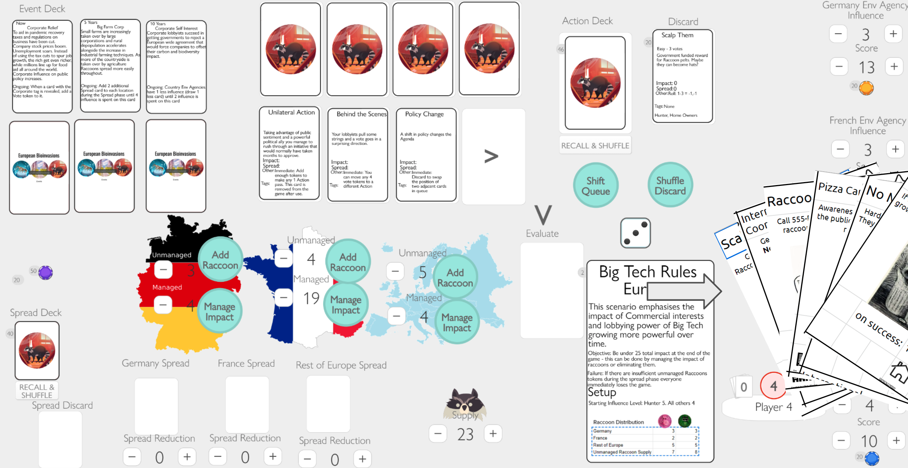
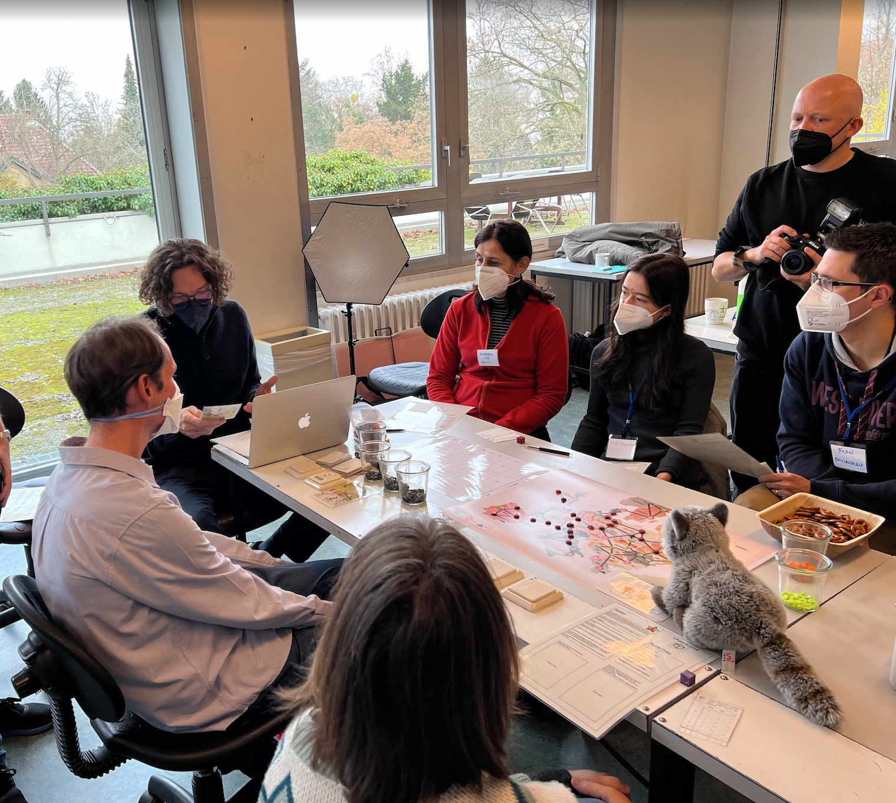
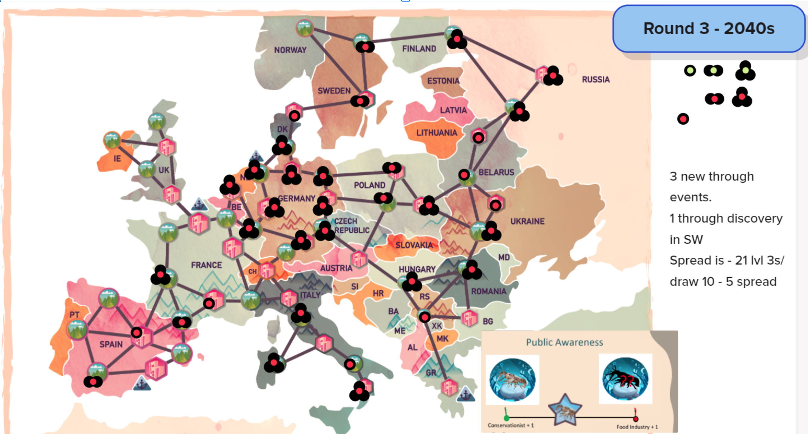
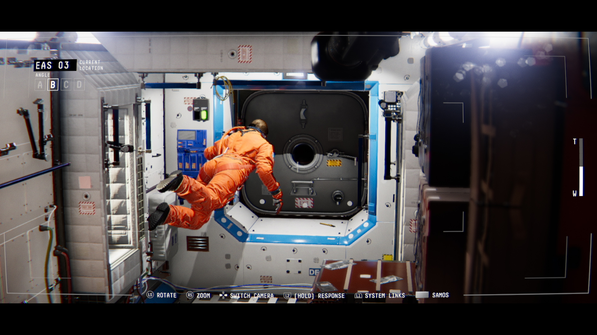
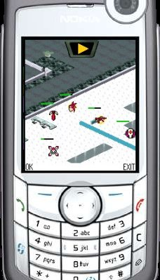

# Spiele-Portfolio (2024-2005)

Ein umfassendes Portfolio mit fast zwei Jahrzehnten innovativer Spielentwicklung, von den neuesten forschungsbasierten Serious Games bis zu bahnbrechenden plattformübergreifenden Erfahrungen und preisgekrönten Bildungsinterventionen.

## Portfolio-Übersicht

Dieses Portfolio umfasst **19 Jahre** Spielentwicklung (2005-2024) mit:

- **Bildungs- & Serious Games**: Lehrplan-orientierte Lernerfahrungen mit messbarer Wirkung
- **Gesundheitsinterventionen**: Digitale Verhaltensänderungs-Tools mit klinischer Validierung
- **Klima & Umwelt**: Politiksimulationsspiele für Stakeholder-Engagement
- **Forschungspartnerschaften**: EU-geförderte Projekte mit wissenschaftlichen Institutionen
- **Plattformübergreifende Innovation**: Von früher Mobil-Web-Integration bis zu moderner digitaler Distribution
- **Auszeichnungen**: Mehrere internationale Gaming- und Bildungspreise

---

# BioInvasions: Raccoon Rampage (2024)

## Zusammenfassung

BioInvasions: Raccoon Rampage ist ein semi‑kooperatives Brettspiel über Waschbär-Invasionen in Europa und stellt die Weiterentwicklung unserer Arbeit zu European BioInvasions (2022) hin zu einer fokussierten, artspezifischen Erkundung dar. Basierend auf den EU-finanzierten Forschungsprojekten InvasiBES und AlienScenarios verbindet dieses 45–60‑minütige Erlebnis strategische Planung mit sozialer Verhandlung, während 3–4 Spielende in die Rollen von Umweltbehörden, Jägern und Tierrechts-Lobbyist:innen schlüpfen – jeweils mit eigenen Zielen – und zugleich die ökologischen und gesellschaftlichen Auswirkungen einer sich rasch ausbreitenden invasiven Art gemeinsam managen.

Das Spiel ist in mehreren Formaten verfügbar: kostenlos spielbar auf Tabletopia, als kostenloser Print-and-Play-Download zum Ausdrucken zu Hause, und wir befinden uns in den letzten Zügen, einen Online-Shop einzurichten, in dem die hochwertige physische Version erworben werden kann. Das Spiel wurde durch akademische Forschung validiert; eine Masterarbeit mit 86 Teilnehmenden zeigte signifikante Wissenszuwächse zu invasiven Arten sowie ein verbessertes Bewusstsein für die Notwendigkeit kooperativer, multi-stakeholder-basierter Managementstrategien.

## Entwicklungsdetails

**Forschungsgrundlage:** Baut direkt auf den EU-finanzierten Forschungsprojekten InvasiBES und AlienScenarios auf und übersetzt modernste Invasionsbiologie und Szenariomodellierung in zugängliche Spielmechaniken.

**Fortführung von European BioInvasions (2022):** Dieser Titel entwickelt unsere European-BioInvasions-Reihe weiter, indem er den Fokus speziell auf Waschbär-Invasionen verengt. So werden tiefere Rollen-Asymmetrien und politische Abwägungen möglich, während der semi‑kooperative Verhandlungsrahmen in einer kompakteren 45–60‑Minuten-Sitzung, die für wiederholtes Spielen geeignet ist, ausgebaut wird.

**Artwork und Design:** Wunderschönes Artwork sorgt für sofortige Präsenz am Spieltisch.

**Iterative digitale und physische Entwicklung:** Wir haben einen hybriden Entwicklungsansatz genutzt, abwechselnd mit Präsenz-Sitzungen von Stakeholdern und digitalem Prototyping, um Iterationen zu beschleunigen und umfassendes Feedback von vielfältigen Teilnehmenden zu sammeln.

## Digitales Prototyping und Entwicklungsprozess

*Früher digitaler Prototyp auf PlayingCards.io entwickelt, um schnelle Spieletests zwischen persönlichen Stakeholder-Sitzungen zu ermöglichen*

  
*Endgültige, produktionsreife Version auf Tabletopia verfügbar; sie bildet den Höhepunkt unseres iterativen Designprozesses*

Unser Entwicklungsprozess kombinierte strategisch physisches und digitales Playtesting, um die Qualität des Feedbacks und die Geschwindigkeit der Iterationen zu maximieren:

**Phase 1 - Physische Stakeholder-Sitzungen:** Erste Konzeptentwicklung und Validierung der Kernmechaniken in Präsenz-Workshops mit Umweltwissenschaftler:innen, politischen Entscheidungsträger:innen und Vertreter:innen von Interessengruppen.

**Phase 2 - Schnelles digitales Prototyping:** Zwischen formellen Stakeholder-Treffen entwickelten wir spielbare Prototypen auf PlayingCards.io, was schnelle Regelanpassungen, Karten-Balancing und Mechanik-Experimente mit kleineren Testgruppen ermöglichte.

**Phase 3 - Stakeholder-Validierung:** Verfeinerte Mechaniken und Inhalte wurden in weiteren Präsenzsitzungen getestet, in denen Stakeholder-Feedback sowohl spielerische Verbesserungen als auch pädagogische Authentizität validieren konnte.

**Phase 4 - Produktionsreife digitale Implementierung:** Endversion auf der Tabletopia-Plattform bereitgestellt, um kostenlose Zugänglichkeit für Bildungs- und Forschungskontexte zu gewährleisten und gleichzeitig hohe Produktionsqualität und ein reibungsloses digitales Brettspielerlebnis sicherzustellen.

Dieser iterative Ansatz ermöglichte es uns, das authentische Stakeholder-Feedback zu bewahren, das für pädagogische Glaubwürdigkeit entscheidend ist, und zugleich die schnellen Iterationszyklen zu erreichen, die für ein ausgereiftes Spieldesign notwendig sind. Die Phasen des digitalen Prototypings erwiesen sich als besonders wertvoll, um mechanische Komplexität und Spielenden-Engagement zwischen den formelleren Stakeholder-Validierungssitzungen zu testen.

## Spielablauf und Mechaniken

**Kernstruktur:**
- **Spieler:innen:** 3–4 Teilnehmende, ab 12+
- **Dauer:** 45–60 Minuten pro Sitzung
- **Format:** Semi‑kooperatives Strategiespiel mit kompetitiven Elementen
- **Komponenten:** Großer Spielplan, über 160 Karten mit einzigartigem Artwork, vier Spielerdecks, Markerwürfel und Spielwürfel
- **Alleinstellungsmerkmal:** "Ja, ihr müsst zusammenarbeiten - ABER ihr wollt auch alle anderen schlagen!"

**Spielerrollen und Ziele:**
Vier einzigartige Rollen, jeweils mit eigenem Spielertableau, einzigartigen Kartendecks und spezifischen Zielsetzungen:
- **Umweltbehörden:** Priorisieren den Schutz der Biodiversität und die langfristige Resilienz von Ökosystemen durch wissenschaftsbasierte Managementansätze
- **Jäger:** Betonen praktische Kontrollmaßnahmen und kosteneffizientes Populationsmanagement durch direkte Eingriffe
- **Tierrechtsaktivist:innen:** Setzen sich für humane Ansätze und die öffentliche Meinung ein, stellen harte Eingriffe infrage und fördern ethische Alternativen
- **Zusätzliche Rolle:** [Vierte Rolle variiert je nach Szenario]

Jede Rolle erzeugt eine Spannung zwischen der gemeinsamen Mission, die Waschbär-Invasion zu stoppen, und individuellen, kompetitiven Zielen. Das treibt dynamische Allianzen und strategische Entscheidungen voran.

**Kartengetriebenes Spiel:**

*Politikkarten (schwarzer Rand):* Standard- und einzigartige Karten, die Spielende in eine Warteschlange legen und über die gemeinsam abgestimmt wird. Sie repräsentieren Managementstrategien und Interventionen, die demokratische Entscheidungsprozesse erfordern und zugleich individuellen, strategischen Zielen dienen.

*Aktionskarten (weißer Rand):* Standard- und einzigartige Karten, mit denen Spielende anderen in die Quere kommen können – etwa durch Stimmenklau, Politiken-Tausch und das Manipulieren von Abstimmungsergebnissen – und so kompetitive Spannung in die kooperativen Ziele bringen.

*Story-Karten:* Werden in jeder Runde eingeführt, um narrativen Druck zwischen Gruppenmission und persönlichen Zielen aufzubauen; sie liefern Kontext und steigern die Herausforderungen, während sich die Waschbär-Invasion ausbreitet.

**Spielablauf:**
1. **Story-Entwicklung:** Neue Story-Karten führen sich wandelnde Herausforderungen und narrativen Kontext ein
2. **Politik-Warteschlange:** Spielende schlagen Managementmaßnahmen mittels Politikkarten vor
3. **Verhandlung und Abstimmung:** Koalitionen bilden und über Politiken abstimmen, während individuelle Ziele verfolgt werden
4. **Manipulation durch Aktionen:** Aktionskarten ausspielen, um Ergebnisse zu beeinflussen, Stimmen zu stehlen oder Strategien anderer zu stören
5. **Auswirkungen auswerten:** Kollektive und individuelle Konsequenzen der getroffenen Entscheidungen auflösen
6. **Adaptive Strategie:** Ansätze anpassen, wenn neue Story-Elemente und Interaktionen den Spielzustand verändern

## Pädagogischer Rahmen und Wirkung

**Akademische Validierung:** Eine umfassende Vorher-/Nachher-Studie mit 86 Teilnehmenden bestätigte die Wirksamkeit des Spiels:
- **Wissenszuwächse:** Signifikante Zunahme des Wissens zu invasiven Arten nach dem Spielen
- **Perspektivwechsel:** Sichtweisen auf Waschbären wandelten sich von überwiegend positiv hin zu informierteren, neutraleren Positionen, die sowohl Tierschutz- als auch ökologische Auswirkungen berücksichtigen
- **Systemdenken:** Verbesserte Wahrnehmung der Notwendigkeit kooperativer, multi-stakeholder-basierter Managementstrategien in der Umweltgovernance
- **Qualität der Beteiligung:** Obwohl einige Komplexitätsgrenzen für zukünftige Verfeinerungen identifiziert wurden, wurde das Potenzial als pädagogisches Werkzeug insgesamt bestätigt

**Lehrplanintegration:** Das Spiel unterstützt Lernziele in den Bereichen Umweltwissenschaften, Politikwissenschaften und Stakeholder-Engagement, mit besonderer Relevanz für:
- Invasionsökologie und Biodiversitätsschutz
- Umweltpolitik und Governance
- Entscheidungsprozesse mit mehreren Stakeholdern
- Dynamiken an der Schnittstelle zwischen Wissenschaft und Politik

## Technische Innovation und Umsetzung

**Übersetzung von Forschung in Praxis:** Transformiert abstrakte ökologische Daten und politische Rahmenwerke aus EU-finanzierter Forschung in praktische Entscheidungserfahrungen, die die menschlichen Dimensionen des Umweltmanagements sichtbar machen.

**Authentizität der Stakeholder-Perspektiven:** Jede Rolle repräsentiert authentisch realweltliche Standpunkte von Umweltbehörden, Wildtier-Managementfachleuten und Interessenvertretungen, fördert Empathie und Systemdenken zu komplexen Naturschutzherausforderungen.

**Simulation demokratischer Entscheidungsprozesse:** Das Vorschlags- und Abstimmungssystem spiegelt reale Prozesse der Umweltgovernance wider, in denen Stakeholder konkurrierende Interessen ausbalancieren müssen, während gemeinsame Bedrohungen für die Stabilität von Ökosystemen adressiert werden.

**Zugängliche digitale Plattform:** Kostenlose Verfügbarkeit über Tabletopia maximiert die Bildungsreichweite und ermöglicht eine breite Nutzung in akademischen, beruflichen und öffentlichen Engagement-Kontexten.

## Bedeutung und Vermächtnis

BioInvasions: Raccoon Rampage zeigt, wie fokussierte, artspezifische Serious Games die Auseinandersetzung mit komplexen Umweltfragen vertiefen können, ohne die wissenschaftliche Genauigkeit zu verlieren. Durch die Konzentration speziell auf Waschbär-Invasionen entstand Raum für eine nuanciertere Exploration der ethischen, praktischen und ökologischen Abwägungen, die das Management invasiver Arten in der realen Welt kennzeichnen.

Die Validierung des Spiels durch akademische Forschung etabliert es als glaubwürdiges Lehrwerkzeug, während seine Entwicklung aus EU-finanzierter wissenschaftlicher Forschung sicherstellt, dass die Spielmechaniken den aktuellen Stand der Invasionsbiologie und politischen Dynamiken widerspiegeln. Als Fortsetzung unserer Arbeit zu European BioInvasions (2022) führt Raccoon Rampage unsere Methodik fort, Forschung in fesselnde, kollaborative Lernerfahrungen zu übersetzen.

Das Projekt exemplifiziert unseren Ansatz eines forschungsinformierten Game Designs: Mechaniken in wissenschaftlichen Evidenzen zu verankern, Bildungsergebnisse durch rigorose Evaluation zu validieren und die Zugänglichkeit über digitale Plattformen sicherzustellen, die eine breite Adoption in Bildungs- und beruflichen Kontexten unterstützen.

---

**Jahr:** 2024  
**Auftraggeber/Förderung:** EU-finanzierte Forschungsprojekte (InvasiBES und AlienScenarios)  
**Plattform:** Tabletopia (kostenlos spielbar), herunterladen und zu Hause drucken, Shop folgt in Kürze  
**Website:** https://raccoonrampage.ecologygames.eu/  
**Kontakt:** jonathan.jeschke@gmx.net  
**Akademische Validierung:** Evaluierung im Rahmen einer Masterarbeit mit 86 Teilnehmenden

## Öffentlichkeitsarbeit und Veranstaltungen

*Spieler:innen genießen BioInvasions: Raccoon Rampage auf der Essen Spiel 2023, was die Attraktivität des Spiels sowohl für Spielefans als auch für Bildungszielgruppen zeigt.*

Das Spiel wurde erfolgreich auf großen Spieleconventions demonstriert, darunter die Essen Spiel 2023, wo es sowohl ernsthafte Spieleenthusiast:innen als auch Pädagog:innen mit Interesse an Umweltthemen anzog. Diese öffentlichen Vorführungen bestätigen die Zugänglichkeit und das Engagementpotenzial des Spiels über akademische Kontexte hinaus und zeigen, wie forschungsbasierte Serious Games durch Spielekultur und Conventions ein breiteres Publikum erreichen können.

---

# European BioInvasions

## Zusammenfassung

European BioInvasions ist ein "koopetitives" Rollenspiel, das wir im Rahmen zweier EU-finanzierter Forschungsprojekte entwickelt haben: InvasiBES und AlienScenarios. Konzipiert für Studierende, Wissenschaftlerinnen und Wissenschaftler sowie Stakeholder, die sich mit biologischen Invasionen befassen, fordert das Spiel die Spielenden heraus, in 60-120-minütigen Sitzungen bei der Bewältigung invasiver Arten in Europa zu kooperieren und zu konkurrieren. Die Spielenden stimmen über Vorschläge zu Managementmaßnahmen ab, während sie sich durch Ereigniskarten eingeführten, sich verändernden Rahmenbedingungen navigieren, mit dem gemeinsamen Ziel, die Auswirkungen invasiver Arten durch strategische Entscheidungsfindung zu verringern.

Das Spiel umfasst vier Schlüsselarten – Marmorkrebs, Nordamerikanischer Waschbär, Beifuß-Ambrosie und Asiatische Hornisse – wobei jede Art 4 potenzielle Zukunftsszenarien und 6-7 einzigartige Spielerrollen bietet, die unterschiedliche Stakeholder-Perspektiven und Prioritäten repräsentieren. Erfolgreich bei einem Workshop in Berlin im Jahr 2022 getestet, wurde das Spiel für seinen innovativen Ansatz zur Simulation von Umweltpolitik als Finalist bei der 2022 International Educational Games Competition anerkannt.

## Entwicklungsdetails

- **Forschungsprojekte:** EU-finanzierte InvasiBES und AlienScenarios
- **Jahr:** 2022 (Projektzeitraum 2021–2022)
- **Kategorie:** Koopetitives Rollenspiel / Umweltbildung
- **Auszeichnung:** Finalist, 2022 International Educational Games Competition
- **Dauer:** 60-120 Minuten pro Sitzung
- **Materialien:** Zum Download verfügbar unter europeanbioinvasions.ecologygames.eu
- **Kontakt:** jonathan.jeschke@gmx.net

Wir haben das Spiel durch kollaborative wissenschaftliche Forschung und iteratives Design entwickelt:

- **Forschungsintegration:** Direkt auf EU-finanzierter wissenschaftlicher Forschung zu biologischen Invasionen basierend, um Genauigkeit und Relevanz für aktuelle Naturschutzherausforderungen sicherzustellen
- **Mehrarten-Fokus:** Umfassende Szenarien für vier zentrale invasive Arten entwickelt, jede mit unterschiedlichen ökologischen und Managementeigenschaften
- **Stakeholder-Einbindung:** Einzigartige Spielerrollen gestaltet, die reale Perspektiven von Forschenden, Entscheidungsträgern, Naturschutzgruppen und betroffenen Gemeinschaften widerspiegeln
- **Workshop-Tests:** 2022 in Berlin erfolgreich mit Wissenschaftlern und Stakeholdern pilotiert, um Spielmechaniken und Bildungsergebnisse zu validieren
- **Open-Access-Materialien:** Erstellte, herunterladbare Spielregeln, druckbare Spielkomponenten, Karten und Kartenstapel zur Maximierung der Zugänglichkeit und Wiederverwendbarkeit

## Technische Aspekte

### Kernmechaniken des Spiels

- **Koopetitives Gameplay:** Spielende müssen zusammenarbeiten, um gemeinsamen Bedrohungen zu begegnen, während sie um begrenzte Ressourcen und unterschiedliche Stakeholder-Prioritäten konkurrieren
- **Rollenbasierte Perspektiven:** 6-7 einzigartige Rollen pro Artenszenario, jeweils mit eigenen Überzeugungen, Prioritäten und Einschränkungen, die reale Stakeholder-Positionen widerspiegeln
- **Demokratische Entscheidungsfindung:** Spielende stimmen über Vorschläge zu Managementmaßnahmen ab und simulieren kollektive Entscheidungsprozesse in der Umweltgovernance
- **Ereignisgetriebene Szenarien:** Dynamische Ereigniskarten führen in jeder Runde veränderte Bedingungen ein, wodurch Spielende ihre Strategien anpassen und die Resilienz ihrer Pläne testen müssen
- **Komplexität über mehrere Arten:** Vier unterschiedliche invasive Arten (Marmorkrebs, Waschbär, Ambrosie, Asiatische Hornisse), die jeweils artspezifische Managementansätze erfordern
- **Planung zukünftiger Szenarien:** 4 potenzielle Zukunftsszenarien pro Art ermöglichen die Erkundung unterschiedlicher Umwelt- und Politik-Kontexte
- **Moderation durch die Spielleitung:** Geführte Sitzungen mit strukturierter Nachbesprechung zur Maximierung von Lernerfolgen und Policy-Insights

### Bildungsrahmen

- **Visualisierung auf Europakarte:** Physische Spielkarte verfolgt die Ausbreitung der Arten und Managementmaßnahmen über europäische Regionen
- **Evidenzbasierte Szenarien:** Alle Artprofile und Managementoptionen sind in aktueller wissenschaftlicher Forschung und Politikrahmen verankert
- **Kollaboratives Lernen:** Gruppenentscheidungsprozesse spiegeln reale Naturschutzplanung und Stakeholder-Einbindung wider
- **Übertragbare Erkenntnisse:** Spielergebnisse lassen sich direkt auf das Verständnis realer Herausforderungen im Management invasiver Arten übertragen

### Spielmaterialien und Umsetzung

- **Print-and-Play-Design:** Vollständige Spielmaterialien als kostenlose Downloads, einschließlich Regelwerk, Spielkarte, Ereigniskarten und Spielerrollen-Karten
- **Modulare Artenszenarien:** Jede der vier Arten (Marmorkrebs, Waschbär, Ambrosie, Asiatische Hornisse) fungiert als eigenständiges Spielmodul
- **Artwork und Visualisierung:** Von der Künstlerin Kris Tsenova gestaltete Spielkomponenten verbessern die visuelle Darstellung und die Einbindung der Spielenden
- **Workshop-Integration:** Materialien für Bildungs- und Fortbildungskontexte mit klaren Moderationsanleitungen ausgelegt
- **Skalierbare Gruppengrößen:** Flexible Spielerzahlen ermöglichen unterschiedliche Workshop-Größen bei gleichzeitiger Wahrung von Spielbalance und Engagement

## Wirkung und Bedeutung

### Bildungs- und wissenschaftliche Beiträge

European BioInvasions zeigt, wie kollaboratives Spieldesign komplexe Umweltforschung in zugängliche, ansprechende Lernerfahrungen übersetzen kann. Indem das Gameplay auf tatsächlicher, EU-finanzierter Forschung aus den Projekten InvasiBES und AlienScenarios beruht, haben wir eine authentische Brücke zwischen wissenschaftlichem Wissen und öffentlichem Verständnis des Managements invasiver Arten geschaffen.

### Zentrale Innovationen

- **Übersetzung von Forschung in Praxis:** Verwandelt abstrakte ökologische Daten und Politikrahmen in praktische Entscheidungserfahrungen, die die menschlichen Dimensionen der Umweltsteuerung sichtbar machen
- **Integration von Stakeholder-Perspektiven:** Jede Rolle repräsentiert authentisch reale Sichtweisen von Forschenden, Entscheidungsträgern, Naturschützern und betroffenen Gemeinschaften und fördert Empathie und systemisches Denken
- **Kollaboratives Problemlösen:** Die koopetitive Spielstruktur spiegelt reale Herausforderungen der Umweltgovernance wider, bei denen Stakeholder konkurrierende Interessen ausbalancieren müssen, während sie gemeinsamen Bedrohungen begegnen
- **Open-Access-Wirkung:** Die kostenlose Verfügbarkeit aller Spielmaterialien maximiert die Bildungsreichweite und ermöglicht eine breite Nutzung in akademischen und beruflichen Kontexten
- **Modulare Wiederverwendbarkeit:** Artenbasierte Module erlauben es Lehrenden, sich auf lokal relevante invasive Arten zu konzentrieren, bei gleichzeitiger Beibehaltung konsistenter Lernrahmen

### Anerkennung und Reichweite

Die Anerkennung des Spiels als Finalist der 2022 International Educational Games Competition bestätigt seinen Beitrag zur Umweltbildung und zum Design von Serious Games. Seine Entwicklung innerhalb von EU-Forschungsrahmen positioniert es als Modell dafür, wie spielbasierte Methoden die wissenschaftliche Kommunikation und die Stakeholder-Einbindung im Naturschutz verbessern können.

European BioInvasions veranschaulicht, wie spielbasiertes Lernen komplexe Umweltprobleme zugänglich machen kann, während wissenschaftliche Strenge gewahrt bleibt, und fördert sowohl die Praxis des Bildungsspiels als auch die öffentliche Auseinandersetzung mit der Naturschutzwissenschaft.

## Entwicklung von Stakeholder-Workshop-Spielen

*Karte des aktuellen Stands der Waschbär-Invasionen in Europa zur Spielmitte in einem Workshop*

*Variante zur Asiatischen Hornisse wird in einem Workshop gespielt*

*Waschbär-Szenario des Spiels, das in einem Workshop gespielt wird*

Unsere Arbeit an European BioInvasions zeigt unsere Erfahrung in der Entwicklung von Spielen speziell für die Stakeholder-Einbindung und Workshop-Kontexte. Das Spiel dient als moderierte Erfahrung, bei der Teilnehmende mit unterschiedlichen Perspektiven Lösungen für komplexe Umweltprobleme aushandeln müssen.

Wir haben das Spiel erfolgreich in mehreren Stakeholder-Workshops zu verschiedenen Szenarien invasiver Arten eingesetzt. Dazu gehören eigens durchgeführte Sitzungen zur Bewältigung der Invasion der Asiatischen Hornisse sowie Strategien zur Kontrolle der Bestände des Nordamerikanischen Waschbären. Jeder Workshop bringt relevante Fachleute, Entscheidungsträger und Vertreter betroffener Gemeinschaften zusammen, um artspezifische Managementansätze durch kollaboratives Gameplay zu erkunden.

Die Workshop-Umsetzung umfasst visuelle Hilfsmittel wie Karten, die den aktuellen Stand der Verbreitung invasiver Arten zeigen, sodass die Teilnehmenden den Umfang und die geografische Ausbreitung der biologischen Invasion verstehen. Diese visuellen Elemente verankern abstrakte Politikdiskussionen in konkreten räumlichen und zeitlichen Realitäten und ermöglichen fundiertere Entscheidungen während der Spielesitzungen.

Unser Ansatz für Stakeholder-Workshop-Spiele betont:

- **Mehrperspektivische Darstellung:** Sicherstellung, dass alle relevanten Stakeholder-Sichtweisen durch unterschiedliche Spielerrollen authentisch repräsentiert sind
- **Visuelle Kommunikation:** Einsatz von Karten, Kartenstapeln und anderen visuellen Hilfen, um komplexe Informationen in Gruppenentscheidungen zugänglich zu machen
- **Strukturierte Moderation:** Bereitstellung klarer Rahmen für Gruppendiskussion, Verhandlung und Konsensbildung
- **Praxisnähe:** Entwicklung von Mechaniken, die sich direkt auf reale Politik- und Managementkontexte übertragen lassen
- **Kollaboratives Lernen:** Schaffung von Erfahrungen, bei denen Teilnehmende voneinander lernen – aus Perspektiven und Expertise der jeweils anderen

Diese Expertise im Design von Stakeholder-Workshop-Spielen versetzt uns in die Lage, ähnliche kollaborative Entscheidungswerkzeuge für andere komplexe Politikfelder zu entwickeln, die Koordination und Verhandlung zwischen mehreren Akteuren erfordern.

## Digitale Prototypisierung und Remote-Tests

*Darstellung des Spiels, prototypisiert auf einer Miro-ähnlichen Plattform, die Online-Spiel zwischen physischen Sitzungen erleichtert*

*Karte der Ausbreitung des Marmorkrebses in Europa in der digitalen Version*

Um unseren Design-Iterationsprozess zwischen formellen Stakeholder-Workshops zu beschleunigen, haben wir digitale Prototypen von European BioInvasions mit Online-Kollaborationstools ähnlich Miro entwickelt. Dieser Ansatz ermöglichte es uns, Spielmechaniken zu testen, Rollen-Balancing zu verfeinern und Feedback von Teilnehmenden remote zu sammeln, ohne die logistische Koordination vollständiger Präsenz-Workshops zu benötigen.

Der digitale Prototypisierungsprozess ermöglichte schnelle Iterationszyklen, in denen wir:

- **Regelvarianten testen** und mechanische Anpassungen mit kleineren Gruppen von Teilnehmenden vornehmen konnten
- **Stakeholder-Rollen verfeinern** und deren jeweilige Ziele auf Basis von Remote-Feedback-Sitzungen anpassen konnten
- **Szenario-Balance validieren** über verschiedene Artenmodule hinweg, bevor wir uns auf physische Workshop-Durchführungen festlegten
- **Internationale Teilnehmende einbinden** konnten, die nicht an regionalen Workshops teilnehmen konnten, aber wertvolle Fachexpertise einbrachten
- **Spielmuster dokumentieren** konnten, erleichtert durch digitale Interaktionsprotokolle und Bildschirmaufzeichnungen

Dieser hybride Entwicklungsansatz – die Kombination aus digitaler Prototypisierung und formellen Stakeholder-Workshops – erwies sich als entscheidend für die Erstellung eines robusten, ausgewogenen Spiels. Die digitalen Versionen dienten als Testfelder für neue Ideen und Mechaniken, während die physischen Workshops die authentische Stakeholder-Einbindung und Validierung für den Bildungserfolg lieferten.

Unsere Erfahrung mit der Entwicklung vom Digitalen zum Physischen zeigt unsere Fähigkeit, Remote-Zusammenarbeitstools für effiziente Spieldesign-Prozesse zu nutzen – besonders wertvoll für komplexe Multi-Stakeholder-Szenarien, die umfangreiche Iteration und Verfeinerung erfordern.

---

# SuperbMarket (2022)

## Zusammenfassung

SuperbMarket ist ein Serious Game, das wir 2021–2022 für die Universität Glasgow entwickelt haben und das das komplexe Zusammenspiel von Identität, Gesundheit und geschäftlichen Entscheidungen im Kontext menschenwürdiger Arbeitsbedingungen und des Real Living Wage untersucht. Angesiedelt in einem zeitgenössischen Supermarktbetrieb, ermöglicht das Projekt Lernenden, praktische Abwägungen zwischen Mitarbeiterwohlbefinden, operativer Leistung und finanzieller Tragfähigkeit zu erkunden. Das Spiel wurde als Finalist bei den IEGA-Auszeichnungen 2022 anerkannt, was seine didaktische Strenge und Relevanz für aktuelle Arbeitsplatzthemen würdigt.

**Kontakt:** Rosalind.Searle@glasgow.ac.uk

## Entwicklungsdetails

  
**Auftraggeber:** Universität Glasgow  
**Jahr:** 2021-2022  
**Kategorie:** Serious Game / Bildungsanwendung  
**Auszeichnungen:** 2022 IEGA Finalist

Wir entwickelten dieses Projekt aus dem Bedarf der Universität Glasgow nach einem interaktiven Werkzeug, um abstrakte Politikdiskussionen—wie die Einführung eines existenzsichernden Lohns, Dienstplanpraktiken und Gesundheit am Arbeitsplatz—in konkrete, navigierbare Entscheidungsräume zu überführen, die Konsequenzen sowohl für Einzelne als auch für Organisationen sichtbar machen.

## Technische Aspekte

### Kernmechaniken
- **Charaktergetriebene Erzählungen:** Spielende erleben die Geschichte aus den Perspektiven von Lee (erfahrene Arbeitskraft mit familiären Verpflichtungen) oder Bo (Student/in, der/die Arbeit und Studium ausbalanciert), sowie von Manager/in Jo, verantwortlich für Einstellungs- und operative Entscheidungen
- **Simulation von Herausforderungen am Arbeitsplatz:** Reale Szenarien wie Autopannen, Konflikte bei der Kinderbetreuung, Lerndruck und Vorfälle zur Arbeitssicherheit, die Leistung und Wohlbefinden von Mitarbeitenden beeinflussen
- **System der Entscheidungsfolgen:** Entscheidungen der Spielenden bezüglich Einstellungskriterien (Mindestlohn vs. Erfahrung, Flexibilität vs. Unternehmentreue) und Reaktionen des Managements (Unterstützung vs. Disziplin) erzeugen verzweigende Story-Ergebnisse
- **Progressiver Schwierigkeitsgrad:** Beginnend mit alltäglichen Herausforderungen am Arbeitsplatz, die sich zu ernsten Vorfällen steigern und von den Spielenden eine Anpassung von Richtlinien und Führungsansätzen erfordern
- **Mehrere Enden:** Unterschiedliche Erzählpfade, basierend auf Entscheidungen der Mitarbeitenden (Zweitjob, Kündigung, Arbeitsunfälle) und den Reaktionen des Managements, schaffen Wiederspielwert

### Technische Umsetzung
- **Narratives Scripting mit Ink:** Erstellt mit der Engine für interaktive Fiktion Ink für robust verzweigende Dialoge und Zustandsverwaltung über komplexe Erzählstrukturen hinweg
- **Charakterzustands-Tracking:** Dynamische Variablen überwachen Stress, Motivation, finanziellen Druck der Mitarbeitenden und die Haltung der Führungskraft, um eine realistische Erzählfortschreitung zu steuern
- **Visual-Novel-Präsentation:** Charakterpositionierung, Hintergründe und visuelle Requisiten bereichern die Erzählung, bei Fokus auf Geschichte und Entscheidungen
- **Modulare Erzählstruktur:** Separate Erzählstränge für verschiedene Figuren ermöglichen komplexe Interaktionen bei gleichzeitiger Code-Organisation
- **Visualisierung von Konsequenzen in Echtzeit:** Story-Ergebnisse spiegeln unmittelbar die Auswirkungen von Richtlinienentscheidungen auf das Wohlbefinden der Mitarbeitenden und den Geschäftsbetrieb wider
- **Didaktische Integration:** Für den Unterricht konzipiert, mit klaren Lernmomenten in authentischen Arbeitsszenarien

## Lernziele

SuperbMarket zielt auf mehrere Lernergebnisse in den Kontexten Wirtschaft, öffentliche Gesundheit und Sozialpolitik ab:

- **Systemdenken:** Verknüpfen von Lohnpolitik, Personalbesetzung, Nachfrageschwankungen und Auswirkungen auf das Wohlbefinden
- **Ethische Entscheidungsfindung:** Stakeholder-Auswirkungen identifizieren und durch konkurrierende Prioritäten abwägen
- **Kompetenzen zu menschenwürdiger Arbeit:** Real Living Wage von Mindestlohnrahmen unterscheiden und Implikationen von Arbeitsplatzrichtlinien interpretieren
- **Identitätsbewusstsein:** Verstehen, wie sich überschneidende Identitäten (Alter, Pflegeverantwortung, Behinderung) Arbeitserfahrungen prägen
- **Evidenzinterpretation:** Einsichten aus der Simulation in umsetzbare Empfehlungen übersetzen

## Wirkung und Bedeutung

### Akademische Zusammenarbeit
Unsere Partnerschaft mit der Universität Glasgow verankerte Mechaniken und Szenarien in Kurszielen und Forschungsfragen rund um faire Arbeit. Das Spiel fungiert als lebendes Labor, um Entscheidungsfindung unter sozialen und operativen Druckbedingungen zu untersuchen; Telemetrie und reflektierende Impulse ermöglichen Vorher-/Nachher-Analysen des Denkens der Lernenden.

### Branchenanerkennung
Die Auswahl von SuperbMarket als IEGA-Finalist 2022 signalisierte sowohl Pädagoginnen und Pädagogen als auch Branchenakteuren, dass komplexe Arbeitsthemen durch fesselndes, dateninformiertes Spiel vermittelt werden können. Die Anerkennung hilft, die simulationsbasierte Erkundung fairer Arbeit in der Managementausbildung und im Arbeitgebertraining zu normalisieren.

### Innovation bei Serious Games
- **Authentische Erzählungen aus dem Arbeitsalltag:** Verankert Politikdiskussionen in realistischen Mitarbeitererfahrungen, einschließlich finanziellem Druck, familiären Verpflichtungen und Herausforderungen der beruflichen Entwicklung
- **Empathiegetriebenes Design:** Spielende erleben Arbeitsbedingungen aus mehreren Perspektiven und entwickeln Verständnis dafür, wie Managemententscheidungen individuelle Lebensumstände beeinflussen
- **Konsequenzen statt Mechaniken:** Story-Ergebnisse spiegeln direkt reale Arbeitsdynamiken statt abstrakter Spielsysteme wider und machen politische Implikationen greifbar
- **Intersektionale Darstellung:** Lees familiäre Verpflichtungen und Bos Status als Student/in repräsentieren unterschiedliche Beschäftigtengruppen und verdeutlichen, wie Richtlinien verschiedene Mitarbeitende unterschiedlich betreffen
- **Schrittweise Offenlegung:** Komplexe Arbeitsplatzthemen treten natürlich durch die Erzählentwicklung hervor, ohne belehrende Botschaften
- **Wiederholbarkeit fürs Lernen:** Mehrere Erzählpfade ermutigen zur Erkundung verschiedener Führungsansätze und ihrer Konsequenzen

SuperbMarket zeigt, wie erzählgetriebene Serious Games aktuelle Herausforderungen am Arbeitsplatz effektiv adressieren können, indem sie menschliche Erfahrungen innerhalb politischer Rahmen in den Mittelpunkt stellen. Unser Fokus auf authentische Charakterentwicklung und realistische Arbeitsszenarien macht Prinzipien menschenwürdiger Arbeit durch fesselndes, folgenreiches Storytelling zugänglich und treibt Educational Gaming in Arbeits- und Geschäftskontexten voran.

---

# Shades – Spiele- und Engagement-Ebene für ein Nachrichten-Startup (2021-2022)

## Zusammenfassung

cf.me hat sich vorgenommen, die Art und Weise zu verändern, wie Menschen tägliche Nachrichten erhalten, indem redaktionelle Inhalte mit spielerischen, gewohnheitsbildenden Interaktionen verknüpft werden. Das Unternehmen firmierte später als Shades News um. Wir wurden beauftragt, ein kohärentes Erlebnis über Website und Mobile-App hinweg zu entwerfen. Wir entwarfen zwei iOS-Spiele, die als leichte, tägliche Kontaktpunkte dienen konnten. "baw" und "wurd" wurden als schnelle, wiederholt spielbare Titel konzipiert, die Lesephasen ergänzen—sie bieten kurzweiliges Spiel während Nachrichtenpausen und schaffen neue Einstiegspunkte zurück ins Nachrichtenerlebnis. Diese Arbeit schuf die Grundlage für eine Nachrichtenplattform, in der Spiele kein Add-on sind, sondern eine zentrale Mechanik für Bindung und Engagement.

**Kontakt:** Sonali Maitra - sonali@shades.news

## Entwicklungsdetails

**Experience-Architektur:** Definierte einen einheitlichen Engagement-Loop, der die Website, die Nachrichten-App und die beiden Spiele umspannt. Nutzer konnten über In-App-Flächen, Deep Links und cross-promotional Hooks nahtlos von Schlagzeilen ins Spiel und wieder zurück wechseln.

**Produktintegration:** Trug zur cf.me-Website und zur iOS-App bei und verantwortete zugleich die Spiele, um eine gemeinsame Designsprache, konsistente Interaktionsmuster und die Auffindbarkeit von Spiel innerhalb des Nachrichtenflusses sicherzustellen.

**Spiele-als-Einstieg:** Lieferte zwei iOS-Titel—"baw" und "wurd"—als reibungsarme, Pick‑up‑and‑Play‑Erlebnisse, die für kurze Sessions gedacht sind. Die Spiele wurden als tägliche Rituale positioniert, die Nutzer mit der Marke bekannt machen und für Nachrichten-Updates zurückbringen konnten.

**Iterative Entwicklung:** Prototypisierte UX-Flows und Spielschleifen schnell, um zu validieren, wie und wo Spiel in eine Nachrichtenroutine passt (Einstiegspunkte, Session-Timing, Benachrichtigungen und Belohnungen).

**Content- und Community-Flächen:** Implementierte In-App-Platzierungen und teilbare Momente, sodass Erfolge in Spielen sich in soziale und produktinterne Sichtbarkeit übersetzen und organische Entdeckung vorantreiben konnten.

---

  
**Plattformen:** Web, iOS  
**Jahr:** 2021-2022

---

# Observation (2019)

**Jahr:** 2019  

**Typ:** Game-Design-Beratung  

## Zusammenfassung

Neben der Entwicklung eigener Titel bieten wir Designberatung für Spielestudios an und stellen flexible, bedarfsorientierte Expertise bereit.

Wir haben NoCode bei Observation beratend unterstützt und zur Usability-Analyse experimenteller narrativer Interfaces sowie zur Überprüfung der Kohärenz von Inhalten und Systemen beigetragen. Unser Engagement war begrenzt, aber darauf fokussiert, das Spielererlebnis in diesem innovativen, storygetriebenen Spiel zu verfeinern.

**Kontakt:** jon@screenburn.com

## Beiträge

**Rolle:** Design  
**Beiträge:** 
- Usability-Analyse für experimentelle narrative Interfaces
- Überprüfung der Kohärenz von Inhalten und Systemen
- Unterstützung der Vision des Teams für dieses komplexe, erzählerisch getriebene Erlebnis

Dies war ein punktuelles Beratungsengagement, bei dem wir gezieltes Feedback gaben, um die hervorragende Arbeit des Entwicklungsteams an diesem einzigartigen Projekt zu unterstützen.

## Auszeichnungen und Anerkennungen

**BAFTA Scotland Best Game 2019** - Gewinner  
**BAFTA Best British Game 2020** - Gewinner  
Observation erhielt bemerkenswerte Anerkennung und gewann sowohl den BAFTA Scotland Best Game Award 2019 als auch den BAFTA Best British Game Award 2020. Das Spiel wurde für seinen innovativen Ansatz des Sci-Fi-Erzählens und die einzigartige Perspektive gelobt, als KI einer Raumstation zu spielen.

---

# Gaming Climate Futures: Die Erde erinnert sich

## Zusammenfassung

Gaming Climate Futures (2018) ist eine Klimapolitik-Simulation, die wir gemeinsam mit Studierenden der Glasgow Caledonian University für UN-Entscheidungsträger entwickelt haben und die die Beziehung zwischen globalen Temperaturzielen und Klimakipppunkten operationalisiert. Als Mixed-Media-Workshop durchgeführt—der Spielmechaniken, strukturierte Verhandlungen, Storytelling und Co-Creation verbindet—fungiert er als Entscheidungsunterstützungs- und Lerninstrument, um das Verständnis systemischer Klimarisiken zu vertiefen und zugleich die diplomatische Kommunikation zu stärken. Das Projekt wurde bei der International Educational Games Competition 2019 als Bestes Spiel nominiert.

## Entwicklungskontext und Ziele

Wir entwickelten es zur Unterstützung von Sitzungen auf der UN-Klimakonferenz und adressierten damit einen doppelten Bedarf: die nichtlinearen Dynamiken von Klimakipppunkten zu vermitteln und die Qualität des internationalen Klimadialogs unter Zeit- und Informationsbeschränkungen zu verbessern. Zu den Zielen gehörten:

- Komplexes wissenschaftliches Wissen über Kaskaden von Kipppunkten in umsetzbare, gemeinsame Referenzpunkte für Verhandelnde zu übersetzen
- Diplomatische Strategien gegenüber systemischem Risiko, Unsicherheit und Pfadabhängigkeit einem Stresstest zu unterziehen
- Innovative Koproduktion zwischen Wissenschaft und Entscheidungsträgern zu etablieren, um Modelle, Annahmen und politische Rahmungen in Einklang zu bringen
- Kommunikation über diverse Stakeholder-Gruppen hinweg durch gemeinsame erfahrungsbasierte Bezugsrahmen zu verbessern

## Technischer Ansatz und innovative Aspekte

**Mixed-Media-Serious-Game-Design:** Ein modulares Toolkit integriert moderiertes Rollenspiel, Szenariokarten, Verhandlungsprotokolle und narrative Impulse mit einem technologieunterstützten Beteiligungsprozess zur Erfassung, Aggregation und Rückmeldung von Inputs in Echtzeit.

**Von Kipppunkten informierte Mechaniken:** Spielzustände und Auszahlungen berücksichtigen Schwellenwerte und nichtlineare Übergänge und machen die Konsequenzen des Überschreitens von Temperaturzielen im Verhandlungsraum sichtbar (z. B. eskalierende Risiken, Verlust von Handlungsoptionen, kaskadierende Auswirkungen).

**Prozedurale Abbildung von Politik auf Risiko:** Verpflichtungen der Spielenden (Minderung, Finanzierung, Anpassung) sind prozedural mit Pfaden verknüpft, die kollektive Risikoniveaus aktualisieren und Zielkonflikte sowie das Timing von Maßnahmen in den Vordergrund rücken.

**Co-Creation-Workflow:** Unsere iterativen Design-Sprints mit wissenschaftlichen Expertinnen/Experten und Praktikerinnen/Praktikern aus der Politik stellten evidenzkonforme Parameter und Plausibilität für diplomatische Kontexte sicher; der Prozess selbst ist eine Innovation in der wissensbasierten Koproduktion.

**Moderation und Analytik:** Strukturierte Debriefs und leichtgewichtige Datentools unterstützen die Reflexion über Strategie, Vertrauensbildung und Kommunikationsmuster und verwandeln Spielverläufe in gemeinsame Lernartefakte.

## Wirkung und Bedeutung

**Politikrelevante Genauigkeit ohne Überkomplexität:** Unser Design balanciert wissenschaftliche Glaubwürdigkeit mit Nutzbarkeit für hochrangige, zeitlich begrenzte Workshops und bietet ein replizierbares Modell für evidenzbasiertes Policy Gaming.

**Nachgewiesene Aufnahme in internationalen Foren:** Bei Workshops der UN-Klimakonferenz eingesetzt, zeigte das Spiel, dass Serious Games Diskussionen unter hochrangigen Entscheidungsträgern produktiv informieren können.

**Anerkennung von Exzellenz:** Die Nominierung als Bestes Spiel bei der International Educational Games Competition 2019 bestätigte sowohl die Designqualität als auch die pädagogische Wirkung.

**Methodischer Benchmark:** Wir haben partizipatives Modellieren und Stakeholder-Engagement weiterentwickelt und gezeigt, wie Mixed-Media-Formate und technologieunterstützte Prozesse komplexe Systeme in kollektive, handlungsrelevante Einsichten übersetzen können.

## Einzigartige Beiträge zur Klimakommunikation und zum Policy Gaming

**Innovativer Koproduktionsansatz:** Wir haben Wissenschaft und Verhandelnde in eine gemeinsame Design- und Spielumgebung eingebettet, mentale Modelle angeglichen und Annahmen sichtbar gemacht, die in formellen Gesprächen oft implizit bleiben.

**Kipppunkte erlebbar machen:** Verwandelt abstrakte Schwellenwerte in greifbare strategische Einschränkungen und narrative Konsequenzen und verbessert Verständnis und Erinnerungsvermögen.

**Brücke zwischen quantitativen Zielen und menschlichen Narrativen:** Integriert datengesteuerte Dynamiken mit Storytelling, um Empathie, Vertrauen und interkulturellen Dialog zu fördern—kritische Ressourcen in multilateralen Verhandlungen.

**Strukturiertes Kommunikationstraining:** Das Verhandlungsprotokoll dient zugleich als Kommunikationsgerüst und verbessert Klarheit, Zuhören und Koalitionsbildung unter Unsicherheit.

**Portable Engagement-Architektur:** Ein modulares, technologieunterstütztes Format ermöglicht die Anpassung an unterschiedliche Konferenzumgebungen und Stakeholder-Mixe, während die zentralen Lernziele erhalten bleiben.

## Forschungswirkung und Ergebnisse

Das Projekt generierte bedeutende wissenschaftliche Forschung und führte zu begutachteten Veröffentlichungen, die die Wirksamkeit des Spiels untersuchten:

**Veröffentlichte Forschung:**
- van Beek, L., Vervoort, J.M., Milkoreit, M., et al. (2022). "Nicht nur spielen: Die Politik der Gestaltung von Spielen mit Wirkung auf antizipative Klimagovernance." *Geoforum*, 130, 107-119.
- van Beek, L., Milkoreit, M., Vervoort, J.M., Prokopy, L., Lenton, T., Weiner, R., Reed, J.B., Farrell, D., Wardekker, A. (2022). "Die Auswirkungen von Serious Gaming auf die Risikowahrnehmung von Klima-Kipppunkten." *Climatic Change*, 170, 31.

**Zentrale Forschungsergebnisse:**
- **Verringerte psychologische Distanz:** Das Spiel machte Klimakipppunkte für die Teilnehmenden 'wirklich', nah und greifbar und verbesserte das Verständnis abstrakter Klimarisiken
- **Erhöhte Risikowahrnehmung:** Teilnehmende zeigten nach dem Spiel eine gesteigerte Besorgnis über Klimakipppunkte
- **Effektive Schnittstelle zwischen Wissenschaft und Politik:** Die Simulation erwies sich als wertvolles Instrument zur Einbindung hochrangiger Klimaverhandler und nichtstaatlicher Beobachter
- **Erfolg der Wissenskoproduktion:** Das Projekt zeigte, wie Spiele wissenschaftliches Wissen und politische Entscheidungsprozesse überbrücken können

**UN-Umsetzung:** Erfolgreich beim Treffen der Nebenorgane der UN-Rahmenkonvention über den Klimawandel 2018 in Bonn, Deutschland, eingesetzt, mit bis zu 30 Teilnehmenden, die Verhandlungen simulierten, die den Zustand der Erde 25-100 Jahre in die Zukunft projizierten. Delegierte beschrieben die Workshops als "emotional berührende und handlungsrelevante Einsichten" und eine "erfrischende, aber aufschlussreiche Pause von angespannten Klimaverhandlungen."

Zusammen positionieren diese Beiträge Gaming Climate Futures als einen bedeutenden Fortschritt in der Klimapolitik-Simulation—und zeigen, wie Serious-Game-Design, Mixed-Media-Engagement und Wissenskoproduktion die internationale Entscheidungsfindung mit hohen Einsätzen sinnvoll unterstützen können.

---

**Jahr:** 2018  
**Anerkennung:** Nominiert als Bestes Spiel bei der International Educational Games Competition 2019  
**Kontakt:** j.m.vervoort@uu.nl

---

# Enchanted Crystals (2018)

## Zusammenfassung

Enchanted Crystals (2018) ist ein von uns entwickeltes Lernspiel für Mobilgeräte, das die Kopfrechenfertigkeit europäischer Schülerinnen und Schüler in einem von Harry Potter inspirierten Fantasy-Setting stärkt. Im Rahmen eines EU-Erasmus-Zuschusses entwickelt, führten wir ein gestenbasiertes mathematisches Eingabesystem pionierhaft ein, das es Lernenden ermöglicht, Zahlen und mathematische Operationen (wie "3 × 5") direkt auf den Bildschirm zu zeichnen, wodurch die traditionelle Tastenfelder-Eingabe durch intuitive Gesten ersetzt wird. Durch eine internationale Zusammenarbeit mit einem deutschen Serious-Games-Partner sowie Lehrkräften aus Deutschland, Schottland, Portugal und Griechenland umgesetzt, erhielt der Titel beim 7. Internationalen Wettbewerb für Bildungsspiele die Auszeichnung Bestes Mobile Game und den 2. Gesamtpreis.

## Entwicklungsdetails

**Finanzierung und Umfang:** Unterstützt durch das EU-Programm Erasmus, um grenzüberschreitende Bildungsinnovation voranzutreiben und offene Praktiken im digitalen Lernen zu verbreiten.

**Partnerschaftsmodell:** Co-Entwicklung mit einem Serious-Games-Unternehmen in Deutschland und Gremien von Lehrkräften aus Deutschland, Schottland, Portugal und Griechenland. Lehrkräfte verfassten gemeinsam Lernziele, Aufgabentypen und formative Beurteilungsroutinen.

**Co-Design und Iteration:** Strukturierte Entwicklungszyklen kombinierten Remote-Produktion mit Pilotversuchen im Unterricht in den Partnerländern. Lehrerworkshops und Beobachtungen der Lernenden informierten die Feinabstimmung der Mechaniken, Verfeinerungen des Gestenvokabulars und die Inhaltsprogression.

**Compliance und Datenpraktiken:** Entwickelt nach dem Prinzip Datenschutz durch Voreinstellung, geeignet für Minderjährige und europäische Kontexte. Anonymisierte Spieltelemetrie und In-App-Einwilligungsmuster unterstützten ethische Forschung im Klassenzimmer und Iteration.

**Produktionsansatz:** Ein plattformübergreifender mobiler Build mit Inhaltsmodularisierung zur Unterstützung von Lokalisierung, Lehrplanabstimmung pro Land und schneller Iteration an Aufgabenvorlagen, ohne dass Client-Updates erforderlich sind.

## Kerninnovation

Die zentrale Innovation des Spiels war sein gestenbasiertes mathematisches Eingabesystem, bei dem Schülerinnen und Schüler Zahlen und mathematische Operationen (wie "3 × 5") direkt auf den Bildschirm mit natürlichen Gesten zeichnen konnten, anstatt traditionelle Tastenfelder zu verwenden. Dieser Ansatz reduzierte die kognitive Belastung und machte das Ausdrücken mathematischer Inhalte für junge Lernende intuitiver und unmittelbarer.

## Bildungswirkung

**Lehrplanabstimmung:** Aufgaben zielen auf Kopfrechenstrategien ab, die in europäischen Lehrplänen betont werden (Addition, Subtraktion, Multiplikation, Division, Zerlegung, Partitionierung und Schätzung) und ermöglichen Relevanz in den Partnerländern.

**Reduzierte Eingabereibung:** Indem Schülerinnen und Schüler mit den Fingern "denken" können, minimiert das Gestensystem die Einstiegshürde, hilft, den Fokus des Arbeitsgedächtnisses auf Zahlenbeziehungen zu halten, und verkürzt die Schleife zwischen Strategiewahl und Antwortangabe.

**Mitverantwortung der Lehrkräfte:** Pädagoginnen und Pädagogen beeinflussten direkt Aufgabendesign, Fehlermeldungen und Unterstützungsstrukturen, was Passung zum Unterricht und Konstruktvalidität verbesserte. Das Co-Design-Modell berücksichtigte praktische Aspekte wie Unterrichtszeit, Gerätevielfalt und Klassenmanagement.

**Internationale Unterrichtspiloten:** Iterationen wurden durch Beobachtungen in unterschiedlichen sprachlichen und kulturellen Kontexten informiert, wodurch Randfälle früh sichtbar wurden (z. B. Symbolkonventionen, Ziffernformen) und die Generalisierbarkeit des Eingabevokabulars und der Lernsequenzen gestärkt wurde.

**Anerkennung:** Auszeichnungen beim 7. Internationalen Wettbewerb für Bildungsspiele bestätigten sowohl Benutzerfreundlichkeit als auch pädagogische Fundierung; Bestes Mobile Game und 2. Gesamtpreis hoben kriterienübergreifende Exzellenz hervor.

## Bedeutung

Enchanted Crystals zeigt, wie Forschung zur Mensch–Computer-Interaktion die Aneignung von Kernkompetenzen in der Bildung wesentlich verbessern kann. Unser gestenbasiertes mathematisches Eingabesystem bietet eine replizierbare Alternative zu tastaturzentriertem Design und zeigt, dass verkörperte, latenzarme Interaktionen die kognitive Belastung reduzieren und das Engagement beim Kopfrechnen erhöhen können. 

Ebenso modellierten wir einen skalierbaren internationalen Co-Design-Prozess: Lehrkräfte und Entwickler arbeiten länderübergreifend zusammen, um Inhalte zu produzieren, die sowohl technisch robust als auch pädagogisch fundiert sind. Unsere Arbeit treibt Best Practices voran für:

- kindertauglich robuste Gestenerkennung und konfidenzbasierte Fallbacks auf gängiger Standard-Mobilhardware
- von Autorinnen und Autoren erstellbare, kontextbewusste Eingabegrammatiken, die direkt an Lernziele gekoppelt sind
- grenzüberschreitende Lehrplanabstimmung und ethische Datenpraktiken, die für Klassenzimmer geeignet sind

Durch die Kopplung neuartiger Eingabetechnologie mit einer reichhaltig gestalteten Fantasy-Welt und rigorosem pädagogischem Co-Design leistet Enchanted Crystals einen eigenständigen, preisgekrönten Beitrag zu Serious Games für die Mathematikbildung.

---

---

# Stories Untold (2017)

**Jahr:** 2017  

**Typ:** Game-Design-Beratung  

## Zusammenfassung

Zusätzlich zur Entwicklung eigener Titel bieten wir Designberatung für Spielestudios an und stellen flexible Expertise nach Bedarf bereit.

Wir unterstützten NoCode bei Stories Untold mit Beratungsleistungen, leisteten Beiträge zur Usability-Analyse experimenteller narrativer Schnittstellen sowie zur Überprüfung der Kohärenz von Inhalt und System. Unsere Rolle war unterstützend, wir halfen dem Team, Neuartigkeit und Lesbarkeit über ihre innovativen episodischen Inhalte hinweg in Einklang zu bringen.

**Kontakt:** jon@screenburn.com

## Beiträge

**Rolle:** Zusätzliches Design  
**Beiträge:** 
- Usability-Analyse für experimentelle narrative Schnittstellen
- Prüfung der Kohärenz von Inhalt und System
- Unterstützung eines Gleichgewichts zwischen Innovation und Zugänglichkeit in der narrativen Umsetzung

Dies war ein fokussiertes Beratungsmandat, in dem wir Feedback gaben, um das Entwicklungsteam bei der Verfeinerung seines bahnbrechenden Ansatzes für interaktives Erzählen zu unterstützen.

## Auszeichnungen und Anerkennungen

**BAFTA Scotland Game of the Year 2017** - Gewinner  
Stories Untold wurde 2017 mit dem renommierten BAFTA Scotland Game of the Year ausgezeichnet, was seinen innovativen Ansatz für episodisches Adventure-Gaming und experimentelles narratives Design würdigte.

---

# Party Pugs (2017)

**Jahr:** 2017  

**Typ:** Game-Design-Beratung  

## Zusammenfassung

Zusätzlich zur Entwicklung eigener Titel bieten wir Designberatung für Spielestudios an und stellen flexible Expertise nach Bedarf bereit.

Wir waren am Party Pugs-Projekt von Channel 4 beteiligt und trugen mit Schreiben und Level-Design bei. Unsere Rolle umfasste, dem Team, das die übrigen Level erstellte, Feedback zu geben, um Konsistenz und Qualität der für ein breites Publikum konzipierten Spielinhalte sicherzustellen.

## Beiträge

**Rolle:** Schreiben und Level-Design  
**Beiträge:** 
- Schreiben und Level-Design für ausgewählte Inhalte
- Feedback an das Team, das zusätzliche Level erstellt
- Unterstützung bei Tonfall- und Zugänglichkeitsaspekten für die Zielgruppe

Diese Beratung umfasste eine praxisnahe Mitarbeit an spezifischen Inhaltsbereichen und zugleich die Unterstützung der Arbeit des größeren Entwicklungsteams an diesem zugänglichen, familienfreundlichen Spiel.

## Auszeichnungen und Anerkennung

**TIGA Game Industry Awards 2016 - Bestes Arcade-Spiel Finalist**  
Party Pugs (ursprünglich mit dem Titel "Pug Life") von Steely Glint Games war Finalist in der Kategorie Bestes Arcade-Spiel bei den TIGA Game Industry Awards 2016 und trat neben Titeln großer Studios, darunter Sony Interactive Entertainment Europe, sowie etablierten Indie-Entwicklern an.

---

# LifeLab+

## Zusammenfassung

LifeLab+ ist ein nutzergeleitetes Serious Game und eine digitale Gesundheitsintervention, entwickelt im Rahmen des Forschungsprogramms **EACH-B (Einbindung von Jugendlichen in Verhaltensänderung)** - einer großen cluster-randomisierten kontrollierten Studie, die auf die Verbesserung von Ernährungs- und Bewegungsverhalten bei Teenagern fokussiert ist. Beauftragt unter NIHR (Nationales Institut für Gesundheitsforschung) und in Zusammenarbeit mit der MRC-Einheit an der University of Southampton entwickelt, verband das Projekt Verhaltenspsychologie mit Spieldesign, um bedeutungsvolle, messbare Beteiligung zu fördern. Die EACH-B-Studie richtet sich an etwa 2.300 Schülerinnen und Schüler im Alter von 12–13 Jahren aus 50 Schulen, wobei LifeLab+ als interaktive digitale Komponente neben einem dreiwöchigen naturwissenschaftlichen Curriculum und einer Lehrkräftefortbildung dient. Das Programm erhielt eine besondere Anerkennung bei den IEGC Awards 2020. Das Gesamtprojektbudget betrug £2,2 Mio., davon £330 Tsd. für das Spiel.

**Kontakt:** meb@mrc.soton.ac.uk

## Entwicklungsdetails

- **Co-Design-Methodik**: Wir bezogen Jugendliche als Mitgestalterinnen und Mitgestalter ein, nicht nur als Testerinnen und Tester. Über iterative Zyklen hinweg prägten die teilnehmenden Teenager die Konzeptbildung, Interaktionsmuster, Aufgabenthemen und den Tonfall. Strukturierte Workshops, Rapid Prototyping und durch In‑App-Telemetrie informierte Feedbackschleifen stellten sicher, dass Designentscheidungen jugendzentriert blieben.

- **Integration der Verhaltenswissenschaften**: Wir überführten psychologische Prinzipien (z. B. Motivation, Selbstwirksamkeit, Gewohnheitsbildung, Zielsetzung, soziale Verstärkung) in Mechaniken, die kleine, nachhaltige Verhaltensänderungen fördern. Gameplay-Loops wurden mit evidenzbasierten Techniken der Verhaltensänderung abgeglichen und in zugängliche Herausforderungen und Mikrobelohnungen übersetzt.

- **Forschungspartnerschaft**: Im Rahmen der cluster-randomisierten kontrollierten EACH-B-Studie arbeiteten wir mit der MRC-Einheit an der University of Southampton zusammen, um Design-Sprints mit Forschungsmeilensteinen und Evaluationsbedarfen abzustimmen. Die App wurde auf Grundlage der Selbstbestimmungstheorie und von Techniken der Verhaltensänderung gestaltet, sodass das Produkt robuste Studiendesigns unterstützen konnte und zugleich ansprechend und altersgerecht blieb. Gemessene sekundäre Endpunkte umfassen Verhaltensselbstregulation, Selbstwirksamkeit für gesundes Essen und körperliche Aktivität sowie Lebensqualitätsmaße.

- **Governance und Umsetzung**: Mehrjährige Roadmap (2017–2022), umgesetzt über agile Delivery. Regelmäßige Ethik- und Schutzprüfungen, Beiträge eines jugendlichen Beirats sowie Data-Governance-Checkpoints informierten das Release-Gating. Wir verantworteten einen £330k-Workstream innerhalb des £2,2 Mio.-Programms, der Experience-Design, App-Architektur, Feature-Implementierung und Analytics-Instrumentierung abdeckte.

- **Anerkennung**: Die besondere Anerkennung bei den IEGC Awards 2020 hob die innovative Verbindung aus jugendgeleitetem Design und der Umsetzung von gesundheitsbezogener Verhaltensänderung hervor.

## Technische Aspekte

- **Hub-and-Spoke-Architektur**: Ein zentraler "Hub" koordinierte den Zugriff auf modulare "Spokes", darunter:
  • Verhaltensherausforderungen für Ernährung und körperliche Aktivität, mit gestufter Schwierigkeit und streak-basierter Fortschritt
  • Gewohnheitsverfolgung und Mikrozielsetzung, mit kontextuellen Anstupsern
  • Pädagogische Minispiele und interaktive Lernmodule
  • Reflexionsräume und Fortschrittsvisualisierung
  
  Diese Architektur ermöglichte die unabhängige Weiterentwicklung der Spokes, sichereres Experimentieren und das schnelle Austauschen von Inhalten oder Mechaniken, ohne den Kern zu destabilisieren.

- **Modulare Inhalts-Pipeline**: Ein strukturiertes Inhaltsmodell trennte Narrativ, Assets und Konfiguration und ermöglichte es nicht-technischen Teams, Herausforderungen, Tipps und Belohnungen zu erstellen und zu aktualisieren. Feature-Flags und Konfigurationstoggles unterstützten kontrollierte Rollouts, A/B-Vergleiche und Forschungskohorten.

- **Adaptive Feedbackschleifen**: Engagementsignale (Abschlussraten, Verweildauer, Integrität von Streaks) informierten Just-in-Time-Aufforderungen, Schwierigkeitsanpassungen und Belohnungskalibrierung. Das System konnte Intensität und Kadenz anpassen, um Abbrüche zu reduzieren und die Festigung von Gewohnheiten zu unterstützen.

- **Analytics für Forschung und Iteration**: Telemetrie auf Event-Ebene unterstützte die Messung von Engagement, Einhaltung von Herausforderungen und Fortschritt durch Lernmodule. Exportpfade ermöglichten datenschutzwahrende Aggregation für Forschungsanalysen. Die Instrumentierung wurde in Zusammenarbeit mit Forschenden gestaltet, um mit Studienendpunkten in Einklang zu stehen und zugleich eine ansprechende UX zu erhalten.

- **Datenschutz und Sicherheit**: Privacy-by-Design-Prinzipien informierten Datenminimierung, Einwilligungs-/Zustimmungsabläufe, die für Jugendliche geeignet sind, sowie die Verschlüsselung von Daten in Transit und im Ruhezustand. Audit-Trails und rollenbasierte Kontrollen unterstützten Forschungsintegrität und Schutzanforderungen.

## Wirkung/Bedeutung

- **Förderung nutzergeleiteter gesundheitsbezogener Verhaltensänderung**: LifeLab+ zeigt, wie Co-Design mit Jugendlichen von der Beratung zur Kernproduktion erhoben werden kann und direkt Mechaniken prägt, die mit den Motivationen von Teenagern in Resonanz stehen. Dies stärkte Engagementtreiber, die für Verhaltensänderungen in den Bereichen Ernährung und körperliche Aktivität entscheidend sind.

- **Psychologie ins Spiel übersetzen**: Das Projekt operationalisierte Verhaltenskonstrukte in Spielsysteme—Zielgradienten, Streaks, rechtzeitige Aufforderungen und soziale Verstärkung—ohne auf plumpe Gamification zurückzugreifen. Dieses Gleichgewicht steigerte sowohl die Einhaltung als auch die wahrgenommene Autonomie.

- **Eine replizierbare Architektur für Serious Games im Gesundheitsbereich**: Das Hub-and-Spoke-Modell, analytische Instrumentierung und die modulare Inhalts-Pipeline bilden eine wiederverwendbare Blaupause für zukünftige digitale Gesundheitsinterventionen, die Experimente, Kohortenmanagement und laufende Inhaltsaktualisierung erfordern.

- **Forschungsbereit und zugleich jugendfreundlich**: Durch die Ausrichtung der technischen Instrumentierung an Forschungsfragen unterstützt das Produkt robuste Evaluationen, ohne die User Experience zu beeinträchtigen—eine häufige Hürde bei Gesundheits-Apps für junge Menschen.

- **Anerkannte Innovation und Glaubwürdigkeit im Sektor**: Die besondere IEGC-Anerkennung und die NIHR/MRC-Zusammenarbeit unterstreichen LifeLab+ als glaubwürdiges, preisgekröntes Exemplar an der Schnittstelle von Games, Designforschung und öffentlicher Gesundheit.

- **Kapazitätsaufbau**: Das Projekt trug dazu bei, gemeinsame Praktiken zwischen Spieleentwicklern und Gesundheitsforschenden zu etablieren und zeigte, wie Interventionen koproduziert werden können, die evidenzinformiert, ethisch fundiert und für die Zielgruppe ansprechend sind.

Unser Beitrag konzentrierte sich darauf, Erkenntnisse von Jugendlichen und Verhaltenswissenschaft in ein wartbares, forschungsfähiges und fesselndes Produkt zu überführen. LifeLab+ steht als Modell dafür, wie Serious Games durch rigoroses Co-Design, durchdachte Architektur und messbares Engagement realen Mehrwert im digitalen Gesundheitswesen liefern können.

---

**Projektdauer**: 2017-2022  
**Auftraggeber**: NIHR (Nationales Institut für Gesundheitsforschung)  
**Budget**: £2,2 Mio. Gesamtprojekt (£330 Tsd. für das Spiel)  
**Auszeichnungen**: Besondere Anerkennung, 2020 IEGC Awards

---

# Brand Bang! (2013)

*Genre: Kachel-Aufdeckrätsel, gamifizierte Marktforschung*  
*Plattformen: Facebook (Canvas) und iPad (iOS)*  
*Kunde: BunnyFoot*  

## Spielzusammenfassung

Brand Bang! verwandelt Tests zur Markenwiedererkennung in ein wettbewerbsorientiertes, fesselndes Puzzlespiel, in dem Spieler Kacheln entfernen, um verborgene Logos freizulegen und Identifikationsversuche abzugeben. Die Kernmechanik ist trügerisch einfach: Entferne die minimale Anzahl an Kacheln, die nötig ist, um ein Logo korrekt zu identifizieren; die Wertung basiert auf Geschwindigkeit und Effizienz. Doch hinter diesem lockeren Gameplay verbirgt sich ein ausgefeiltes Messframework, das hochwertige Verhaltensdaten für Marktforschungszwecke erfasst.

Anstatt sich auf traditionelle statische Umfragen zu stützen, rahmt Brand Bang! Marktforschung als interaktive Herausforderung neu und erfasst Verhaltenssignale wie Zeit bis zur Erkennung, Muster visueller Salienz und Fehlertypen im fortlaufenden Spiel. Jede Kachelfreilegung, jede Zögerpause, jeder falsche Tipp und jede erfolgreiche Identifikation fließt in umfassende Analysen der Markenwahrnehmung ein.

## Entwicklungsdetails

Wir arbeiteten eng mit Marktforschern zusammen, um die Spielmechaniken mit etablierten Erkennungs- und Erinnerungsmetriken abzugleichen. Zu den wichtigsten Entwicklungsaspekten gehörten:

**Forschungs-kollaboratives Design**: Spielmechaniken und Instrumentierung wurden in Partnerschaft mit Marktforschern co-entwickelt, um sicherzustellen, dass die Spielsignale mit etablierten Erkennungs- und Erinnerungsmetriken übereinstimmen.

**Content-Pipeline**: Es wurde ein ausgeklügeltes System zur Kuration und Verschlagwortung von Logo-Assets aufgebaut, inklusive Kategorisierung nach Region, Markenkomplexität, Farbpalette und Silhouettenstärke. Dies ermöglichte kontrollierte Rotationen, Kohorten und Schwierigkeitsmischungen über Spielsitzungen hinweg.

**Schwierigkeitskalibrierung**: Wir haben Kachelmasken und Freigabebudgets iterativ anhand von Pilotdaten abgestimmt, um die Schwierigkeit über Marken mit unterschiedlicher visueller Komplexität hinweg zu normalisieren, und kontrollierte Varianten eingeführt, um Markenvertrautheit von Puzzleschwierigkeit zu trennen.

**Datengütesicherungen**: Das System bettete Goldstandard-Items ein, randomisierte Kachellayouts und Anti-Bot-Heuristiken und implementierte Ausreißererkennung sowie Qualitätsflags, um die Integrität von Datensätzen in Forschungsqualität zu gewährleisten.

## Technische Aspekte und Plattformen

**Plattformübergreifende Architektur**: Das Spiel verfügte über einen engine-agnostischen Kern mit geteilter Spiellogik und Datenmodellen, die von der Plattform-UI abstrahiert waren, wodurch konsistente Regeln und Metriken über Facebook- und iPad-Plattformen hinweg ermöglicht wurden.

**Kachel-Aufdecksystem**: Ein prozeduraler Maskengenerator erzeugte Raster und geformte Partitionen, kalibriert anhand der Logotopologie, und steuerte die Verteilung früh- versus spät-informativer Kacheln. Eine Heatmap-Instrumentierung erfasste die exakten vor der Identifikation entfernten Kacheln und ermöglichte post hoc Salienz-Karten, die die Markenelemente hervorheben, die am stärksten zur Erkennung beitragen.

**Performanceoptimierung**: Das System nutzte gebündelte Draw-Calls, Dirty-Rect-Rendering, geklippte Invalidation von Kachelregionen und gepoolte UI-Elemente, um stabile Bildraten auf Geräten der iPad-2-Klasse und innerhalb der damaligen Facebook-Canvas-Beschränkungen aufrechtzuerhalten.

**Telemetrie und Analytics**: Ein umfassendes Ereignisschema erfasste Signale in Forschungsqualität, darunter Zeitstempel, Verhältnis der entfernten Kacheln bis zur korrekten Antwort, Latenz zwischen Tipps, Confidence-Prompts, Fehlertaxonomie und Gerätemetadaten. Ein integriertes A/B-Testing-Framework steuerte Variablen wie Maskendichte, Kachelgröße und Hinweisfrequenz.

## Innovation und Einfluss auf gamifizierte Marktforschung

**Gameplay als Messinstrument**: Brand Bang! positionierte lässiges Puzzle-Gameplay als ausgefeiltes Messgerät und lieferte kontinuierliche, verhaltensbasierte Indikatoren, die traditionellen Selbstberichtsmethoden überlegen sind. Zeit bis zur Erkennung und Schwellen für Minimalfreilegung dienten als Proxys für ungestützte Markenvertrautheit.

**Analytik zur visuellen Salienz**: Das Spiel führte Heatmaps auf Kachelebene ein, um zu quantifizieren, welche Logokomponenten die Erkennung auslösen, und überbrückte damit Spieltelemetrie und kreative Evaluation; dies informierte Entscheidungen zur Logo-Optimierung.

**Schwierigkeitsmodellierung für Marken**: Anwendung von Item-Kalibrierungskonzepten auf Logos, um Markenvertrautheit von Puzzleschwierigkeit zu trennen und sauberere Erkennungsmetriken zu erzeugen, wodurch die experimentelle Strenge in gamifizierter Forschung vorangetrieben wurde.

**Plattformübergreifende Forschungserfahrung**: 2013 wurde eine einheitliche Forschungserfahrung über Facebook und iPad hinweg geliefert, was demonstrierte, dass Casual-Gaming-Plattformen robuste, ethikbewusste Marktforschung in großem Maßstab tragen können.

## Branchenbedeutung

Brand Bang! etablierte methodische Vorlagen für nachfolgende gamifizierte Forschungsprodukte und zeigte, wie kurze, wiederholbar spielbare Herausforderungen robuste Verhaltenssignale sammeln können, während Spielerautonomie und Spaß erhalten bleiben. Wir lieferten Daten in höherer Qualität und Menge im Vergleich zu traditionellen Umfragen und verwandelten gering engagierende Fragebögen in unterhaltsame Spielsessions.

Die Echtzeit-Analysen des Spiels ermöglichten schnellere Iterationszyklen für Marken und Marketingverantwortliche und erlaubten ihnen, Verschiebungen in Erkennungskurven während Kampagnen zu beobachten und kreative Hypothesen schnell zu validieren. Seine Salienz- und Minimalfreilegungsmetriken informierten direkt Logo-Vereinfachung, Kontrastabstimmung und Layoutentscheidungen und erzeugten umsetzbare Erkenntnisse für die Optimierung von Marken-Assets.

Brand Bang! veranschaulicht unseren Ansatz, Unterhaltung und Analytics zu verschmelzen: ein ausgefeiltes, zugängliches Spiel, das als präzises Instrument zur Messung von Markenwiedererkennung und Werbewirksamkeit fungiert und uns Jahre vor der breiteren Branchenentwicklung hin zu gamifizierten Marktforschungsmethodologien positionierte.

---

# The Microbe Files (E‑Bug Senior‑Spiel) - 2012

## Summary
Ein erzählgeleitetes Mystery‑Spiel für 13–15‑Jährige, in dem die Spielenden zu Ermittlerinnen und Ermittlern werden und Public‑Health‑Fälle mit Mikroben lösen. Wir entwickelten es 2012 für Public Health England als Teil der EU‑finanzierten E‑Bug‑Initiative, als Senior‑Gegenstück zum Junior‑Spiel Super Microbe World. Unter dem Banner edugames4all erweitert und führte zum STAR‑Storytelling‑Framework.

## Purpose and Audience
- **Target learners:** Schülerinnen und Schüler der Sekundarstufe im Alter von 13–15 Jahren.
- **Educational focus:** Umsichtiger Antibiotikaeinsatz, Antibiotikaresistenz sowie Hand‑ und Atemwegshygiene.
- **Placement:** Für Unterricht und Desktop‑Nutzung konzipiert, um die E‑Bug‑Ressourcen zur Gesundheitsbildung zu ergänzen.

## Narrative and Learning Design
- **Story-based mystery structure:** Vier Missionen präsentieren beweisgestützte Fälle an Schauplätzen, an denen Mikroben und Public‑Health‑Themen im Zentrum stehen. Die Spielenden übernehmen die Rolle einer Ermittlerin bzw. eines Ermittlers, werden von der Figur Hugh Gaego geleitet und kommen durch das Zusammenfügen von Hinweisen zur Lösung jedes Falls voran.
- **Interactive Digital Storytelling (IDS):** Das Spiel verband filmische Erzähltechniken mit spielbaren Ermittlungsaufgaben und veranschaulichte einen hybriden IDS‑Ansatz, der Lernen durch narrative Spannung, Beweissammlung und Entscheidungsfindung prägte.
- **Explicit learning objectives:** Jede Mission verankerte Ergebnisse zu Antibiotic‑Stewardship und Hygiene und nutzte den narrativen Kontext, um Wissensaufbau und Anwendung zu motivieren.
- **Senior progression:** Als Gegenstück für ältere Lernende zu Super Microbe World gebaut und so Kontinuität im E‑Bug‑Curriculum mit altersgerechter Komplexität und Themen sichergestellt.

## Collaborative, Research-Led Development
- **Co-design methodology:** Missionsideen, Tonalität, Wortschatz und Interface wurden iterativ über interaktive Workshops und Schulbesuche mit Schülerinnen und Schülern, Lehrkräften und Fachexpertinnen und ‑experten verfeinert.
- **Research alignment:** Teil des übergreifenden edugames4all‑Engagements, das das Spiel in ein Forschungsprogramm einbettete, das IDS für Gesundheitsbildung und Public Engagement voranbrachte.
- **Authoring capability:** Wir entwickelten ein zugehöriges Autorentool zur Erstellung von Interactive Digital Storytelling für Bildungsinterventionen, das Erweiterbarkeit, Beiträge von Lehrkräften und zukünftige Missionsautorierung unterstützte.

## Technology and Production
- **Stack:** Adobe Flash (Client), Lotus Domino (Inhalt/Dienste), Google Spreadsheet (datengetriebene Inhalte).
- **Data-driven mission design:** Story‑Beats, Assets und Parameter wurden in strukturierte Daten ausgelagert, was schnelle Inhaltsiteration, Balancing und Lokalisierung ohne Codeänderungen ermöglichte.
- **Internationalization:** Inhalte und Logik wurden getrennt, um Übersetzung und Anpassung in den teilnehmenden E‑Bug‑Ländern zu unterstützen.

## Key Contributions and Innovations
- **Pioneering IDS for education:** The Microbe Files operationalisierte IDS‑Prinzipien—die Verbindung aus filmischer Narration und interaktiver Problemlösung—für einen formalen Bildungskontext und zeigte, wie Story die Auseinandersetzung mit komplexen Gesundheitsthemen strukturieren und tragen kann.
- **STAR storytelling framework:** In der Fortführung unter edugames4all übernahmen wir das STAR‑Framework, um konsistentes narratives Design über Missionen hinweg zu strukturieren und die Klarheit von Handlungsbögen sowie die Ausrichtung an Lernzielen zu unterstützen.
- **Authoring plus analytics-ready design:** Der datengetriebene Ansatz und das Autorentool schufen eine nachhaltige Pipeline für Inhaltsupdates, Missionsautorierung und Lokalisierung—ein wichtiger Schritt hin zu skalierbaren, forschungsinformierten Bildungsspielen.
- **Co-creation with end users:** Der kollaborative Prozess sicherte Authentizität der Sprache, Relevanz der Szenarien und Nutzbarkeit für Sekundarstufenschülerinnen und ‑schüler und steht beispielhaft für Best Practices im partizipativen Design von Bildungsspielen.

## Gameplay and Pedagogy
Die Rollenübernahme als Ermittlerin bzw. Ermittler verortet Lernende in authentischen Public‑Health‑Szenarien und nutzt die Aufklärung eines Mysteriums, um zu kontextualisieren, wie sich Mikroben verbreiten und kontrollieren lassen, warum umsichtiger Antibiotikaeinsatz wichtig ist und wie Resistenzen entstehen, sowie praktische Hand‑ und Atemwegshygiene‑Verhaltensweisen. Problemlösungsmechaniken—Beweiserhebung, Hypothesenprüfung und Falllösung—unterstützen den Wissenstransfer vom narrativen Kontext auf reale Gesundheitsverhaltensweisen.

## Partnerships and Provenance
- **Commissioned by:** Public Health England (2012).
- **Embedded in:** Das Bildungsprogramm der EU‑Initiative E‑Bug.
- **Extended:** Unter dem edugames4all‑Banner erweitert, unter Einbindung des STAR‑Frameworks und als Beitrag zu einem umfassenden Ansatz der Gesundheitsbildung durch Spiele.

## Legacy and Significance
The Microbe Files zeigte, dass erzähllastiges, datengetriebenes IDS curricular ausgerichtete Gesundheitsbildung für Jugendliche in einem Format liefern kann, das Lehrkräfte übernehmen und Forschende erweitern konnten. Unsere Kombination aus Co‑Design, Autorentools, Internationalisierung und Forschungsintegration positionierte es als prägendes Beispiel für den Einsatz von IDS in der Public‑Health‑Bildung, prägte die anschließende edugames4all‑Arbeit und förderte den Einsatz interaktiven Storytellings zur Förderung eines verantwortungsvollen Antibiotikaeinsatzes und von Hygienemaßnahmen.

---

# Super Microbe World (E‑Bug-Junior-Spiel) - 2011

## Zusammenfassung
Super Microbe World, das wir 2011 für Public Health England entwickelt haben, bildete das zentrale Junior-Spiel innerhalb der EU‑finanzierten e‑Bug-Initiative. Als Serious-Game-Plattform für Schulen Ende der 2000er/Anfang der 2010er Jahre konzipiert, ebnete es einen Ansatz, der Lernen durch Spielmechaniken in den Vordergrund stellte. Ausgerichtet auf 9–12‑Jährige nutzte das Projekt konstruktive Ausrichtung, um Unterrichtslernziele mit spezifischen In‑Game‑Aktionen zu verknüpfen, wodurch Schülerinnen und Schüler Konzepte zu umsichtigem Antibiotikaeinsatz sowie Hand- und Atemhygiene spielerisch verinnerlichen konnten. **Das Spiel wurde in den ersten drei Monaten nach dem Start etwa 1.700‑mal gespielt**, was eine erhebliche frühe Nutzung belegte. Es war eines der größten Serious‑Games‑Projekte seiner Zeit, und seine Erkenntnisse werden in der Bildungs‑ und Public‑Health‑Forschung weiterhin stark zitiert.

## Bildungsziele und Zielgruppe
- **Zielgruppe:** Grundschülerinnen und ‑schüler im Alter von 9–12 Jahren (Studien durchgeführt mit 153 Kindern im Alter von 9–11 Jahren in Grund- und Sommerschulen).
- **Lernfokus:** Grundprinzipien des Antimicrobial/Antibiotic Stewardship (Bakterien vs. Viren und wann Antibiotika angemessen sind), Händehygiene und Atemhygiene.
- **Eignung für den Unterricht:** Entwickelt zur Ergänzung von Lehrmaterialien und einer Schüler-Website mit Spielen und interaktiven Aktivitäten, zur Unterstützung eines integrierten Unterrichts.

## Design und Pädagogik
- **Verankert in konstruktiver Ausrichtung:** Jedes Level und jede Mechanik wurde bewusst auf explizite Lernziele abgebildet. Spielverben (was die Spielenden tun) wurden gewählt, um curriculare Ziele zu verkörpern, statt Quizfragen über das Gameplay zu legen.
- **Mechanik‑First‑Forschungsinversion:** Das Projekt kehrte typische Serious‑Games‑Vorgehensweisen explizit um, indem es mit Mechaniken begann, die Zielkonzepte verkörpern, und das Lernen anschließend iterativ durch den Einsatz im Unterricht validierte.
- **Iteratives Co‑Design in Schulen:** Wir verbrachten den Großteil unserer Zeit mit Schulbesuchen, arbeiteten mit Lehrkräften und Schülerinnen und Schülern zusammen und entwickelten iterativ Erfahrungen, die im Unterricht helfen konnten.
- **Level‑Struktur:** Ein Plattformspiel mit fünf Levels, wobei jedem Level ein definierter Satz von Lernzielen und Feedback‑Schleifen zugeordnet ist, die Leistung mit Verständnis in Einklang bringen.

## Technologie und Produktion
- **Technologie:** Entwickelt in ActionScript (CS2‑Ära) mit einer kundenspezifischen Physik‑Engine und einem maßgeschneiderten Animations‑Director, um reaktionsschnelle Plattformmechaniken und ausdrucksstarkes Charakter‑Feedback auf unterschiedlicher Schulhardware zu unterstützen.
- **Produktionsansatz:** Schnelle Iterationszyklen, getrieben durch Beobachtungen im Unterricht, formative Tests und enge Zusammenarbeit mit Lehrkräften, um Schwierigkeitsgrad, Klarheit des Feedbacks und die Ausrichtung an Unterrichtsplanungen zu verfeinern.

## Evaluation und Wirkung
- **Studienkohorte:** 153 Kinder (9–11 Jahre) in Grund- und Sommerschulumgebungen.
- **Spielnutzung:** Während eines dreimonatigen Evaluationszeitraums (Mai–August 2009) griffen rund 1.700 Spielende online auf das Junior‑Spiel zu, plus 62 Kinder in drei britischen Schulen in Glasgow, Gloucester und London.
- **Ergebnisse:** Die Evaluation zeigte statistisch signifikante Wissenszuwächse in Schlüsselbereichen, insbesondere beim Verständnis, wann Antibiotika wirksam sind (Unterscheidung bakterieller gegenüber viralen Infektionen) und bei der Sicherstellung, dass Antibiotikakuren vollständig abgeschlossen werden. Obwohl viele Kinder bereits vor dem Spielen Grundwissen besaßen, stellte die Studie die erste umfassende statistische Evaluation von edukativen Hygienespielen für diese Altersgruppe dar.
- **Größe und Einfluss:** Damals eines der größten Serious‑Games‑Projekte im Sektor; Methodik und Ergebnisse werden sowohl in der Serious‑Games‑ als auch in der Public‑Health‑Bildungsforschung weithin zitiert.
- **Nachhaltiger Beitrag:** Zeigte, dass sorgfältig ausgerichtete Spielmechaniken in Unterrichtskontexten messbares Lernen ermöglichen und die spätere Praxis im lehrplan‑ausgerichteten Game‑Design beeinflussen.

## Entwicklungsherausforderungen
Wir mussten pädagogische Strenge mit fesselnden Gameplay‑Mechaniken auf eingeschränkter Schulhardware in Einklang bringen. Eine eigene Physik‑Engine in ActionScript CS2 zu entwickeln und dabei auf verschiedensten Klassenraum‑Computern eine flüssige Performance zu gewährleisten, erforderte sorgfältige Optimierung. Unser iterativer Co‑Design‑Prozess bedeutete, die Ausrichtung zwischen Spielhandlungen und Lernzielen ständig zu verfeinern, sodass jede Interaktion die beabsichtigten Bildungsergebnisse stärkte, ohne die Spielerbindung zu beeinträchtigen.

## Beauftragung und Credits
- **Auftraggeber:** Public Health England (als Teil der EU‑finanzierten E‑Bug‑Initiative).
- **Jahr:** 2011.
- **Kontext:** Eine Serious‑Game‑Plattform, speziell für den Schuleinsatz Ende der 2000er/Anfang der 2010er Jahre geschaffen, die Lernen durch interaktives Gameplay in den Fokus stellt.

## Bedeutung
Super Microbe World etablierte eine Blaupause für lehrplan‑ausgerichtete, mechanik‑getriebene Serious‑Games. Durch die Verbindung eines rigorosen pädagogischen Rahmens mit maßgeschneiderter Technologie und umfangreicher Iteration im Unterricht zeigten wir, dass Lernende differenziertes Public‑Health‑Wissen durch Spiel erwerben können – mit einem nachhaltigen Fußabdruck in der Forschung und prägend für Best Practices im Educational‑Game‑Design.

---

# Evil Machines (2005)

## Zusammenfassung
- Ein isometrisches, rundenbasiertes Mehrspieler-Strategiespiel mit einem Spielablauf, der mit XCOM und Laser Squad Nemesis vergleichbar ist.
- Gilt weithin als das erste plattformübergreifende Spiel, das nahtloses Spielen zwischen PC und Mobilgeräten unterstützt.

## Anerkennung
- Gewinner, Dare to be Digital-Wettbewerb, 2005.

## Entwicklungsübersicht
- **Zeitplan:** 12 Wochen.
- **Team:** Dies war das erste Spiel, an dem wir gemeinsam gearbeitet haben; zwei von uns arbeiteten zusammen, bevor unser Unternehmen formell gegründet wurde, und arbeiten seitdem weiterhin zusammen.
- **Ziel:** Funktionsparität beim Mehrspieler-Strategiespiel zwischen PC-Web und früher mobiler Hardware erreichen, in einer Zeit, bevor plattformübergreifende Engines oder Dienste existierten.

## Plattformen und Modi
- **PC:** Webbasierter Client.
- **Mobile:** Java-Mobilanwendung (z. B. kompatibel mit Geräten der Nokia-Ära).
- **Spielmodell:** Rundenbasiert; Spieler konnten ihre Züge auf beiden Plattformen ausführen, mit einem gemeinsamen, autoritativen Spielzustand.

## Zentrale Innovationen
- **Plattformübergreifende Parität:** Dieselbe Kern-Spielschleife zeitgleich auf zwei grundverschiedenen Technologie-Stacks geliefert und damit ein neues Modell für das Spielen über mehrere Geräte etabliert.
- **Palettenwechsel zur Laufzeit:** Eine leichtgewichtige Methode erfunden, um Teams auf speicherbeschränkten Geräten visuell zu unterscheiden, indem zur Laufzeit Farbpaletten gewechselt werden, anstatt separate Sprite-Sets zu laden.
- **Mobile-First-Strategie-UX:** Eine Benutzeroberfläche für strategisches Spielen auf frühen Mobiltelefonen entworfen, bei denen Bildschirmgröße, Eingabemethoden und Rechenleistung erhebliche Einschränkungen darstellten.
- **Serverseitig autoritative Architektur:** Zentralisierte Regel- und Zustandsverwaltung, um Konsistenz über Plattformen hinweg sicherzustellen, wodurch zuverlässige geräteübergreifende Züge möglich wurden.

## Technische Architektur
- **Web-Architektur für plattformübergreifendes Spielen:** Ein Server vermittelte alle Interaktionen, sodass sowohl der PC-Webclient als auch die mobile Java-App gegen denselben Spielzustand arbeiteten.
- **Datenfluss:** Clients übermittelten Zuganweisungen an ein Backend mittels serverseitiger SQL-Abfragen und Verarbeitung; der Server validierte, löste auf und persistierte die Ergebnisse, bevor er Aktualisierungen verteilte.
- **Thin-Client-Design:** Clients konzentrierten sich auf Eingabe, Rendering und Zustandsanzeige, während Spiellogik und Regelauflösung auf dem Server stattfanden, um Determinismus über Plattformen hinweg zu garantieren.
- **Ressourcenoptimierung:** Strenge Speicherlimits auf Mobilgeräten wurden adressiert, indem der Asset-Footprint minimiert, Palettenwechsel eingesetzt und das Laden sorgfältig gesteuert wurde, um nicht die Gerätegrenzen zu überschreiten.

## Entwicklungsherausforderungen
Als mobiles Strategie-Gameplay noch weitgehend unerforscht war, stützten wir uns auf iterative UX-Prototypen, abgestimmt auf Tastenfeldeingabe, kleine Bildschirme und kurze Sitzungen, und kombinierten sie mit klaren, isometrischen Visuals, die auf schnelle Lesbarkeit optimiert waren. Um identisches Spielverhalten über eine heterogene Gerätelandschaft hinweg sicherzustellen, verlagerten wir die Regelausführung auf den Server und implementierten ein datenbankgestütztes Zug-System, sodass Ergebnisse einheitlich blieben und frei von plattformspezifischen Eigenheiten. Schließlich, da knappe Speicherbudgets einzigartige Grafiken für jeden Spieler ausschlossen, differenzierten wir Teams durch Palettenwechsel zur Laufzeit und umfangreiche Sprite-Wiederverwendung, um Vielfalt zu liefern, ohne den Footprint zu erhöhen.

## Auswirkungen und Vermächtnis
- Etablierte ein Funktionsmuster für plattformübergreifenden, rundenbasierten Mehrspielerbetrieb, Jahre bevor Mainstream-Engines und -Dienste dies unterstützten.
- Zeigte, dass PC- und Mobil-Clients einen einzigen, autoritativen Spielzustand mit konsistenter Mechanik und Benutzererfahrung teilen können.
- Legte die technische und kollaborative Grundlage für unsere spätere Arbeit; die während dieses Projekts entstandene Partnerschaft setzte sich fort, während sich unser Unternehmen weiterentwickelte.

## Bemerkenswerte Erstleistungen
- Unser erstes echtes Spiel, entwickelt als das Team, das zu unserem Unternehmen wurde.
- Weitgehend anerkannt als das erste plattformübergreifende Spiel, das gleichzeitig über PC-Web und Mobiltelefontechnologien lief.
